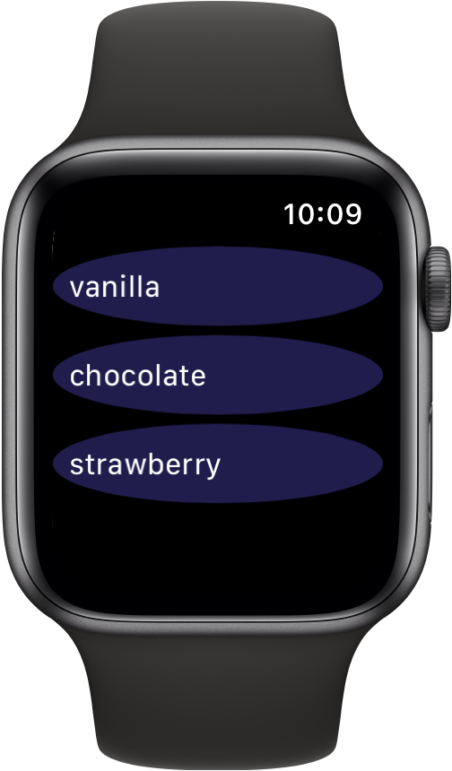

> Navigation: [Technologies](../../technologies.md) · [SwiftUI](../../swiftui.md) · [View](../view.md)

# listRowBackground(_:)

<sub>Instance Method</sub>

Places a custom background view behind a list row item.

<sub>iOS, iPadOS, Mac Catalyst, macOS, tvOS, visionOS, watchOS</sub>

```swift
nonisolated func listRowBackground<V>(_ view: V?) -> some View where V : View

```

## Parameters

- `view` — The [View](../view.md) to use as the background behind the list row view.

## Return Value

A list row view with `view` as its background view.

## Discussion

Use `listRowBackground(_:)` to place a custom background view behind a list row item.

In the example below, the `Flavor` enumeration provides content for list items. The SwiftUI [ForEach](../foreach.md) structure computes views for each element of the `Flavor` enumeration and extracts the raw value of each of its elements using the resulting text to create each list row item. The `listRowBackground(_:)` modifier then places the view you supply behind each of the list row items:

```swift
struct ContentView: View {
    enum Flavor: String, CaseIterable, Identifiable {
        var id: String { self.rawValue }
        case vanilla, chocolate, strawberry
    }

    var body: some View {
        List {
            ForEach(Flavor.allCases) {
                Text($0.rawValue)
                    .listRowBackground(Ellipse()
                                        .background(Color.clear)
                                        .foregroundColor(.purple)
                                        .opacity(0.3)
                    )
            }
        }
    }
}
```



## See Also

### Configuring backgrounds

- [alternatingRowBackgrounds(_:)](<alternatingrowbackgrounds(__).md>) — Overrides whether lists and tables in this view have alternating row backgrounds.
- [AlternatingRowBackgroundBehavior](../alternatingrowbackgroundbehavior.md) — The styling of views with respect to alternating row backgrounds.
- [backgroundProminence](../environmentvalues/backgroundprominence.md) — The prominence of the background underneath views associated with this environment.
- [BackgroundProminence](../backgroundprominence.md) — The prominence of backgrounds underneath other views.
