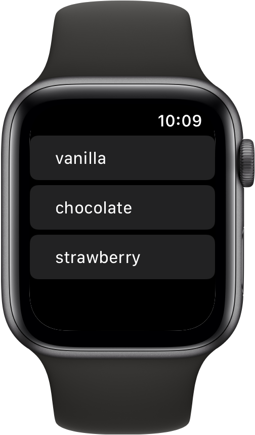

> Navigation: [Technologies](../../technologies.md) · [SwiftUI](../../swiftui.md) · [View](../view.md)

# listRowInsets(_:)

<sub>Instance Method</sub>

Applies an inset to the rows in a list.

<sub>iOS, iPadOS, Mac Catalyst, macOS, tvOS, visionOS, watchOS</sub>

```swift
nonisolated func listRowInsets(_ insets: EdgeInsets?) -> some View

```

## Parameters

- `insets` — The [EdgeInsets](../edgeinsets.md) to apply to the edges of the view.

## Return Value

A view that uses the given edge insets when used as a list cell.

## Discussion

Use `listRowInsets(_:)` to change the default padding of the content of list items.

In the example below, the `Flavor` enumeration provides content for list items. The SwiftUI [ForEach](../foreach.md) structure computes views for each element of the `Flavor` enumeration and extracts the raw value of each of its elements using the resulting text to create each list row item. The `listRowInsets(_:)` modifier then changes the edge insets of each row of the list according to the [EdgeInsets](../edgeinsets.md) provided:

```swift
struct ContentView: View {
    enum Flavor: String, CaseIterable, Identifiable {
        var id: String { self.rawValue }
        case vanilla, chocolate, strawberry
    }

    var body: some View {
        List {
            ForEach(Flavor.allCases) {
                Text($0.rawValue)
                    .listRowInsets(.init(top: 0,
                                         leading: 25,
                                         bottom: 0,
                                         trailing: 0))
            }
        }
    }
}
```



> [!note] Note
> On iOS 18 and earlier, and on visionOS 2 and earlier, the content of list rows can grow slightly into the row insets. The effective vertical insets can then be smaller than expected.

## See Also

### Configuring a list’s layout

- [listRowInsets(_:_:)](<listrowinsets(____).md>) — Sets the insets of rows in a list on the specified edges.
- [defaultMinListRowHeight](../environmentvalues/defaultminlistrowheight.md) — The default minimum height of rows in a list.
- [defaultMinListHeaderHeight](../environmentvalues/defaultminlistheaderheight.md) — The default minimum height of a header in a list.
- [listRowSpacing(_:)](<listrowspacing(__).md>) — Sets the vertical spacing between two adjacent rows in a List.
- [listSectionSpacing(_:)](<listsectionspacing(__).md>) — Sets the spacing between adjacent sections in a [List](../list.md) to a custom value.
- [ListSectionSpacing](../listsectionspacing.md) — The spacing options between two adjacent sections in a list.
- [listSectionMargins(_:_:)](<listsectionmargins(____).md>) — Set the section margins for the specific edges.
