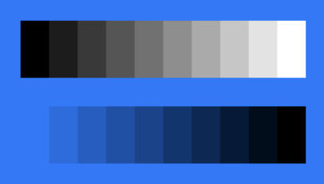

> Navigation: [Technologies](../../technologies.md) · [SwiftUI](../../swiftui.md) · [View](../view.md)

# luminanceToAlpha()

<sub>Instance Method</sub>

Adds a luminance to alpha effect to this view.

<sub>iOS, iPadOS, Mac Catalyst, macOS, tvOS, visionOS, watchOS</sub>

```swift
nonisolated func luminanceToAlpha() -> some View

```

## Return Value

A view with the luminance to alpha effect applied.

## Discussion

Use this modifier to create a semitransparent mask, with the opacity of each part of the modified view controlled by the luminance of the corresponding part of the original view. Regions of lower luminance become more transparent, while higher luminance yields greater opacity.

In particular, the modifier maps the red, green, and blue components of each input pixel’s color to a grayscale value, and that value becomes the alpha component of a black pixel in the output. This modifier produces an effect that’s equivalent to using the `feColorMatrix` filter primitive with the `luminanceToAlpha` type attribute, as defined by the [Scalable Vector Graphics (SVG) 2](https://www.w3.org/TR/SVG2/) specification.

The example below defines a `Palette` view as a series of rectangles, each composed as a [Color](../color.md) with a particular white value, and then displays two versions of the palette over a blue background:

```swift
struct Palette: View {
    var body: some View {
        HStack(spacing: 0) {
            ForEach(0..<10) { index in
                Color(white: Double(index) / Double(9))
                    .frame(width: 20, height: 40)
            }
        }
    }
}

struct LuminanceToAlphaExample: View {
    var body: some View {
        VStack(spacing: 20) {
            Palette()

            Palette()
                .luminanceToAlpha()
        }
        .padding()
        .background(.blue)
    }
}
```

The unmodified version of the palette contains rectangles that range from solid black to solid white, thus with increasing luminance. The second version of the palette, which has the `luminanceToAlpha()` modifier applied, allows the background to show through in an amount that corresponds inversely to the luminance of the input.



## See Also

### Transforming colors

- [brightness(_:)](<brightness(__).md>) — Brightens this view by the specified amount.
- [contrast(_:)](<contrast(__).md>) — Sets the contrast and separation between similar colors in this view.
- [colorInvert()](<colorinvert().md>) — Inverts the colors in this view.
- [colorMultiply(_:)](<colormultiply(__).md>) — Adds a color multiplication effect to this view.
- [saturation(_:)](<saturation(__).md>) — Adjusts the color saturation of this view.
- [grayscale(_:)](<grayscale(__).md>) — Adds a grayscale effect to this view.
- [hueRotation(_:)](<huerotation(__).md>) — Applies a hue rotation effect to this view.
- [materialActiveAppearance(_:)](<materialactiveappearance(__).md>) — Sets an explicit active appearance for materials in this view.
- [materialActiveAppearance](../environmentvalues/materialactiveappearance.md) — The behavior materials should use for their active state, defaulting to `automatic`.
- [MaterialActiveAppearance](../materialactiveappearance.md) — The behavior for how materials appear active and inactive.
