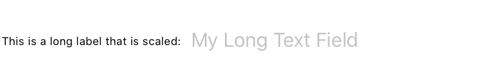

> Navigation: [Technologies](../../technologies.md) · [SwiftUI](../../swiftui.md) · [View](../view.md)

# minimumScaleFactor(_:)

<sub>Instance Method</sub>

Sets the minimum amount that text in this view scales down to fit in the available space.

<sub>iOS, iPadOS, Mac Catalyst, macOS, tvOS, visionOS, watchOS</sub>

```swift
nonisolated func minimumScaleFactor(_ factor: CGFloat) -> some View

```

## Parameters

- `factor` — A fraction between 0 and 1 (inclusive) you use to specify the minimum amount of text scaling that this view permits.

## Return Value

A view that limits the amount of text downscaling.

## Discussion

Use the `minimumScaleFactor(_:)` modifier if the text you place in a view doesn’t fit and it’s okay if the text shrinks to accommodate. For example, a label with a minimum scale factor of `0.5` draws its text in a font size as small as half of the actual font if needed.

In the example below, the [HStack](../hstack.md) contains a [Text](../text.md) label with a line limit of `1`, that is next to a [TextField](../textfield.md). To allow the label to fit into the available space, the `minimumScaleFactor(_:)` modifier shrinks the text as needed to fit into the available space.

```swift
HStack {
    Text("This is a long label that will be scaled to fit:")
        .lineLimit(1)
        .minimumScaleFactor(0.5)
    TextField("My Long Text Field", text: $myTextField)
}
```



## See Also

### Managing text layout

- [truncationMode(_:)](<truncationmode(__).md>) — Sets the truncation mode for lines of text that are too long to fit in the available space.
- [truncationMode](../environmentvalues/truncationmode.md) — A value that indicates how the layout truncates the last line of text to fit into the available space.
- [allowsTightening(_:)](<allowstightening(__).md>) — Sets whether text in this view can compress the space between characters when necessary to fit text in a line.
- [allowsTightening](../environmentvalues/allowstightening.md) — A Boolean value that indicates whether inter-character spacing should tighten to fit the text into the available space.
- [minimumScaleFactor](../environmentvalues/minimumscalefactor.md) — The minimum permissible proportion to shrink the font size to fit the text into the available space.
- [baselineOffset(_:)](<baselineoffset(__).md>) — Sets the vertical offset for the text relative to its baseline in this view.
- [kerning(_:)](<kerning(__).md>) — Sets the spacing, or kerning, between characters for the text in this view.
- [tracking(_:)](<tracking(__).md>) — Sets the tracking for the text in this view.
- [flipsForRightToLeftLayoutDirection(_:)](<flipsforrighttoleftlayoutdirection(__).md>) — Sets whether this view mirrors its contents horizontally when the layout direction is right-to-left.
- [TextAlignment](../textalignment.md) — An alignment position for text along the horizontal axis.
