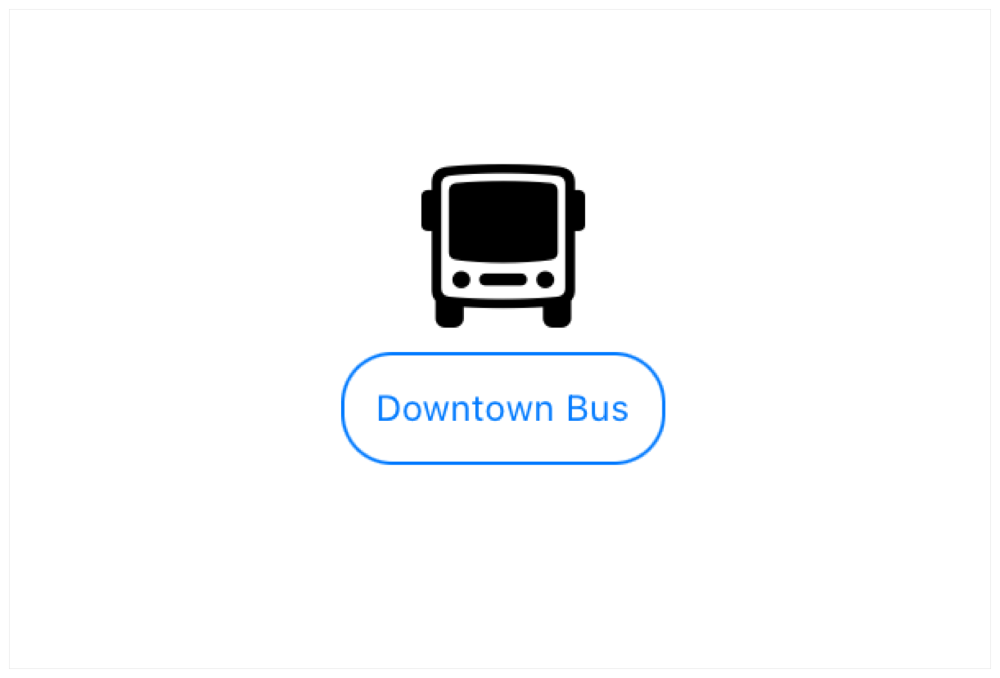

> Navigation: [Technologies](../../technologies.md) · [SwiftUI](../../swiftui.md) · [View](../view.md)

# modifier(_:)

<sub>Instance Method</sub>

Applies a modifier to a view and returns a new view.

<sub>iOS, iPadOS, Mac Catalyst, macOS, tvOS, visionOS, watchOS</sub>

```swift
nonisolated func modifier<T>(_ modifier: T) -> ModifiedContent<Self, T>
```

## Parameters

- `modifier` — The modifier to apply to this view.

## Discussion

Use this modifier to combine a [View](../view.md) and a [ViewModifier](../viewmodifier.md), to create a new view. For example, if you create a view modifier for a new kind of caption with blue text surrounded by a rounded rectangle:

```swift
struct BorderedCaption: ViewModifier {
    func body(content: Content) -> some View {
        content
            .font(.caption2)
            .padding(10)
            .overlay(
                RoundedRectangle(cornerRadius: 15)
                    .stroke(lineWidth: 1)
            )
            .foregroundColor(Color.blue)
    }
}
```

You can use [modifier(_:)](<modifier(__).md>) to extend [View](../view.md) to create new modifier for applying the `BorderedCaption` defined above:

```swift
extension View {
    func borderedCaption() -> some View {
        modifier(BorderedCaption())
    }
}
```

Then you can apply the bordered caption to any view:

```swift
Image(systemName: "bus")
    .resizable()
    .frame(width:50, height:50)
Text("Downtown Bus")
    .borderedCaption()
```



## See Also

### Modifying a view

- [Configuring views](../configuring-views.md) — Adjust the characteristics of a view by applying view modifiers.
- [Reducing view modifier maintenance](../reducing-view-modifier-maintenance.md) — Bundle view modifiers that you regularly reuse into a custom view modifier.
- [ViewModifier](../viewmodifier.md) — A modifier that you apply to a view or another view modifier, producing a different version of the original value.
- [EmptyModifier](../emptymodifier.md) — An empty, or identity, modifier, used during development to switch modifiers at compile time.
- [ModifiedContent](../modifiedcontent.md) — A value with a modifier applied to it.
- [EnvironmentalModifier](../environmentalmodifier.md) — A modifier that must resolve to a concrete modifier in an environment before use.
- [ManipulableModifier](../manipulablemodifier.md)
- [ManipulableResponderModifier](../manipulablerespondermodifier.md)
- [ManipulableTransformBindingModifier](../manipulabletransformbindingmodifier.md)
- [ManipulationGeometryModifier](../manipulationgeometrymodifier.md)
- [ManipulationGestureModifier](../manipulationgesturemodifier.md)
- [ManipulationUsingGestureStateModifier](../manipulationusinggesturestatemodifier.md)
- [Manipulable](../manipulable.md) — A namespace for various manipulable related types.
