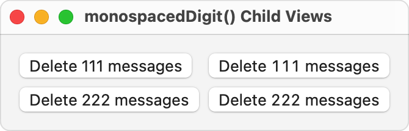

> Navigation: [Technologies](../../technologies.md) · [SwiftUI](../../swiftui.md) · [View](../view.md)

# monospacedDigit()

<sub>Instance Method</sub>

Modifies the fonts of all child views to use fixed-width digits, if possible, while leaving other characters proportionally spaced.

<sub>iOS, iPadOS, Mac Catalyst, macOS, tvOS, visionOS, watchOS</sub>

```swift
nonisolated func monospacedDigit() -> some View

```

## Return Value

A view whose child views’ fonts use fixed-width numeric characters, while leaving other characters proportionally spaced.

## Discussion

Using fixed-width digits allows you to easily align numbers of the same size in a table-like arrangement. This feature is also known as “tabular figures” or “tabular numbers.”

This modifier only affects numeric characters, and leaves all other characters unchanged.

The following example shows the effect of `monospacedDigit()` on multiple child views. The example consists of two [VStack](../vstack.md) views inside an [HStack](../hstack.md). Each `VStack` contains two [Button](../button.md) views, with the second `VStack` applying the `monospacedDigit()` modifier to its contents. As a result, the digits in the buttons in the trailing `VStack` are the same width, which in turn gives the buttons equal widths.

```swift
var body: some View {
    HStack(alignment: .top) {
        VStack(alignment: .leading) {
            Button("Delete 111 messages") {}
            Button("Delete 222 messages") {}
        }
        VStack(alignment: .leading) {
            Button("Delete 111 messages") {}
            Button("Delete 222 messages") {}
        }
        .monospacedDigit()
    }
    .padding()
    .navigationTitle("monospacedDigit() Child Views")
}
```



If a child view’s base font doesn’t support fixed-width digits, the font remains unchanged.

## See Also

### Controlling text style

- [bold(_:)](<bold(__).md>) — Applies a bold font weight to the text in this view.
- [italic(_:)](<italic(__).md>) — Applies italics to the text in this view.
- [underline(_:pattern:color:)](<underline(__pattern_color_).md>) — Applies an underline to the text in this view.
- [strikethrough(_:pattern:color:)](<strikethrough(__pattern_color_).md>) — Applies a strikethrough to the text in this view.
- [textCase(_:)](<textcase(__).md>) — Sets a transform for the case of the text contained in this view when displayed.
- [textCase](../environmentvalues/textcase.md) — A stylistic override to transform the case of `Text` when displayed, using the environment’s locale.
- [monospaced(_:)](<monospaced(__).md>) — Modifies the fonts of all child views to use the fixed-width variant of the current font, if possible.
- [AttributedTextFormattingDefinition](../attributedtextformattingdefinition.md) — A protocol for defining how text can be styled in a view.
- [AttributedTextValueConstraint](../attributedtextvalueconstraint.md) — A protocol for defining a constraint on the value of a certain attribute.
- [AttributedTextFormatting](../attributedtextformatting.md) — A namespace for types related to attributed text formatting definitions.
