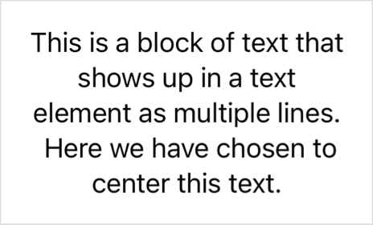

> Navigation: [Technologies](../../technologies.md) · [SwiftUI](../../swiftui.md) · [View](../view.md)

# multilineTextAlignment(_:)

<sub>Instance Method</sub>

Sets the alignment of a text view that contains multiple lines of text.

<sub>iOS, iPadOS, Mac Catalyst, macOS, tvOS, visionOS, watchOS</sub>

```swift
nonisolated func multilineTextAlignment(_ alignment: TextAlignment) -> some View

```

## Parameters

- `alignment` — A value that you use to align multiple lines of text within a view.

## Return Value

A view that aligns the lines of multiline [Text](../text.md) instances it contains.

## Discussion

Use this modifier to set an alignment for a multiline block of text. For example, the modifier centers the contents of the following [Text](../text.md) view:

```swift
Text("This is a block of text that shows up in a text element as multiple lines.\("\n") Here we have chosen to center this text.")
    .frame(width: 200)
    .multilineTextAlignment(.center)
```

The text in the above example spans more than one line because:

- The newline character introduces a line break.
- The frame modifier limits the space available to the text view, and by default a text view wraps lines that don’t fit in the available width. As a result, the text before the explicit line break wraps to three lines, and the text after uses two lines.

The modifier applies the alignment to the all the lines of text in the view, regardless of why wrapping occurs:



The modifier has no effect on a [Text](../text.md) view that contains only one line of text, because a text view has a width that exactly matches the width of its widest line. If you want to align an entire text view rather than its contents, set the aligment of its container, like a [VStack](../vstack.md) or a frame that you create with the [frame(minWidth:idealWidth:maxWidth:minHeight:idealHeight:maxHeight:alignment:)](<frame(minwidth_idealwidth_maxwidth_minheight_idealheight_maxheight_alignment_).md>) modifier.

> [!note] Note
> You can use this modifier to control the alignment of a [Text](../text.md) view that you create with the [init(_:style:)](<../text/init(__style_).md>) initializer to display localized dates and times, including when the view uses only a single line, but only when that view appears in a widget.

The modifier also affects the content alignment of other text container types, like [TextEditor](../texteditor.md) and [TextField](../textfield.md). In those cases, the modifier sets the alignment even when the view contains only a single line because view’s width isn’t dictated by the width of the text it contains.

The modifier operates by setting the [multilineTextAlignment](../environmentvalues/multilinetextalignment.md) value in the environment, so it affects all the text containers in the modified view hierarchy. For example, you can apply the modifier to a [VStack](../vstack.md) to configure all the text views inside the stack.

## See Also

### Formatting multiline text

- [lineSpacing(_:)](<linespacing(__).md>) — Sets the amount of space between lines of text in this view.
- [lineSpacing](../environmentvalues/linespacing.md) — The distance in points between the bottom of one line fragment and the top of the next.
- [multilineTextAlignment](../environmentvalues/multilinetextalignment.md) — An environment value that indicates how a text view aligns its lines when the content wraps or contains newlines.
