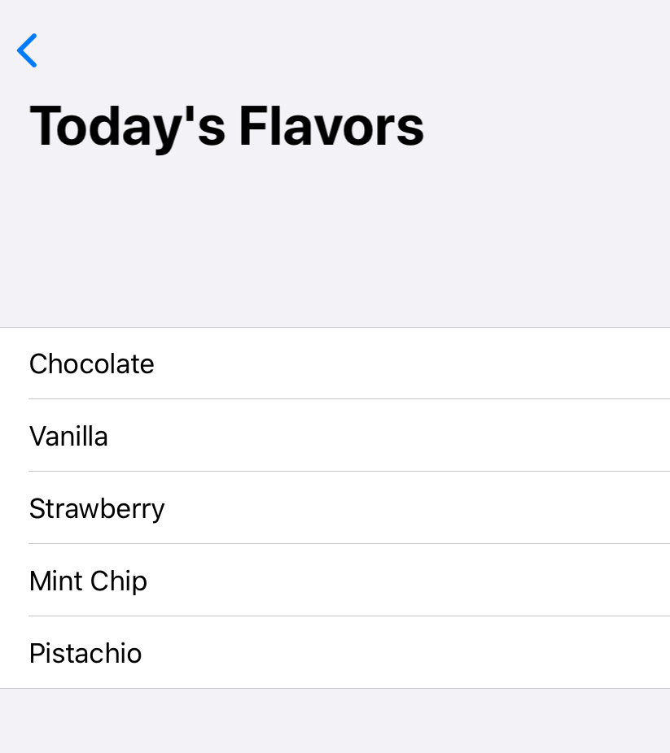

> Navigation: [Technologies](../../technologies.md) · [SwiftUI](../../swiftui.md) · [View](../view.md)

# navigationBarTitle(_:)

<sub>Instance Method</sub>

Sets the title in the navigation bar for this view.

> [!warning] Deprecated
> Use [navigationTitle(_:)](<navigationtitle(__)-5di1u.md>) instead.

<sub>iOS, iPadOS, Mac Catalyst, tvOS, visionOS, watchOS</sub>

```swift
nonisolated func navigationBarTitle(_ title: Text) -> some View

```

## Parameters

- `title` — A description of this view to display in the navigation bar.

## Discussion

Use `navigationBarTitle(_:)` to set the title of the navigation bar. This modifier only takes effect when this view is inside of and visible within a [NavigationView](../navigationview.md).

The example below shows setting the title of the navigation bar using a [Text](../text.md) view:

```swift
struct FlavorView: View {
    let items = ["Chocolate", "Vanilla", "Strawberry", "Mint Chip",
                 "Pistachio"]
    var body: some View {
        NavigationView {
            List(items, id: \.self) {
                Text($0)
            }
            .navigationBarTitle(Text("Today's Flavors"))
        }
    }
}
```



## See Also

### Auxiliary view modifiers

- [navigationBarTitle(_:displayMode:)](<navigationbartitle(__displaymode_).md>) — Sets the title and display mode in the navigation bar for this view. _(deprecated)_
- [navigationBarItems(leading:)](<navigationbaritems(leading_).md>) — Sets the navigation bar items for this view. _(deprecated)_
- [navigationBarItems(leading:trailing:)](<navigationbaritems(leading_trailing_).md>) — Sets the navigation bar items for this view. _(deprecated)_
- [navigationBarItems(trailing:)](<navigationbaritems(trailing_).md>) — Configures the navigation bar items for this view. _(deprecated)_
- [navigationBarHidden(_:)](<navigationbarhidden(__).md>) — Hides the navigation bar for this view. _(deprecated)_
- [statusBar(hidden:)](<statusbar(hidden_).md>) — Sets the visibility of the status bar. _(deprecated)_
- [contextMenu(_:)](<contextmenu(__).md>) — Adds a context menu to the view. _(deprecated)_
