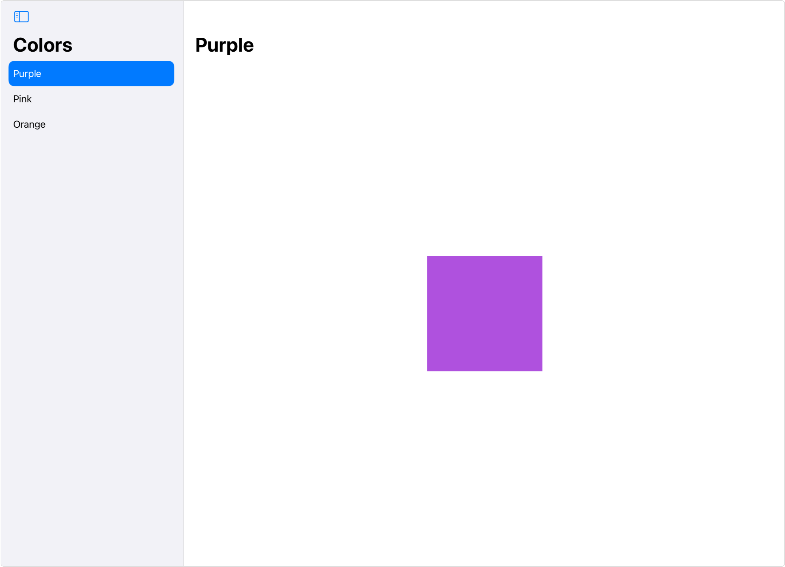
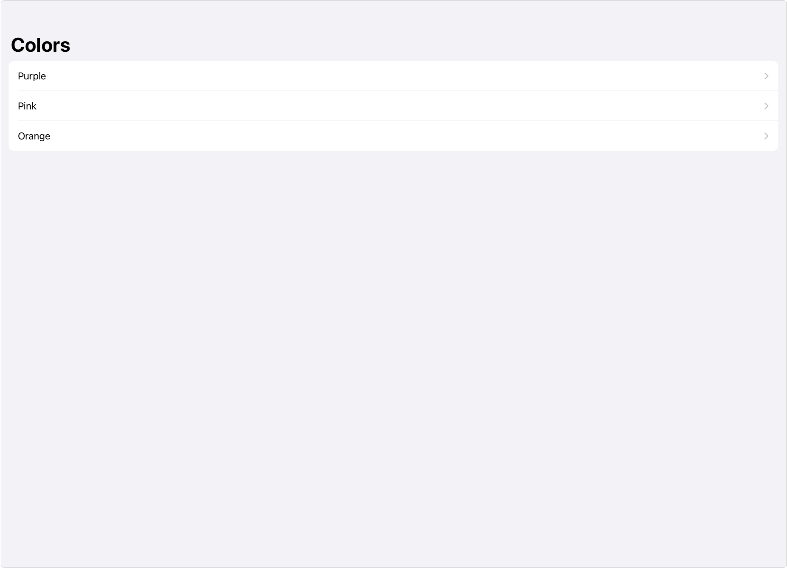

> Navigation: [Technologies](../../technologies.md) · [SwiftUI](../../swiftui.md) · [View](../view.md)

# navigationViewStyle(_:)

<sub>Instance Method</sub>

Sets the style for navigation views within this view.

> [!warning] Deprecated
> Replace a styled [NavigationView](../navigationview.md) with a [NavigationStack](../navigationstack.md) or [NavigationSplitView](../navigationsplitview.md). For more information, see [Migrating to new navigation types](../migrating-to-new-navigation-types.md).

<sub>iOS, iPadOS, Mac Catalyst, macOS, tvOS, visionOS, watchOS</sub>

```swift
nonisolated func navigationViewStyle<S>(_ style: S) -> some View where S : NavigationViewStyle

```

## Discussion

Use this modifier to change the appearance and behavior of navigation views. For example, by default, navigation views appear with multiple columns in wider environments, like iPad in landscape orientation:



You can apply the [stack](../navigationviewstyle/stack.md) style to force single-column stack navigation in these environments:

```swift
NavigationView {
    List {
        NavigationLink("Purple", destination: ColorDetail(color: .purple))
        NavigationLink("Pink", destination: ColorDetail(color: .pink))
        NavigationLink("Orange", destination: ColorDetail(color: .orange))
    }
    .navigationTitle("Colors")

    Text("Select a Color") // A placeholder to show before selection.
}
.navigationViewStyle(.stack)
```



<sub>A screenshot of an iPad in landscape orientation mode showing a single column containing the list Purple, Pink, and Orange.</sub>

## See Also

### Styling navigation views

- [NavigationViewStyle](../navigationviewstyle.md) — A specification for the appearance and interaction of a navigation view. _(deprecated)_
