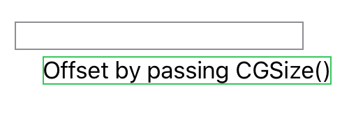

> Navigation: [Technologies](../../technologies.md) · [SwiftUI](../../swiftui.md) · [View](../view.md)

# offset(_:)

<sub>Instance Method</sub>

Offset this view by the horizontal and vertical amount specified in the offset parameter.

<sub>iOS, iPadOS, Mac Catalyst, macOS, tvOS, visionOS, watchOS</sub>

```swift
nonisolated func offset(_ offset: CGSize) -> some View

```

## Parameters

- `offset` — The distance to offset this view.

## Return Value

A view that offsets this view by `offset`.

## Discussion

Use `offset(_:)` to shift the displayed contents by the amount specified in the `offset` parameter.

The original dimensions of the view aren’t changed by offsetting the contents; in the example below the gray border drawn by this view surrounds the original position of the text:

```swift
Text("Offset by passing CGSize()")
    .border(Color.green)
    .offset(CGSize(width: 20, height: 25))
    .border(Color.gray)
```



## See Also

### Adjusting a view’s position

- [Making fine adjustments to a view’s position](../making-fine-adjustments-to-a-view-s-position.md) — Shift the position of a view by applying the offset or position modifier.
- [position(_:)](<position(__).md>) — Positions the center of this view at the specified point in its parent’s coordinate space.
- [position(x:y:)](<position(x_y_).md>) — Positions the center of this view at the specified coordinates in its parent’s coordinate space.
- [offset(x:y:)](<offset(x_y_).md>) — Offset this view by the specified horizontal and vertical distances.
- [offset(z:)](<offset(z_).md>) — Brings a view forward in Z by the provided distance in points.
