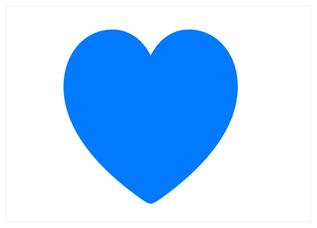

> Navigation: [Technologies](../../technologies.md) · [SwiftUI](../../swiftui.md) · [View](../view.md)

# onTapGesture(count:perform:)

<sub>Instance Method</sub>

Adds an action to perform when this view recognizes a tap gesture.

<sub>iOS, iPadOS, Mac Catalyst, macOS, tvOS, visionOS, watchOS</sub>

```swift
nonisolated func onTapGesture(count: Int = 1, perform action: @escaping () -> Void) -> some View

```

## Parameters

- `count` — The number of taps or clicks required to trigger the action closure provided in `action`. Defaults to `1`.

- `action` — The action to perform.

## Discussion

Use this method to perform the specified `action` when the user clicks or taps on the view or container `count` times.

> [!note] Note
> If you create a control that’s functionally equivalent to a [Button](../button.md), use [ButtonStyle](../buttonstyle.md) to create a customized button instead.

In the example below, the color of the heart images changes to a random color from the `colors` array whenever the user clicks or taps on the view twice:

```swift
struct TapGestureExample: View {
    let colors: [Color] = [.gray, .red, .orange, .yellow,
                           .green, .blue, .purple, .pink]
    @State private var fgColor: Color = .gray

    var body: some View {
        Image(systemName: "heart.fill")
            .resizable()
            .frame(width: 200, height: 200)
            .foregroundColor(fgColor)
            .onTapGesture(count: 2) {
                fgColor = colors.randomElement()!
            }
    }
}
```



## See Also

### Recognizing tap gestures

- [onTapGesture(count:coordinateSpace:perform:)](<ontapgesture(count_coordinatespace_perform_).md>) — Adds an action to perform when this view recognizes a tap gesture, and provides the action with the location of the interaction.
- [onTapGesture(count:coordinateSpace:inputKinds:perform:)](<ontapgesture(count_coordinatespace_inputkinds_perform_).md>) — Adds an action to perform when this view recognizes a tap gesture, and provides the action with the location of the interaction. _(beta)_
- [TapGesture](../tapgesture.md) — A gesture that recognizes one or more taps.
- [SpatialTapGesture](../spatialtapgesture.md) — A gesture that recognizes one or more taps and reports their location.
