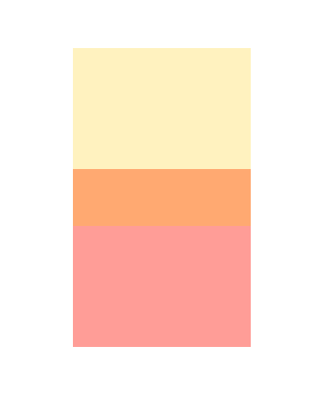

> Navigation: [Technologies](../../technologies.md) · [SwiftUI](../../swiftui.md) · [View](../view.md)

# opacity(_:)

<sub>Instance Method</sub>

Sets the transparency of this view.

<sub>iOS, iPadOS, Mac Catalyst, macOS, tvOS, visionOS, watchOS</sub>

```swift
nonisolated func opacity(_ opacity: Double) -> some View

```

## Parameters

- `opacity` — A value between 0 (fully transparent) and 1 (fully opaque).

## Return Value

A view that sets the transparency of this view.

## Discussion

Apply opacity to reveal views that are behind another view or to de-emphasize a view.

When applying the `opacity(_:)` modifier to a view that has already had its opacity transformed, the modifier multiplies the effect of the underlying opacity transformation.

The example below shows yellow and red rectangles configured to overlap. The top yellow rectangle has its opacity set to 50%, allowing the occluded portion of the bottom rectangle to be visible:

```swift
struct Opacity: View {
    var body: some View {
        VStack {
            Color.yellow.frame(width: 100, height: 100, alignment: .center)
                .zIndex(1)
                .opacity(0.5)

            Color.red.frame(width: 100, height: 100, alignment: .center)
                .padding(-40)
        }
    }
}
```



## See Also

### Hiding views

- [hidden()](<hidden().md>) — Hides this view unconditionally.
