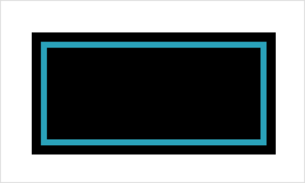

> Navigation: [Technologies](../../technologies.md) · [SwiftUI](../../swiftui.md) · [View](../view.md)

# overlay(_:in:fillStyle:)

<sub>Instance Method</sub>

Layers a shape that you specify in front of this view.

<sub>iOS, iPadOS, Mac Catalyst, macOS, tvOS, visionOS, watchOS</sub>

```swift
nonisolated func overlay<S, T>(_ style: S, in shape: T, fillStyle: FillStyle = FillStyle()) -> some View where S : ShapeStyle, T : Shape

```

## Parameters

- `style` — A [ShapeStyle](../shapestyle.md) that SwiftUI uses to fill the shape that you specify.

- `shape` — An instance of a type that conforms to [Shape](../shape.md) that SwiftUI draws in front of the view.

- `fillStyle` — The [FillStyle](../fillstyle.md) to use when drawing the shape. The default style uses the nonzero winding number rule and antialiasing.

## Return Value

A view with the specified shape drawn in front of it.

## Discussion

Use this modifier to layer a type that conforms to the [Shape](../shape.md) protocol — like a [Rectangle](../rectangle.md), [Circle](../circle.md), or [Capsule](../capsule.md) — in front of a view. Specify a [ShapeStyle](../shapestyle.md) that’s used to fill the shape. For example, you can overlay the outline of one rectangle in front of another:

```swift
Rectangle()
    .frame(width: 200, height: 100)
    .overlay(.teal, in: Rectangle().inset(by: 10).stroke(lineWidth: 5))
```

The example above uses the [inset(by:)](<../insettableshape/inset(by_).md>) method to slightly reduce the size of the overlaid rectangle, and the [stroke(lineWidth:)](<../shape/stroke(linewidth_).md>) method to fill only the shape’s outline. This creates an inset border:



This modifier is a convenience method for layering a shape over a view. To handle the more general case of overlaying a [View](../view.md) — or a stack of views — with control over the position, use [overlay(alignment:content:)](<overlay(alignment_content_).md>) instead. To cover a view with a [ShapeStyle](../shapestyle.md), use [overlay(_:ignoresSafeAreaEdges:)](<overlay(__ignoressafeareaedges_).md>).

## See Also

### Layering views

- [Adding a background to your view](../adding-a-background-to-your-view.md) — Compose a background behind your view and extend it beyond the safe area insets.
- [ZStack](../zstack.md) — A view that overlays its subviews, aligning them in both axes.
- [zIndex(_:)](<zindex(__).md>) — Controls the display order of overlapping views.
- [background(alignment:content:)](<background(alignment_content_).md>) — Layers the views that you specify behind this view.
- [background(_:ignoresSafeAreaEdges:)](<background(__ignoressafeareaedges_).md>) — Sets the view’s background to a style.
- [background(ignoresSafeAreaEdges:)](<background(ignoressafeareaedges_).md>) — Sets the view’s background to the default background style.
- [background(_:in:fillStyle:)](<background(__in_fillstyle_).md>) — Sets the view’s background to an insettable shape filled with a style.
- [background(in:fillStyle:)](<background(in_fillstyle_).md>) — Sets the view’s background to an insettable shape filled with the default background style.
- [overlay(alignment:content:)](<overlay(alignment_content_).md>) — Layers the views that you specify in front of this view.
- [overlay(_:ignoresSafeAreaEdges:)](<overlay(__ignoressafeareaedges_).md>) — Layers the specified style in front of this view.
- [backgroundMaterial](../environmentvalues/backgroundmaterial.md) — The material underneath the current view.
- [containerBackground(_:for:)](<containerbackground(__for_).md>) — Sets the container background of the enclosing container using a view.
- [containerBackground(for:alignment:content:)](<containerbackground(for_alignment_content_).md>) — Sets the container background of the enclosing container using a view.
- [ContainerBackgroundPlacement](../containerbackgroundplacement.md) — The placement of a container background.
