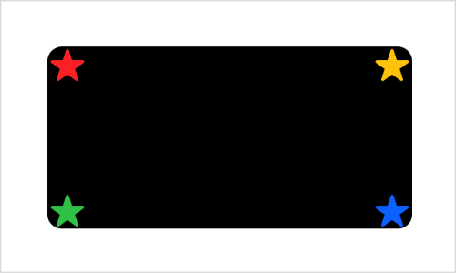
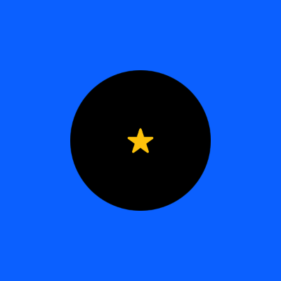
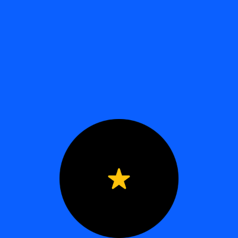
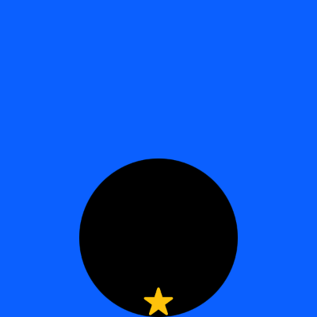

> Navigation: [Technologies](../../technologies.md) · [SwiftUI](../../swiftui.md) · [View](../view.md)

# overlay(alignment:content:)

<sub>Instance Method</sub>

Layers the views that you specify in front of this view.

<sub>iOS, iPadOS, Mac Catalyst, macOS, tvOS, visionOS, watchOS</sub>

```swift
nonisolated func overlay<V>(alignment: Alignment = .center, @ContentBuilder content: () -> V) -> some View where V : View

```

## Parameters

- `alignment` — The alignment that the modifier uses to position the implicit [ZStack](../zstack.md) that groups the foreground views. The default is [center](../alignment/center.md).

- `content` — A [ContentBuilder](../contentbuilder.md) that you use to declare the views to draw in front of this view, stacked in the order that you list them. The last view that you list appears at the front of the stack.

## Return Value

A view that uses the specified content as a foreground.

## Discussion

Use this modifier to place one or more views in front of another view. For example, you can place a group of stars on a [RoundedRectangle](../roundedrectangle.md):

```swift
RoundedRectangle(cornerRadius: 8)
    .frame(width: 200, height: 100)
    .overlay(alignment: .topLeading) { Star(color: .red) }
    .overlay(alignment: .topTrailing) { Star(color: .yellow) }
    .overlay(alignment: .bottomLeading) { Star(color: .green) }
    .overlay(alignment: .bottomTrailing) { Star(color: .blue) }
```

The example above assumes that you’ve defined a `Star` view with a parameterized color:

```swift
struct Star: View {
    var color = Color.yellow

    var body: some View {
        Image(systemName: "star.fill")
            .foregroundStyle(color)
    }
}
```

By setting different `alignment` values for each modifier, you make the stars appear in different places on the rectangle:



If you specify more than one view in the `content` closure, the modifier collects all of the views in the closure into an implicit [ZStack](../zstack.md), taking them in order from back to front. For example, you can place a star and a [Circle](../circle.md) on a field of [blue](../shapestyle/blue.md):

```swift
Color.blue
    .frame(width: 200, height: 200)
    .overlay {
        Circle()
            .frame(width: 100, height: 100)
        Star()
    }
```

Both the overlay modifier and the implicit [ZStack](../zstack.md) composed from the overlay content — the circle and the star — use a default [center](../alignment/center.md) alignment. The star appears centered on the circle, and both appear as a composite view centered in front of the square:



If you specify an alignment for the overlay, it applies to the implicit stack rather than to the individual views in the closure. You can see this if you add the [bottom](../alignment/bottom.md) alignment:

```swift
Color.blue
    .frame(width: 200, height: 200)
    .overlay(alignment: .bottom) {
        Circle()
            .frame(width: 100, height: 100)
        Star()
    }
```

The circle and the star move down as a unit to align the stack’s bottom edge with the bottom edge of the square, while the star remains centered on the circle:



To control the placement of individual items inside the `content` closure, either use a different overlay modifier for each item, as the earlier example of stars in the corners of a rectangle demonstrates, or add an explicit [ZStack](../zstack.md) inside the content closure with its own alignment:

```swift
Color.blue
    .frame(width: 200, height: 200)
    .overlay(alignment: .bottom) {
        ZStack(alignment: .bottom) {
            Circle()
                .frame(width: 100, height: 100)
            Star()
        }
    }
```

The stack alignment ensures that the star’s bottom edge aligns with the circle’s, while the overlay aligns the composite view with the square:



You can achieve layering without an overlay modifier by putting both the modified view and the overlay content into a [ZStack](../zstack.md). This can produce a simpler view hierarchy, but changes the layout priority that SwiftUI applies to the views. Use the overlay modifier when you want the modified view to dominate the layout.

If you want to specify a [ShapeStyle](../shapestyle.md) like a [Color](../color.md) or a [Material](../material.md) as the overlay, use [overlay(_:ignoresSafeAreaEdges:)](<overlay(__ignoressafeareaedges_).md>) instead. To specify a [Shape](../shape.md), use [overlay(_:in:fillStyle:)](<overlay(__in_fillstyle_).md>).

## See Also

### Layering views

- [Adding a background to your view](../adding-a-background-to-your-view.md) — Compose a background behind your view and extend it beyond the safe area insets.
- [ZStack](../zstack.md) — A view that overlays its subviews, aligning them in both axes.
- [zIndex(_:)](<zindex(__).md>) — Controls the display order of overlapping views.
- [background(alignment:content:)](<background(alignment_content_).md>) — Layers the views that you specify behind this view.
- [background(_:ignoresSafeAreaEdges:)](<background(__ignoressafeareaedges_).md>) — Sets the view’s background to a style.
- [background(ignoresSafeAreaEdges:)](<background(ignoressafeareaedges_).md>) — Sets the view’s background to the default background style.
- [background(_:in:fillStyle:)](<background(__in_fillstyle_).md>) — Sets the view’s background to an insettable shape filled with a style.
- [background(in:fillStyle:)](<background(in_fillstyle_).md>) — Sets the view’s background to an insettable shape filled with the default background style.
- [overlay(_:ignoresSafeAreaEdges:)](<overlay(__ignoressafeareaedges_).md>) — Layers the specified style in front of this view.
- [overlay(_:in:fillStyle:)](<overlay(__in_fillstyle_).md>) — Layers a shape that you specify in front of this view.
- [backgroundMaterial](../environmentvalues/backgroundmaterial.md) — The material underneath the current view.
- [containerBackground(_:for:)](<containerbackground(__for_).md>) — Sets the container background of the enclosing container using a view.
- [containerBackground(for:alignment:content:)](<containerbackground(for_alignment_content_).md>) — Sets the container background of the enclosing container using a view.
- [ContainerBackgroundPlacement](../containerbackgroundplacement.md) — The placement of a container background.
