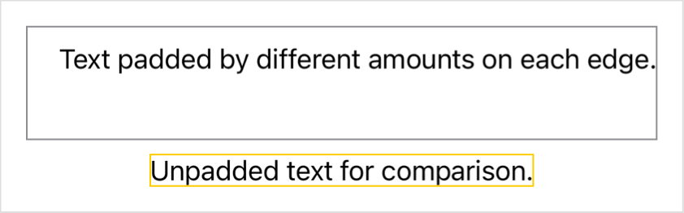

> Navigation: [Technologies](../../technologies.md) · [SwiftUI](../../swiftui.md) · [View](../view.md)

# padding(_:)

<sub>Instance Method</sub>

Adds a different padding amount to each edge of this view.

<sub>iOS, iPadOS, Mac Catalyst, macOS, tvOS, visionOS, watchOS</sub>

```swift
nonisolated func padding(_ insets: EdgeInsets) -> some View

```

## Parameters

- `insets` — An [EdgeInsets](../edgeinsets.md) instance that contains padding amounts for each edge.

## Return Value

A view that’s padded by different amounts on each edge.

## Discussion

Use this modifier to add a different amount of padding on each edge of a view:

```swift
VStack {
    Text("Text padded by different amounts on each edge.")
        .padding(EdgeInsets(top: 10, leading: 20, bottom: 40, trailing: 0))
        .border(.gray)
    Text("Unpadded text for comparison.")
        .border(.yellow)
}
```

The order in which you apply modifiers matters. The example above applies the padding before applying the border to ensure that the border encompasses the padded region:



To pad a view on specific edges with equal padding for all padded edges, use [padding(_:_:)](<padding(____).md>). To pad all edges of a view equally, use [padding(_:)](<padding(__).md>).

## See Also

### Adding padding around a view

- [padding(_:_:)](<padding(____).md>) — Adds an equal padding amount to specific edges of this view.
- [padding3D(_:)](<padding3d(__).md>) — Pads this view using the edge insets you specify.
- [padding3D(_:_:)](<padding3d(____).md>) — Pads this view using the edge insets you specify.
- [scenePadding(_:)](<scenepadding(__).md>) — Adds padding to the specified edges of this view using an amount that’s appropriate for the current scene.
- [scenePadding(_:edges:)](<scenepadding(__edges_).md>) — Adds a specified kind of padding to the specified edges of this view using an amount that’s appropriate for the current scene.
- [ScenePadding](../scenepadding.md) — The padding used to space a view from its containing scene.
