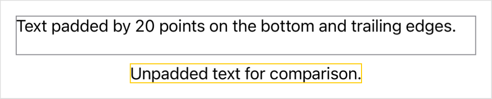
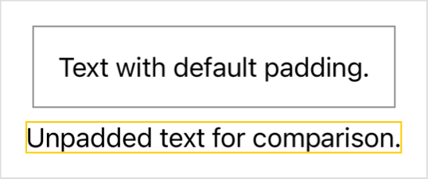

> Navigation: [Technologies](../../technologies.md) · [SwiftUI](../../swiftui.md) · [View](../view.md)

# padding(_:_:)

<sub>Instance Method</sub>

Adds an equal padding amount to specific edges of this view.

<sub>iOS, iPadOS, Mac Catalyst, macOS, tvOS, visionOS, watchOS</sub>

```swift
nonisolated func padding(_ edges: Edge.Set = .all, _ length: CGFloat? = nil) -> some View

```

## Parameters

- `edges` — The set of edges to pad for this view. The default is [all](../edge/set/all.md).

- `length` — An amount, given in points, to pad this view on the specified edges. If you set the value to `nil`, SwiftUI uses a platform-specific default amount. The default value of this parameter is `nil`.

## Return Value

A view that’s padded by the specified amount on the specified edges.

## Discussion

Use this modifier to add a specified amount of padding to one or more edges of the view. Indicate the edges to pad by naming either a single value from [Set](../edge/set.md), or by specifying an [OptionSet](../../swift/optionset.md) that contains edge values:

```swift
VStack {
    Text("Text padded by 20 points on the bottom and trailing edges.")
        .padding([.bottom, .trailing], 20)
        .border(.gray)
    Text("Unpadded text for comparison.")
        .border(.yellow)
}
```

The order in which you apply modifiers matters. The example above applies the padding before applying the border to ensure that the border encompasses the padded region:



You can omit either or both of the parameters. If you omit the `length`, SwiftUI uses a default amount of padding. If you omit the `edges`, SwiftUI applies the padding to all edges. Omit both to add a default padding all the way around a view. SwiftUI chooses a default amount of padding that’s appropriate for the platform and the presentation context.

```swift
VStack {
    Text("Text with default padding.")
        .padding()
        .border(.gray)
    Text("Unpadded text for comparison.")
        .border(.yellow)
}
```

The example above looks like this in iOS under typical conditions:



To control the amount of padding independently for each edge, use [padding(_:)](<padding(__)-6pgqq.md>). To pad all outside edges of a view by a specified amount, use [padding(_:)](<padding(__)-68shk.md>).

## See Also

### Adding padding around a view

- [padding(_:)](<padding(__).md>) — Adds a different padding amount to each edge of this view.
- [padding3D(_:)](<padding3d(__).md>) — Pads this view using the edge insets you specify.
- [padding3D(_:_:)](<padding3d(____).md>) — Pads this view using the edge insets you specify.
- [scenePadding(_:)](<scenepadding(__).md>) — Adds padding to the specified edges of this view using an amount that’s appropriate for the current scene.
- [scenePadding(_:edges:)](<scenepadding(__edges_).md>) — Adds a specified kind of padding to the specified edges of this view using an amount that’s appropriate for the current scene.
- [ScenePadding](../scenepadding.md) — The padding used to space a view from its containing scene.
