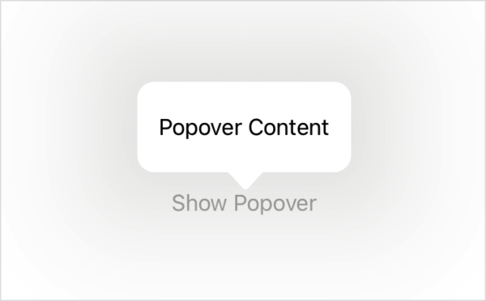

> Navigation: [Technologies](../../technologies.md) · [SwiftUI](../../swiftui.md) · [View](../view.md)

# popover(isPresented:attachmentAnchor:arrowEdge:content:)

<sub>Instance Method</sub>

Presents a popover when a given condition is true.

<sub>iOS, iPadOS, Mac Catalyst, macOS, visionOS</sub>

```swift
@export(implementation) nonisolated func popover<Content>(isPresented: Binding<Bool>, attachmentAnchor: PopoverAttachmentAnchor = .rect(.bounds), arrowEdge: Edge? = nil, @ContentBuilder content: @escaping () -> Content) -> some View where Content : View

```

## Parameters

- `isPresented` — A binding to a Boolean value that determines whether to present the popover content that you return from the modifier’s `content` closure.

- `attachmentAnchor` — The positioning anchor that defines the attachment point of the popover. The default is [bounds](../anchor/source/bounds.md).

- `arrowEdge` — The edge of the `attachmentAnchor` that defines the location of the popover’s arrow. The default is `nil`, which results in the system allowing any arrow edge.

- `content` — A closure returning the content of the popover.

## Discussion

Use this method to show a popover with contents that are a SwiftUI view, which you provide when a bound Boolean variable is `true`. In the example below, a popover displays whenever the user toggles the `isShowingPopover` state variable by pressing the “Show Popover” button:

```swift
struct PopoverExample: View {
    @State private var isShowingPopover = false

    var body: some View {
        Button("Show Popover") {
            self.isShowingPopover = true
        }
        .popover(isPresented: $isShowingPopover) {
            Text("Popover Content")
                .padding()
        }
    }
}
```



> [!important] Important
> Prior to iOS 18.1, the popover arrow edge was not respected. Apps that are re-compiled with the iOS 18.1 or later SDK or visionOS 2.1 or later SDK and run on iOS 18.1 or later or visionOS 2.1 or later have the arrow edge respected. On macOS, arrow edge has always been respected. Alternatively, to allow the system to choose the best orientation of the popover’s arrow, use the `View/popover(isPresented:attachmentAnchor:content:)` variant.

On iPhone, popovers adapt into sheets. In vertically compact environments, such as iPhone in landscape orientation, a popover presentation automatically adapts to appear as a full-screen cover. Use the [presentationCompactAdaptation(_:)](<presentationcompactadaptation(__).md>) or [presentationCompactAdaptation(horizontal:vertical:)](<presentationcompactadaptation(horizontal_vertical_).md>) modifier to override this behavior.

### Breakthrough effect

In visionOS, most system presentations appear with a breakthrough effect by default. To change how the enclosing presentation breaks through content occluding it, use [presentationBreakthroughEffect(_:)](<presentationbreakthrougheffect(__).md>), like in the following example:

```swift
.popover(isPresented: $isShowingPopover) {
    Text("Popover Content")
        .padding()
        .presentationBreakthroughEffect(.prominent)
}
```

## See Also

### Showing a sheet, cover, or popover

- [sheet(isPresented:onDismiss:content:)](<sheet(ispresented_ondismiss_content_).md>) — Presents a sheet when a binding to a Boolean value that you provide is true.
- [sheet(item:onDismiss:content:)](<sheet(item_ondismiss_content_).md>) — Presents a sheet using the given item as a data source for the sheet’s content.
- [fullScreenCover(isPresented:onDismiss:content:)](<fullscreencover(ispresented_ondismiss_content_).md>) — Presents a modal view that covers as much of the screen as possible when binding to a Boolean value you provide is true.
- [fullScreenCover(item:onDismiss:content:)](<fullscreencover(item_ondismiss_content_).md>) — Presents a modal view that covers as much of the screen as possible using the binding you provide as a data source for the sheet’s content.
- [popover(item:attachmentAnchor:arrowEdge:content:)](<popover(item_attachmentanchor_arrowedge_content_).md>) — Presents a popover using the given item as a data source for the popover’s content.
- [PopoverAttachmentAnchor](../popoverattachmentanchor.md) — An attachment anchor for a popover.
