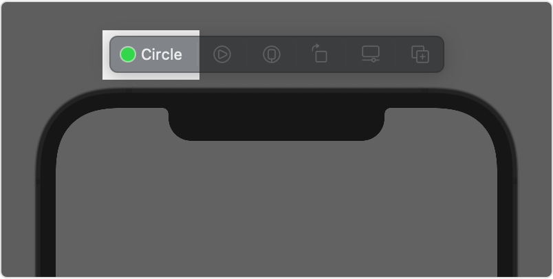

> Navigation: [Technologies](../../technologies.md) · [SwiftUI](../../swiftui.md) · [View](../view.md)

# previewDisplayName(_:)

<sub>Instance Method</sub>

Sets a user visible name to show in the canvas for a preview.

> [!warning] Deprecated
> Use [Preview(_:body:)](<../preview(__body_).md>) instead.

<sub>iOS, iPadOS, Mac Catalyst, macOS, tvOS, visionOS, watchOS</sub>

```swift
nonisolated func previewDisplayName(_ value: String?) -> some View

```

## Parameters

- `value` — A name for the preview.

## Return Value

A preview that uses the given name.

## Discussion

Apply this modifier to a view inside your [PreviewProvider](../previewprovider.md) implementation to associate a display name with that view’s preview:

```swift
struct CircleImage_Previews: PreviewProvider {
    static var previews: some View {
        CircleImage()
            .previewDisplayName("Circle")
    }
}
```



Add a name when you have multiple previews together in the canvas that you need to tell apart. The default value is `nil`, in which case Xcode displays a default string.

## See Also

### Defining a preview

- [PreviewProvider](../previewprovider.md) — A type that produces view previews in Xcode. _(deprecated)_
- [PreviewPlatform](../previewplatform.md) — Platforms that can run the preview. _(deprecated)_
