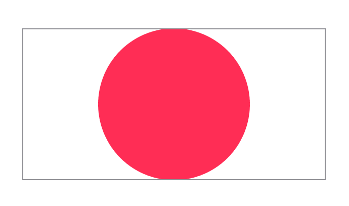

> Navigation: [Technologies](../../technologies.md) · [SwiftUI](../../swiftui.md) · [View](../view.md)

# scaledToFit()

<sub>Instance Method</sub>

Scales this view to fit its parent.

<sub>iOS, iPadOS, Mac Catalyst, macOS, tvOS, visionOS, watchOS</sub>

```swift
nonisolated func scaledToFit() -> some View

```

## Return Value

A view that scales this view to fit its parent, maintaining this view’s aspect ratio.

## Discussion

Use `scaledToFit()` to scale this view to fit its parent, while maintaining the view’s aspect ratio as the view scales.

```swift
Circle()
    .fill(Color.pink)
    .scaledToFit()
    .frame(width: 300, height: 150)
    .border(Color(white: 0.75))
```



This method is equivalent to calling [aspectRatio(_:contentMode:)](<aspectratio(__contentmode_).md>) with a `nil` aspectRatio and a content mode of [ContentMode.fit](../contentmode/fit.md).

## See Also

### Scaling, rotating, or transforming a view

- [scaledToFill()](<scaledtofill().md>) — Scales this view to fill its parent.
- [scaleEffect(_:anchor:)](<scaleeffect(__anchor_).md>) — Scales this view uniformly by the specified factor, relative to an anchor point.
- [scaleEffect(x:y:anchor:)](<scaleeffect(x_y_anchor_).md>) — Scales this view’s rendered output by the given horizontal and vertical amounts, relative to an anchor point.
- [scaleEffect(x:y:z:anchor:)](<scaleeffect(x_y_z_anchor_).md>) — Scales this view by the specified horizontal, vertical, and depth factors, relative to an anchor point.
- [aspectRatio(_:contentMode:)](<aspectratio(__contentmode_).md>) — Constrains this view’s dimensions to the specified aspect ratio.
- [rotationEffect(_:anchor:)](<rotationeffect(__anchor_).md>) — Rotates a view’s rendered output in two dimensions around the specified point.
- [rotation3DEffect(_:axis:anchor:anchorZ:perspective:)](<rotation3deffect(__axis_anchor_anchorz_perspective_).md>) — Renders a view’s content as if it’s rotated in three dimensions around the specified axis.
- [perspectiveRotationEffect(_:axis:anchor:anchorZ:perspective:)](<perspectiverotationeffect(__axis_anchor_anchorz_perspective_).md>) — Renders a view’s content as if it’s rotated in three dimensions around the specified axis.
- [rotation3DEffect(_:anchor:)](<rotation3deffect(__anchor_).md>) — Rotates the view’s content by the specified 3D rotation value.
- [rotation3DEffect(_:axis:anchor:)](<rotation3deffect(__axis_anchor_).md>) — Rotates the view’s content by an angle about an axis that you specify as a tuple of elements.
- [transformEffect(_:)](<transformeffect(__).md>) — Applies an affine transformation to this view’s rendered output.
- [transform3DEffect(_:)](<transform3deffect(__).md>) — Applies a 3D transformation to this view’s rendered output.
- [projectionEffect(_:)](<projectioneffect(__).md>) — Applies a projection transformation to this view’s rendered output.
- [ProjectionTransform](../projectiontransform.md)
- [ContentMode](../contentmode.md) — Constants that define how a view’s content fills the available space.
