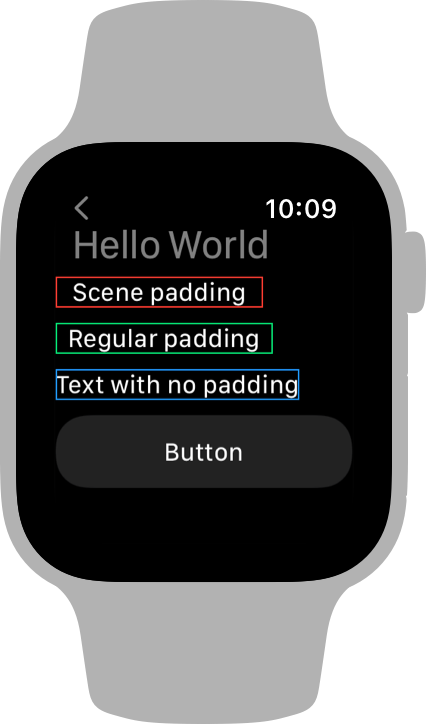

> Navigation: [Technologies](../../technologies.md) · [SwiftUI](../../swiftui.md) · [View](../view.md)

# scenePadding(_:)

<sub>Instance Method</sub>

Adds padding to the specified edges of this view using an amount that’s appropriate for the current scene.

<sub>iOS, iPadOS, Mac Catalyst, macOS, tvOS, visionOS, watchOS</sub>

```swift
nonisolated func scenePadding(_ edges: Edge.Set = .all) -> some View

```

## Parameters

- `edges` — The set of edges along which to pad this view.

## Return Value

A view that’s padded on specified edges by a scene-appropriate amount.

## Discussion

Use this modifier to add a scene-appropriate amount of padding to a view. Specify either a single edge value from [Set](../edge/set.md), or an [OptionSet](../../swift/optionset.md) that describes the edges to pad.

In macOS, use scene padding to produce the recommended spacing around the root view of a window. In watchOS, use scene padding to align elements of your user interface with top level elements, like the title of a navigation view. For example, compare the effects of different kinds of padding on text views presented inside a [NavigationView](../navigationview.md) in watchOS:

```swift
VStack(alignment: .leading, spacing: 10) {
    Text("Scene padding")
        .scenePadding(.horizontal)
        .border(.red) // Border added for reference.
    Text("Regular padding")
        .padding(.horizontal)
        .border(.green)
    Text("Text with no padding")
        .border(.blue)
    Button("Button") { }
}
.navigationTitle("Hello World")
```

The text with scene padding automatically aligns with the title, unlike the text that uses the default padding or the text without padding:



Scene padding in watchOS also ensures that your content avoids the curved edges of a device like Apple Watch Series 7. In other platforms, scene padding produces the same default padding that you get from the [padding(_:_:)](<padding(____).md>) modifier.

> [!important] Important
> Scene padding doesn’t pad the top and bottom edges of a view in watchOS, even if you specify those edges as part of the input. For example, if you specify [vertical](../edge/set/vertical.md) instead of [horizontal](../edge/set/horizontal.md) in the example above, the modifier would have no effect in watchOS. It does, however, apply to all the edges that you specify in other platforms.

## See Also

### Adding padding around a view

- [padding(_:)](<padding(__).md>) — Adds a different padding amount to each edge of this view.
- [padding(_:_:)](<padding(____).md>) — Adds an equal padding amount to specific edges of this view.
- [padding3D(_:)](<padding3d(__).md>) — Pads this view using the edge insets you specify.
- [padding3D(_:_:)](<padding3d(____).md>) — Pads this view using the edge insets you specify.
- [scenePadding(_:edges:)](<scenepadding(__edges_).md>) — Adds a specified kind of padding to the specified edges of this view using an amount that’s appropriate for the current scene.
- [ScenePadding](../scenepadding.md) — The padding used to space a view from its containing scene.
