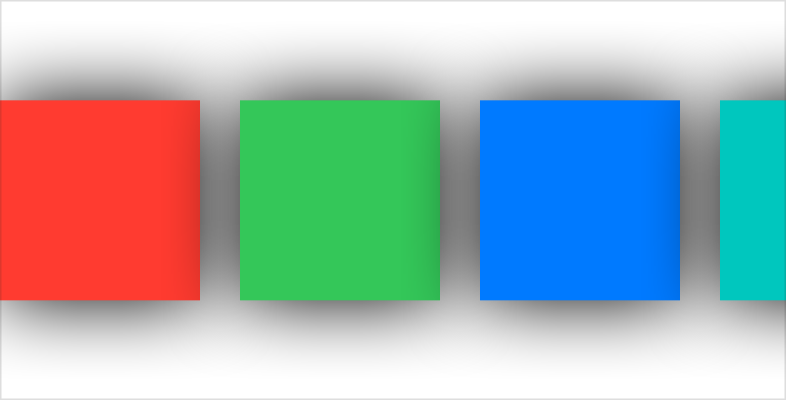
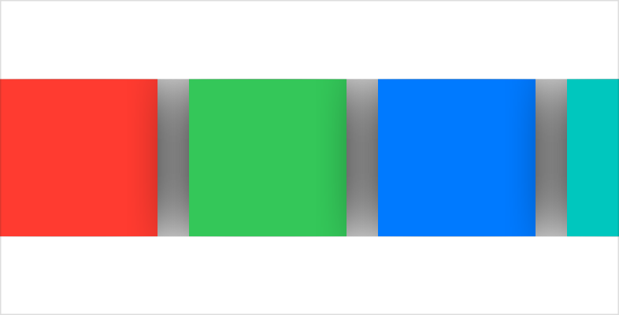

> Navigation: [Technologies](../../technologies.md) · [SwiftUI](../../swiftui.md) · [View](../view.md)

# scrollClipDisabled(_:)

<sub>Instance Method</sub>

Sets whether a scroll view clips its content to its bounds.

<sub>iOS, iPadOS, Mac Catalyst, macOS, tvOS, visionOS, watchOS</sub>

```swift
nonisolated func scrollClipDisabled(_ disabled: Bool = true) -> some View

```

## Parameters

- `disabled` — A Boolean value that specifies whether to disable scroll view clipping.

## Return Value

A view that disables or enables scroll view clipping.

## Discussion

By default, a scroll view clips its content to its bounds, but you can disable that behavior by using this modifier. For example, if the views inside the scroll view have shadows that extend beyond the bounds of the scroll view, you can use this modifier to avoid clipping the shadows:

```swift
struct ContentView: View {
    var disabled: Bool
    let colors: [Color] = [.red, .green, .blue, .mint, .teal]

    var body: some View {
        ScrollView(.horizontal) {
            HStack(spacing: 20) {
                ForEach(colors, id: \.self) { color in
                    Rectangle()
                        .frame(width: 100, height: 100)
                        .foregroundStyle(color)
                        .shadow(color: .primary, radius: 20)
                }
            }
        }
        .scrollClipDisabled(disabled)
    }
}
```

The scroll view in the above example clips when the content view’s `disabled` input is `false`, as it does if you omit the modifier, but not when the input is `true`:

**True**



<sub>A horizontal row of uniformly sized, evenly spaced, vertically aligned squares inside a bounding box that’s about twice the height of the squares, and almost four times the width. From left to right, three squares appear in full, while only the first quarter of a fourth square appears at the far right. All the squares have shadows that fade away before reaching the top or the bottom of the bounding box.</sub>

**False**



<sub>A horizontal row of uniformly sized, evenly spaced, vertically aligned squares inside a bounding box that’s about twice the height of the squares, and almost four times the width. From left to right, three squares appear in full, while only the first quarter of a fourth square appears at the far right. All the squares have shadows that are visible in between squares, but clipped at the top and bottom of the squares.</sub>

While you might want to avoid clipping parts of views that exceed the bounds of the scroll view, like the shadows in the above example, you typically still want the scroll view to clip at some point. Create custom clipping by using the [clipShape(_:style:)](<clipshape(__style_).md>) modifier to add a different clip shape. The following code disables the default clipping and then adds rectangular clipping that exceeds the bounds of the scroll view by the default padding amount:

```swift
ScrollView(.horizontal) {
    // ...
}
.scrollClipDisabled()
.padding()
.clipShape(Rectangle())
```

## See Also

### Managing content visibility

- [scrollContentBackground(_:)](<scrollcontentbackground(__).md>) — Specifies the visibility of the background for scrollable views within this view.
- [ScrollContentOffsetAdjustmentBehavior](../scrollcontentoffsetadjustmentbehavior.md) — A type that defines the different kinds of content offset adjusting behaviors a scroll view can have.
