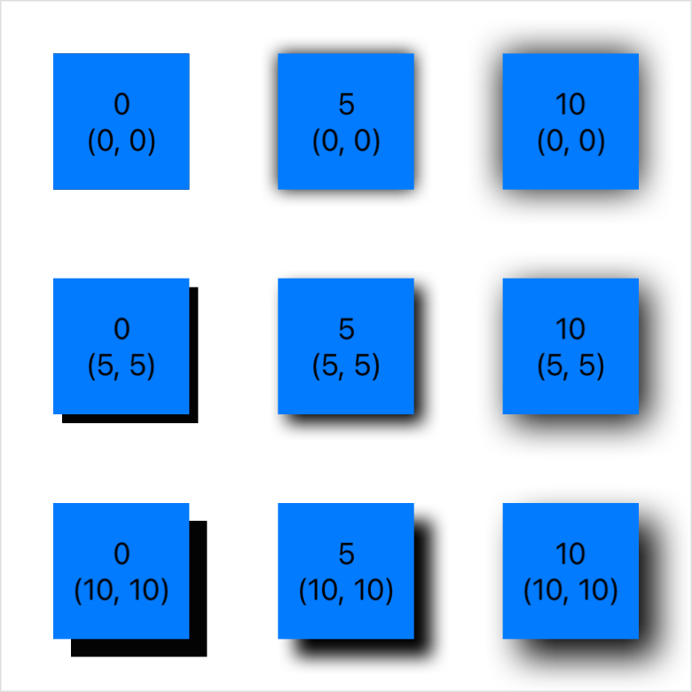

> Navigation: [Technologies](../../technologies.md) · [SwiftUI](../../swiftui.md) · [View](../view.md)

# shadow(color:radius:x:y:)

<sub>Instance Method</sub>

Adds a shadow to this view.

<sub>iOS, iPadOS, Mac Catalyst, macOS, tvOS, visionOS, watchOS</sub>

```swift
nonisolated func shadow(color: Color = Color(.sRGBLinear, white: 0, opacity: 0.33), radius: CGFloat, x: CGFloat = 0, y: CGFloat = 0) -> some View

```

## Parameters

- `color` — The shadow’s color.

- `radius` — A measure of how much to blur the shadow. Larger values result in more blur.

- `x` — An amount to offset the shadow horizontally from the view.

- `y` — An amount to offset the shadow vertically from the view.

## Return Value

A view that adds a shadow to this view.

## Discussion

Use this modifier to add a shadow of a specified color behind a view. You can offset the shadow from its view independently in the horizontal and vertical dimensions using the `x` and `y` parameters. You can also blur the edges of the shadow using the `radius` parameter. Use a radius of zero to create a sharp shadow. Larger radius values produce softer shadows.

The example below creates a grid of boxes with varying offsets and blur. Each box displays its radius and offset values for reference.

```swift
struct Shadow: View {
    let steps = [0, 5, 10]

    var body: some View {
        VStack(spacing: 50) {
            ForEach(steps, id: \.self) { offset in
                HStack(spacing: 50) {
                    ForEach(steps, id: \.self) { radius in
                        Color.blue
                            .shadow(
                                color: .primary,
                                radius: CGFloat(radius),
                                x: CGFloat(offset), y: CGFloat(offset))
                            .overlay {
                                VStack {
                                    Text("\(radius)")
                                    Text("(\(offset), \(offset))")
                                }
                            }
                    }
                }
            }
        }
    }
}
```



The example above uses [primary](../color/primary.md) as the color to make the shadow easy to see for the purpose of illustration. In practice, you might prefer something more subtle, like [gray](../color/gray.md). If you don’t specify a color, the method uses a semi-transparent black.

## See Also

### Applying blur and shadows

- [blur(radius:opaque:)](<blur(radius_opaque_).md>) — Applies a Gaussian blur to this view.
- [ColorMatrix](../colormatrix.md) — A matrix to use in an RGBA color transformation.
