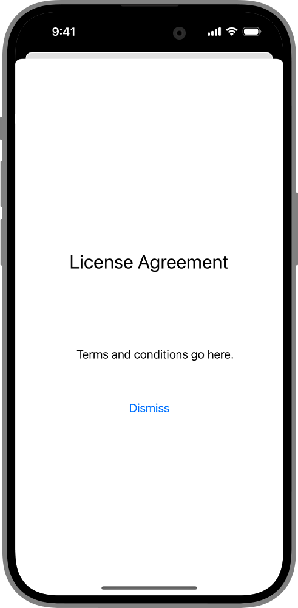

> Navigation: [Technologies](../../technologies.md) · [SwiftUI](../../swiftui.md) · [View](../view.md)

# sheet(isPresented:onDismiss:content:)

<sub>Instance Method</sub>

Presents a sheet when a binding to a Boolean value that you provide is true.

<sub>iOS, iPadOS, Mac Catalyst, macOS, tvOS, visionOS, watchOS</sub>

```swift
nonisolated func sheet<Content>(isPresented: Binding<Bool>, onDismiss: (() -> Void)? = nil, @ContentBuilder content: @escaping () -> Content) -> some View where Content : View

```

## Parameters

- `isPresented` — A binding to a Boolean value that determines whether to present the sheet that you create in the modifier’s `content` closure.

- `onDismiss` — The closure to execute when dismissing the sheet.

- `content` — A closure that returns the content of the sheet.

## Discussion

Use this method when you want to present a modal view to the user when a Boolean value you provide is true. The example below displays a modal view of the mockup for a software license agreement when the user toggles the `isShowingSheet` variable by clicking or tapping on the “Show License Agreement” button:

```swift
struct ShowLicenseAgreement: View {
    @State private var isShowingSheet = false
    var body: some View {
        Button(action: {
            isShowingSheet.toggle()
        }) {
            Text("Show License Agreement")
        }
        .sheet(isPresented: $isShowingSheet,
               onDismiss: didDismiss) {
            VStack {
                Text("License Agreement")
                    .font(.title)
                    .padding(50)
                Text("""
                        Terms and conditions go here.
                    """)
                    .padding(50)
                Button("Dismiss",
                       action: { isShowingSheet.toggle() })
            }
        }
    }

    func didDismiss() {
        // Handle the dismissing action.
    }
}
```



In vertically compact environments, such as iPhone in landscape orientation, a sheet presentation automatically adapts to appear as a full-screen cover. Use the [presentationCompactAdaptation(_:)](<presentationcompactadaptation(__).md>) or [presentationCompactAdaptation(horizontal:vertical:)](<presentationcompactadaptation(horizontal_vertical_).md>) modifier to override this behavior.

### Breakthrough effect

In visionOS, most system presentations appear with a breakthrough effect by default. To change how the enclosing presentation breaks through content occluding it, use [presentationBreakthroughEffect(_:)](<presentationbreakthrougheffect(__).md>), like in the following example:

```swift
.sheet(isPresented: $isShowingSheet,
       onDismiss: didDismiss) {
    VStack {
        Text("License Agreement")
            .font(.title)
            .padding(50)
        Text("""
                Terms and conditions go here.
            """)
            .padding(50)
        Button("Dismiss",
               action: { isShowingSheet.toggle() })
    }
    .presentationBreakthroughEffect(.prominent)
}
```

> [!note] Note
> Passing a `.none` value for a sheet has no effect.

## See Also

### Showing a sheet, cover, or popover

- [sheet(item:onDismiss:content:)](<sheet(item_ondismiss_content_).md>) — Presents a sheet using the given item as a data source for the sheet’s content.
- [fullScreenCover(isPresented:onDismiss:content:)](<fullscreencover(ispresented_ondismiss_content_).md>) — Presents a modal view that covers as much of the screen as possible when binding to a Boolean value you provide is true.
- [fullScreenCover(item:onDismiss:content:)](<fullscreencover(item_ondismiss_content_).md>) — Presents a modal view that covers as much of the screen as possible using the binding you provide as a data source for the sheet’s content.
- [popover(item:attachmentAnchor:arrowEdge:content:)](<popover(item_attachmentanchor_arrowedge_content_).md>) — Presents a popover using the given item as a data source for the popover’s content.
- [popover(isPresented:attachmentAnchor:arrowEdge:content:)](<popover(ispresented_attachmentanchor_arrowedge_content_).md>) — Presents a popover when a given condition is true.
- [PopoverAttachmentAnchor](../popoverattachmentanchor.md) — An attachment anchor for a popover.
