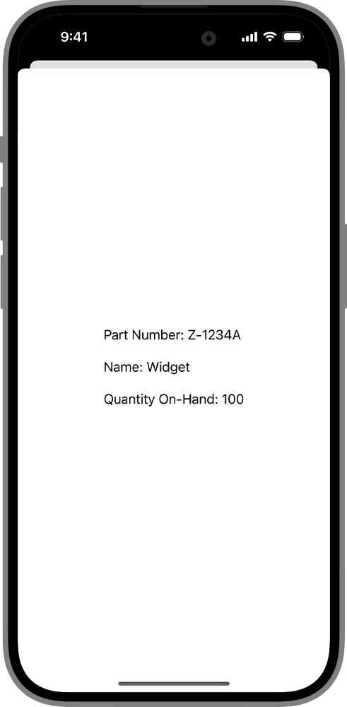

> Navigation: [Technologies](../../technologies.md) · [SwiftUI](../../swiftui.md) · [View](../view.md)

# sheet(item:onDismiss:content:)

<sub>Instance Method</sub>

Presents a sheet using the given item as a data source for the sheet’s content.

<sub>iOS, iPadOS, Mac Catalyst, macOS, tvOS, visionOS, watchOS</sub>

```swift
nonisolated func sheet<Item, Content>(item: Binding<Item?>, onDismiss: (() -> Void)? = nil, @ContentBuilder content: @escaping (Item) -> Content) -> some View where Item : Identifiable, Content : View

```

## Parameters

- `item` — A binding to an optional source of truth for the sheet. When `item` is non-`nil`, the system passes the item’s content to the modifier’s closure. You display this content in a sheet that you create that the system displays to the user. If `item` changes, the system dismisses the sheet and replaces it with a new one using the same process.

- `onDismiss` — The closure to execute when dismissing the sheet.

- `content` — A closure returning the content of the sheet.

## Discussion

Use this method when you need to present a modal view with content from a custom data source. The example below shows a custom data source `InventoryItem` that the `content` closure uses to populate the display the action sheet shows to the user:

```swift
struct ShowPartDetail: View {
    @State private var sheetDetail: InventoryItem?

    var body: some View {
        Button("Show Part Details") {
            sheetDetail = InventoryItem(
                id: "0123456789",
                partNumber: "Z-1234A",
                quantity: 100,
                name: "Widget")
        }
        .sheet(item: $sheetDetail,
               onDismiss: didDismiss) { detail in
            VStack(alignment: .leading, spacing: 20) {
                Text("Part Number: \(detail.partNumber)")
                Text("Name: \(detail.name)")
                Text("Quantity On-Hand: \(detail.quantity)")
            }
            .onTapGesture {
                sheetDetail = nil
            }
        }
    }

    func didDismiss() {
        // Handle the dismissing action.
    }
}

struct InventoryItem: Identifiable {
    var id: String
    let partNumber: String
    let quantity: Int
    let name: String
}
```



In vertically compact environments, such as iPhone in landscape orientation, a sheet presentation automatically adapts to appear as a full-screen cover. Use the [presentationCompactAdaptation(_:)](<presentationcompactadaptation(__).md>) or [presentationCompactAdaptation(horizontal:vertical:)](<presentationcompactadaptation(horizontal_vertical_).md>) modifier to override this behavior.

### Breakthrough effect

In visionOS, most system presentations appear with a breakthrough effect by default. To change how the enclosing presentation breaks through content occluding it, use [presentationBreakthroughEffect(_:)](<presentationbreakthrougheffect(__).md>), like in the following example:

```swift
.sheet(item: $sheetDetail,
       onDismiss: didDismiss) { detail in
    VStack(alignment: .leading, spacing: 20) {
        Text("Part Number: \(detail.partNumber)")
        Text("Name: \(detail.name)")
        Text("Quantity On-Hand: \(detail.quantity)")
    }
    .presentationBreakthroughEffect(.prominent)
    .onTapGesture {
        sheetDetail = nil
    }
}
```

> [!note] Note
> Passing a `.none` value for a sheet has no effect.

## See Also

### Showing a sheet, cover, or popover

- [sheet(isPresented:onDismiss:content:)](<sheet(ispresented_ondismiss_content_).md>) — Presents a sheet when a binding to a Boolean value that you provide is true.
- [fullScreenCover(isPresented:onDismiss:content:)](<fullscreencover(ispresented_ondismiss_content_).md>) — Presents a modal view that covers as much of the screen as possible when binding to a Boolean value you provide is true.
- [fullScreenCover(item:onDismiss:content:)](<fullscreencover(item_ondismiss_content_).md>) — Presents a modal view that covers as much of the screen as possible using the binding you provide as a data source for the sheet’s content.
- [popover(item:attachmentAnchor:arrowEdge:content:)](<popover(item_attachmentanchor_arrowedge_content_).md>) — Presents a popover using the given item as a data source for the popover’s content.
- [popover(isPresented:attachmentAnchor:arrowEdge:content:)](<popover(ispresented_attachmentanchor_arrowedge_content_).md>) — Presents a popover when a given condition is true.
- [PopoverAttachmentAnchor](../popoverattachmentanchor.md) — An attachment anchor for a popover.
