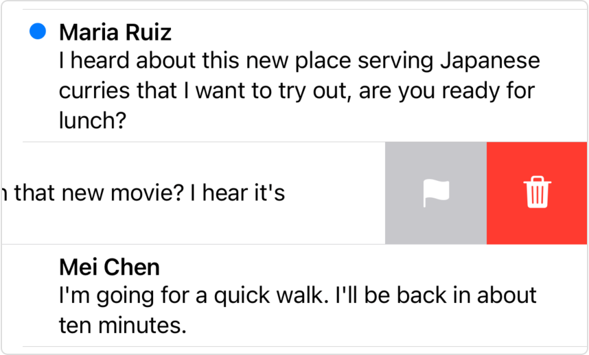
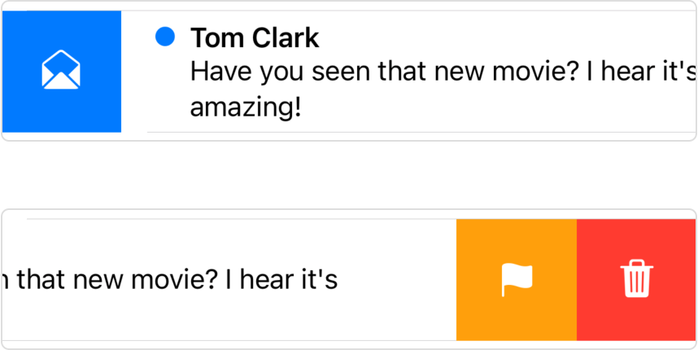

> Navigation: [Technologies](../../technologies.md) · [SwiftUI](../../swiftui.md) · [View](../view.md)

# swipeActions(edge:allowsFullSwipe:content:)

<sub>Instance Method</sub>

Adds custom swipe actions to a row in a list.

<sub>iOS, iPadOS, Mac Catalyst, macOS, visionOS, watchOS</sub>

```swift
nonisolated func swipeActions<T>(edge: HorizontalEdge = .trailing, allowsFullSwipe: Bool = true, @ContentBuilder content: () -> T) -> some View where T : View

```

## Parameters

- `edge` — The edge of the view to associate the swipe actions with. The default is [HorizontalEdge.trailing](../horizontaledge/trailing.md).

- `allowsFullSwipe` — A Boolean value that indicates whether a full swipe automatically performs the first action. The default is `true`.

- `content` — The content of the swipe actions.

## Discussion

Use this method to add swipe actions to a view that acts as a row in a list. Indicate the [HorizontalEdge](../horizontaledge.md) where the swipe action originates, and define individual actions with [Button](../button.md) instances. For example, if you have a list of messages, you can add an action to toggle a message as unread on a swipe from the leading edge, and actions to delete or flag messages on a trailing edge swipe:

```swift
List {
    ForEach(store.messages) { message in
        MessageCell(message: message)
            .swipeActions(edge: .leading) {
                Button { store.toggleUnread(message) } label: {
                    if message.isUnread {
                        Label("Read", systemImage: "envelope.open")
                    } else {
                        Label("Unread", systemImage: "envelope.badge")
                    }
                }
            }
            .swipeActions(edge: .trailing) {
                Button(role: .destructive) {
                    store.delete(message)
                } label: {
                    Label("Delete", systemImage: "trash")
                }
                Button { store.flag(message) } label: {
                    Label("Flag", systemImage: "flag")
                }
            }
        }
    }
}
```

Actions appear in the order you list them, starting from the swipe’s originating edge. In the example above, the Delete action appears closest to the screen’s trailing edge:



For labels or images that appear in swipe actions, SwiftUI automatically applies the [fill](../symbolvariants/fill-swift.type.property.md) symbol variant, as shown above.

By default, the user can perform the first action for a given swipe direction with a full swipe. For the example above, the user can perform both the toggle unread and delete actions with full swipes. You can opt out of this behavior for an edge by setting the `allowsFullSwipe` parameter to `false`. For example, you can disable the full swipe on the leading edge:

```swift
.swipeActions(edge: .leading, allowsFullSwipe: false) {
    Button { store.toggleUnread(message) } label: {
        if message.isUnread {
            Label("Read", systemImage: "envelope.open")
        } else {
            Label("Unread", systemImage: "envelope.badge")
        }
    }
}
```

When you set a role for a button using one of the values from the [ButtonRole](../buttonrole.md) enumeration, SwiftUI styles the button according to its role. In the example above, the delete action appears in [red](../shapestyle/red.md) because it has the [destructive](../buttonrole/destructive.md) role. If you want to set a different color — for example, to match the overall theme of your app’s UI — add the [tint(_:)](<tint(__).md>) modifier to the button:

```swift
MessageCell(message: message)
    .swipeActions(edge: .leading) {
        Button { store.toggleUnread(message) } label: {
            if message.isUnread {
                Label("Read", systemImage: "envelope.open")
            } else {
                Label("Unread", systemImage: "envelope.badge")
            }
        }
        .tint(.blue)
    }
    .swipeActions(edge: .trailing) {
        Button(role: .destructive) { store.delete(message) } label: {
            Label("Delete", systemImage: "trash")
        }
        Button { store.flag(message) } label: {
            Label("Flag", systemImage: "flag")
        }
        .tint(.orange)
    }
```

The modifications in the code above make the toggle unread action [blue](../shapestyle/blue.md) and the flag action [orange](../shapestyle/orange.md):



When you add swipe actions, SwiftUI no longer synthesizes the Delete actions that otherwise appear when using the `ForEach/onDelete(perform:)` method on a [ForEach](../foreach.md) instance. You become responsible for creating a Delete action, if appropriate, among your swipe actions.

Actions accumulate for a given edge if you call the modifier multiple times on the same list row view.

## See Also

### Configuring interaction

- [selectionDisabled(_:)](<selectiondisabled(__).md>) — Adds a condition that controls whether users can select this view.
- [listRowHoverEffect(_:)](<listrowhovereffect(__).md>) — Requests that the containing list row use the provided hover effect.
- [listRowHoverEffectDisabled(_:)](<listrowhovereffectdisabled(__).md>) — Requests that the containing list row have its hover effect disabled.
