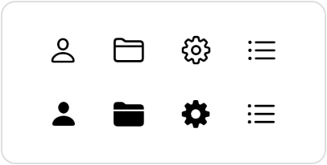
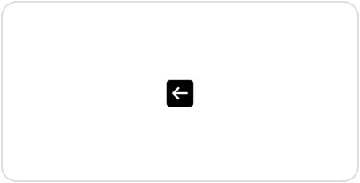

> Navigation: [Technologies](../../technologies.md) · [SwiftUI](../../swiftui.md) · [View](../view.md)

# symbolVariant(_:)

<sub>Instance Method</sub>

Makes symbols within the view show a particular variant.

<sub>iOS, iPadOS, Mac Catalyst, macOS, tvOS, visionOS, watchOS</sub>

```swift
nonisolated func symbolVariant(_ variant: SymbolVariants) -> some View

```

## Parameters

- `variant` — The variant to use for symbols. Use the values in [SymbolVariants](../symbolvariants.md).

## Return Value

A view that applies the specified symbol variant or variants to itself and its child views.

## Discussion

When you want all the [SF Symbols](../../design/human-interface-guidelines/sf-symbols.md) in a part of your app’s user interface to use the same variant, use the `symbolVariant(_:)` modifier with a [SymbolVariants](../symbolvariants.md) value, like [fill](../symbolvariants/fill-swift.type.property.md):

```swift
VStack(spacing: 20) {
    HStack(spacing: 20) {
        Image(systemName: "person")
        Image(systemName: "folder")
        Image(systemName: "gearshape")
        Image(systemName: "list.bullet")
    }

    HStack(spacing: 20) {
        Image(systemName: "person")
        Image(systemName: "folder")
        Image(systemName: "gearshape")
        Image(systemName: "list.bullet")
    }
    .symbolVariant(.fill) // Shows filled variants, when available.
}
```

A symbol that doesn’t have the specified variant remains unaffected. In the example above, the `list.bullet` symbol doesn’t have a filled variant, so the `symbolVariant(_:)` modifer has no effect.



If you apply the modifier more than once, its effects accumulate. Alternatively, you can apply multiple variants in one call:

```swift
Label("Airplane", systemImage: "airplane.circle.fill")

Label("Airplane", systemImage: "airplane")
    .symbolVariant(.circle)
    .symbolVariant(.fill)

Label("Airplane", systemImage: "airplane")
    .symbolVariant(.circle.fill)
```

All of the labels in the code above produce the same output:


You can apply all these variants in any order, but if you apply more than one shape variant, the one closest to the symbol takes precedence. For example, the following image uses the [square](../symbolvariants/square-swift.type.property.md) shape:

```swift
Image(systemName: "arrow.left")
    .symbolVariant(.square) // This shape takes precedence.
    .symbolVariant(.circle)
    .symbolVariant(.fill)
```



To cause a symbol to ignore the variants currently in the environment, directly set the [symbolVariants](../environmentvalues/symbolvariants.md) environment value to [none](../symbolvariants/none.md) using the [environment(_:_:)](<environment(____).md>) modifer.

## See Also

### Setting a symbol variant

- [symbolVariants](../environmentvalues/symbolvariants.md) — The symbol variant to use in this environment.
- [SymbolVariants](../symbolvariants.md) — A variant of a symbol.
