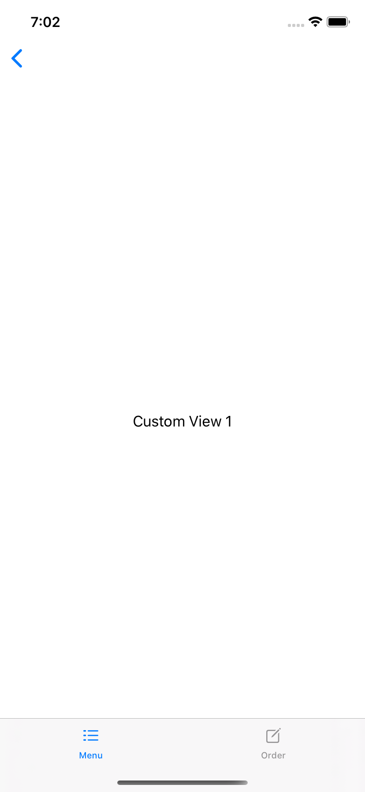

> Navigation: [Technologies](../../technologies.md) · [SwiftUI](../../swiftui.md) · [View](../view.md)

# tabItem(_:)

<sub>Instance Method</sub>

Sets the tab bar item associated with this view.

> [!warning] Deprecated
> Use `Tab(title:image:value:content:)` and related initializers instead

<sub>iOS, iPadOS, Mac Catalyst, macOS, tvOS, visionOS, watchOS</sub>

```swift
nonisolated func tabItem<V>(@ContentBuilder _ label: () -> V) -> some View where V : View

```

## Parameters

- `label` — The tab bar item to associate with this view.

## Discussion

Use `tabItem(_:)` to configure a view as a tab bar item in a [TabView](../tabview.md). The example below adds two views as tabs in a [TabView](../tabview.md):

```swift
struct View1: View {
    var body: some View {
        Text("View 1")
    }
}

struct View2: View {
    var body: some View {
        Text("View 2")
    }
}

struct TabItem: View {
    var body: some View {
        TabView {
            View1()
                .tabItem {
                    Label("Menu", systemImage: "list.dash")
                }

            View2()
                .tabItem {
                    Label("Order", systemImage: "square.and.pencil")
                }
        }
    }
}
```



## See Also

### Deprecated Types

- [NavigationView](../navigationview.md) — A view for presenting a stack of views that represents a visible path in a navigation hierarchy. _(deprecated)_
