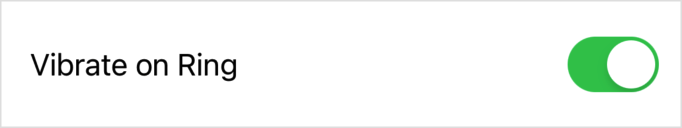
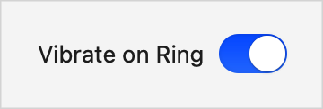
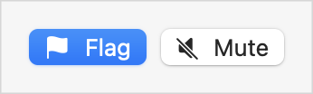
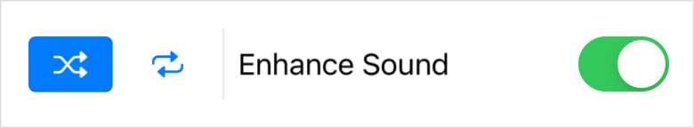
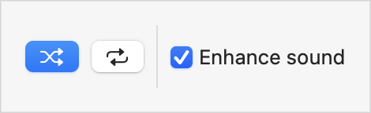

> Navigation: [Technologies](../../technologies.md) · [SwiftUI](../../swiftui.md) · [View](../view.md)

# toggleStyle(_:)

<sub>Instance Method</sub>

Sets the style for toggles in a view hierarchy.

<sub>iOS, iPadOS, Mac Catalyst, macOS, tvOS, visionOS, watchOS</sub>

```swift
nonisolated func toggleStyle<S>(_ style: S) -> some View where S : ToggleStyle

```

## Parameters

- `style` — The toggle style to set. Use one of the built-in values, like [switch](../togglestyle/switch.md) or [button](../togglestyle/button.md), or a custom style that you define by creating a type that conforms to the [ToggleStyle](../togglestyle.md) protocol.

## Return Value

A view that uses the specified toggle style for itself and its child views.

## Discussion

Use this modifier on a [Toggle](../toggle.md) instance to set a style that defines the control’s appearance and behavior. For example, you can choose the [switch](../togglestyle/switch.md) style:

```swift
Toggle("Vibrate on Ring", isOn: $vibrateOnRing)
    .toggleStyle(.switch)
```

Built-in styles typically have a similar appearance across platforms, tailored to the platform’s overall style:

| Platform | Appearance |
|---|---|
| iOS, iPadOS |   <sub>A screenshot of the text Vibrate on Ring appearing to the left of a toggle switch that’s on. The toggle’s tint color is green. The toggle and its text appear in a rounded rectangle.</sub> |
| macOS |   <sub>A screenshot of the text Vibrate on Ring appearing to the left of a toggle switch that’s on. The toggle’s tint color is blue. The toggle and its text appear on a neutral background.</sub> |

### Styling toggles in a hierarchy

You can set a style for all toggle instances within a view hierarchy by applying the style modifier to a container view. For example, you can apply the [button](../togglestyle/button.md) style to an [HStack](../hstack.md):

```swift
HStack {
    Toggle(isOn: $isFlagged) {
        Label("Flag", systemImage: "flag.fill")
    }
    Toggle(isOn: $isMuted) {
        Label("Mute", systemImage: "speaker.slash.fill")
    }
}
.toggleStyle(.button)
```

The example above has the following appearance when `isFlagged` is `true` and `isMuted` is `false`:

| Platform | Appearance |
|---|---|
| iOS, iPadOS |   <sub>A screenshot of two buttons arranged horizontally. The first has the image of a flag and is active with a blue tint. The second has an image of a speaker with a line through it and is inactive with a neutral tint.</sub> |
| macOS |   <sub>A screenshot of two buttons arranged horizontally. The first has the image of a flag and is active with a blue tint. The second has an image of a speaker with a line through it and is inactive with a neutral tint.</sub> |

### Automatic styling

If you don’t set a style, SwiftUI assumes a value of [automatic](../togglestyle/automatic.md), which corresponds to a context-specific default. Specify the automatic style explicitly to override a container’s style and revert to the default:

```swift
HStack {
    Toggle(isOn: $isShuffling) {
        Label("Shuffle", systemImage: "shuffle")
    }
    Toggle(isOn: $isRepeating) {
        Label("Repeat", systemImage: "repeat")
    }

    Divider()

    Toggle("Enhance Sound", isOn: $isEnhanced)
        .toggleStyle(.automatic) // Revert to the default style.
}
.toggleStyle(.button) // Use button style for toggles in the stack.
.labelStyle(.iconOnly) // Omit the title from any labels.
```

The style that SwiftUI uses as the default depends on both the platform and the context. In macOS, the default in most contexts is a [checkbox](../togglestyle/checkbox.md), while in iOS, the default toggle style is a [switch](../togglestyle/switch.md):

| Platform | Appearance |
|---|---|
| iOS, iPadOS |   <sub>A screenshot of several horizontally arranged items: two buttons, a vertical divider line, the text Enhance sound, and a switch. The first button has two right facing arrows that cross over in the middle and is active with a blue tint. The second button has one right and one left facing arrow and is inactive with neutral tint. The switch is on and has a green tint.</sub> |
| macOS |   <sub>A screenshot of several horizontally arranged items: two buttons, a vertical divider line, a checkbox, and the text Enhance sound. The first button has two right facing arrows that cross over in the middle and is active with a blue tint. The second button has one right and one left facing arrow and is inactive with a neutral tint. The check box is checked and has a blue tint.</sub> |

> [!note] Note
> Like toggle style does for toggles, the [labelStyle(_:)](<labelstyle(__).md>) modifier sets the style for [Label](../label.md) instances in the hierarchy. The example above demostrates the compact [iconOnly](../labelstyle/icononly.md) style, which is useful for button toggles in space-constrained contexts. Always include a descriptive title for better accessibility.

For more information about how SwiftUI chooses a default toggle style, see the [automatic](../togglestyle/automatic.md) style.

## See Also

### Getting numeric inputs

- [Slider](../slider.md) — A control for selecting a value from a bounded linear range of values.
- [Stepper](../stepper.md) — A control that performs increment and decrement actions.
- [Toggle](../toggle.md) — A control that toggles between on and off states.
