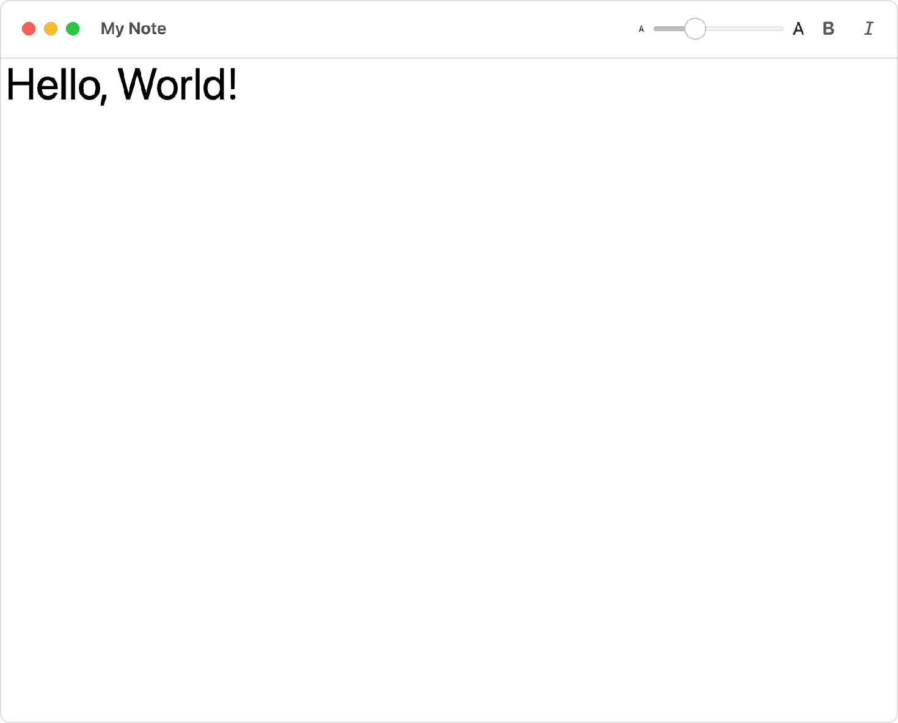

> Navigation: [Technologies](../../technologies.md) · [SwiftUI](../../swiftui.md) · [View](../view.md)

# toolbar(content:)

<sub>Instance Method</sub>

Populates the toolbar or navigation bar with the specified items.

<sub>iOS, iPadOS, Mac Catalyst, macOS, tvOS, visionOS, watchOS</sub>

```swift
nonisolated func toolbar<Content>(@ContentBuilder content: () -> Content) -> some View where Content : ToolbarContent

```

## Parameters

- `content` — The items representing the content of the toolbar.

## Discussion

Use this method to populate a toolbar with a collection of views that you provide to a toolbar content builder.

The toolbar modifier expects a collection of toolbar items which you can provide either by supplying a collection of views with each view wrapped in a [ToolbarItem](../toolbaritem.md), or by providing a collection of views as a [ToolbarItemGroup](../toolbaritemgroup.md). The example below uses a collection of [ToolbarItem](../toolbaritem.md) views to create a macOS toolbar that supports text editing features:

```swift
struct StructToolbarItemGroupView: View {
    @State private var text = ""
    @State private var bold = false
    @State private var italic = false
    @State private var fontSize = 12.0

    var displayFont: Font {
        let font = Font.system(size: CGFloat(fontSize),
                               weight: bold == true ? .bold : .regular)
        return italic == true ? font.italic() : font
    }

    var body: some View {
        TextEditor(text: $text)
            .font(displayFont)
            .toolbar {
                ToolbarItemGroup {
                    Slider(
                        value: $fontSize,
                        in: 8...120,
                        minimumValueLabel:
                            Text("A").font(.system(size: 8)),
                        maximumValueLabel:
                            Text("A").font(.system(size: 16))
                    ) {
                        Text("Font Size (\(Int(fontSize)))")
                    }
                    .frame(width: 150)
                    Toggle(isOn: $bold) {
                        Image(systemName: "bold")
                    }
                    Toggle(isOn: $italic) {
                        Image(systemName: "italic")
                    }
                }
            }
            .navigationTitle("My Note")
    }
}
```



Although it’s not mandatory, wrapping a related group of toolbar items together in a [ToolbarItemGroup](../toolbaritemgroup.md) provides a one-to-one mapping between controls and toolbar items which results in the correct layout and spacing on each platform. For design guidance on toolbars, see [Toolbars](../../design/human-interface-guidelines/toolbars.md) in the Human Interface Guidelines.

## See Also

### Populating a toolbar

- [ToolbarItem](../toolbaritem.md) — A model that represents an item which can be placed in the toolbar or navigation bar.
- [ToolbarItemGroup](../toolbaritemgroup.md) — A model that represents a group of `ToolbarItem`s which can be placed in the toolbar or navigation bar.
- [ToolbarItemPlacement](../toolbaritemplacement.md) — A structure that defines the placement of a toolbar item.
- [toolbarOverflowMenu(content:)](<toolbaroverflowmenu(content_).md>) — Configures the overflow menu of a toolbar. _(beta)_
- [ToolbarOverflowMenu](../toolbaroverflowmenu.md) — The overflow menu of a toolbar. _(beta)_
- [ToolbarContent](../toolbarcontent.md) — Conforming types represent items that can be placed in various locations in a toolbar.
- [ToolbarContentBuilder](../toolbarcontentbuilder.md) — Constructs a toolbar item set from multi-expression closures.
- [ToolbarSpacer](../toolbarspacer.md) — A standard space item in toolbars.
- [DefaultToolbarItem](../defaulttoolbaritem.md) — A toolbar item that represents a system component.
