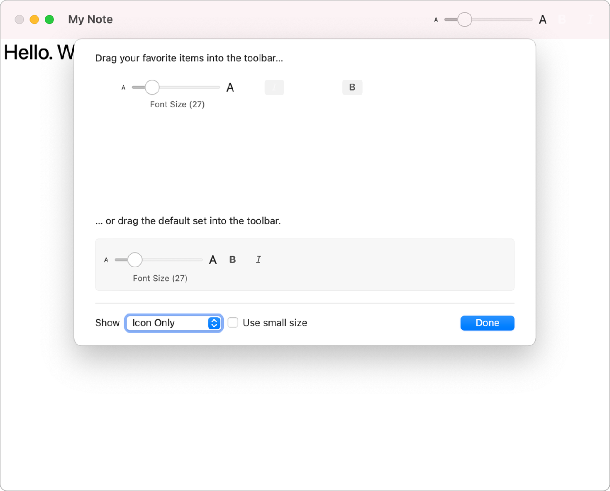
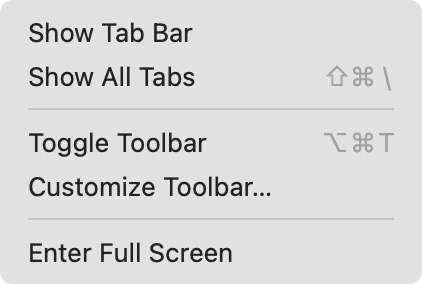

> Navigation: [Technologies](../../technologies.md) · [SwiftUI](../../swiftui.md) · [View](../view.md)

# toolbar(id:content:)

<sub>Instance Method</sub>

Populates the toolbar or navigation bar with the specified items, allowing for user customization.

<sub>iOS, iPadOS, Mac Catalyst, macOS, tvOS, visionOS, watchOS</sub>

```swift
nonisolated func toolbar<Content>(id: String, @ContentBuilder content: () -> Content) -> some View where Content : CustomizableToolbarContent

```

## Parameters

- `id` — A unique identifier for this toolbar.

- `content` — The content representing the content of the toolbar.

## Discussion

Use this modifier when you want to allow the user to customize the components and layout of elements in the toolbar. The toolbar modifier expects a collection of toolbar items which you can provide either by supplying a collection of views with each view wrapped in a [ToolbarItem](../toolbaritem.md).

> [!note] Note
> Customizable toolbars will be displayed on both macOS and iOS, but only apps running on iPadOS 16.0 and later will support user customization.

The example below creates a view that represents each [ToolbarItem](../toolbaritem.md) along with an ID that uniquely identifies the toolbar item to the customization editor:

```swift
struct ToolsEditorView: View {
    @State private var text = ""
    @State private var bold = false
    @State private var italic = false
    @State private var fontSize = 12.0

    var displayFont: Font {
        let font = Font.system(
           size: CGFloat(fontSize),
             weight: bold == true ? .bold : .regular)
        return italic == true ? font.italic() : font
    }

    var body: some View {
        TextEditor(text: $text)
            .font(displayFont)
            .toolbar(id: "editingtools") {
                ToolbarItem(
                    id: "sizeSelector", placement: .secondaryAction
                ) {
                    Slider(
                        value: $fontSize,
                        in: 8...120,
                        minimumValueLabel:
                            Text("A").font(.system(size: 8)),
                        maximumValueLabel:
                            Text("A").font(.system(size: 16))
                    ) {
                        Text("Font Size (\(Int(fontSize)))")
                    }
                    .frame(width: 150)
                }
                ToolbarItem(
                    id: "bold", placement: .secondaryAction
                ) {
                    Toggle(isOn: $bold) {
                        Image(systemName: "bold")
                    }
                }
                ToolbarItem(
                    id: "italic", placement: .secondaryAction
                ) {
                    Toggle(isOn: $italic) {
                        Image(systemName: "italic")
                    }
                }
            }
            .navigationTitle("My Note")
    }
}
```



> [!note] Note
> Only [secondaryAction](../toolbaritemplacement/secondaryaction.md) items support customization in iPadOS. Other items follow the normal placement rules and can’t be customized by the user.

In macOS you can enable menu support for toolbar customization by adding a [ToolbarCommands](../toolbarcommands.md) instance to a scene using the [commands(content:)](<../scene/commands(content_).md>) scene modifier:

```swift
@main
struct ToolbarContent_macOSApp: App {
    var body: some Scene {
        WindowGroup {
            ToolsEditorView()
                .frame(maxWidth: .infinity, maxHeight: .infinity)
        }
        .commands {
            ToolbarCommands()
        }
    }
}
```

When you add the toolbar commands, the system adds a menu item to your app’s main menu to provide toolbar customization support. This is in addition to the ability to Control-click on the toolbar to open the toolbar customization editor.



## See Also

### Populating a customizable toolbar

- [toolbarItemHidden(_:)](<toolbaritemhidden(__).md>) — Hides an individual view within a control group toolbar item.
- [CustomizableToolbarContent](../customizabletoolbarcontent.md) — Conforming types represent items that can be placed in various locations in a customizable toolbar.
- [ToolbarCustomizationBehavior](../toolbarcustomizationbehavior.md) — The customization behavior of customizable toolbar content.
- [ToolbarCustomizationOptions](../toolbarcustomizationoptions.md) — Options that influence the default customization behavior of customizable toolbar content.
- [SearchToolbarBehavior](../searchtoolbarbehavior.md) — The behavior of a search field in a toolbar.
