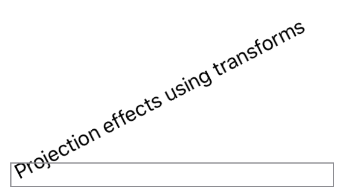

> Navigation: [Technologies](../../technologies.md) · [SwiftUI](../../swiftui.md) · [View](../view.md)

# transformEffect(_:)

<sub>Instance Method</sub>

Applies an affine transformation to this view’s rendered output.

<sub>iOS, iPadOS, Mac Catalyst, macOS, tvOS, visionOS, watchOS</sub>

```swift
nonisolated func transformEffect(_ transform: CGAffineTransform) -> some View

```

## Parameters

- `transform` — A [CGAffineTransform](../../corefoundation/cgaffinetransform.md) to apply to the view.

## Discussion

Use `transformEffect(_:)` to rotate, scale, translate, or skew the output of the view according to the provided [CGAffineTransform](../../corefoundation/cgaffinetransform.md).

In the example below, the text is rotated at -30˚ on the `y` axis.

```swift
let transform = CGAffineTransform(rotationAngle: -30 * (.pi / 180))

Text("Projection effect using transforms")
    .transformEffect(transform)
    .border(Color.gray)
```



## See Also

### Scaling, rotating, or transforming a view

- [scaledToFill()](<scaledtofill().md>) — Scales this view to fill its parent.
- [scaledToFit()](<scaledtofit().md>) — Scales this view to fit its parent.
- [scaleEffect(_:anchor:)](<scaleeffect(__anchor_).md>) — Scales this view uniformly by the specified factor, relative to an anchor point.
- [scaleEffect(x:y:anchor:)](<scaleeffect(x_y_anchor_).md>) — Scales this view’s rendered output by the given horizontal and vertical amounts, relative to an anchor point.
- [scaleEffect(x:y:z:anchor:)](<scaleeffect(x_y_z_anchor_).md>) — Scales this view by the specified horizontal, vertical, and depth factors, relative to an anchor point.
- [aspectRatio(_:contentMode:)](<aspectratio(__contentmode_).md>) — Constrains this view’s dimensions to the specified aspect ratio.
- [rotationEffect(_:anchor:)](<rotationeffect(__anchor_).md>) — Rotates a view’s rendered output in two dimensions around the specified point.
- [rotation3DEffect(_:axis:anchor:anchorZ:perspective:)](<rotation3deffect(__axis_anchor_anchorz_perspective_).md>) — Renders a view’s content as if it’s rotated in three dimensions around the specified axis.
- [perspectiveRotationEffect(_:axis:anchor:anchorZ:perspective:)](<perspectiverotationeffect(__axis_anchor_anchorz_perspective_).md>) — Renders a view’s content as if it’s rotated in three dimensions around the specified axis.
- [rotation3DEffect(_:anchor:)](<rotation3deffect(__anchor_).md>) — Rotates the view’s content by the specified 3D rotation value.
- [rotation3DEffect(_:axis:anchor:)](<rotation3deffect(__axis_anchor_).md>) — Rotates the view’s content by an angle about an axis that you specify as a tuple of elements.
- [transform3DEffect(_:)](<transform3deffect(__).md>) — Applies a 3D transformation to this view’s rendered output.
- [projectionEffect(_:)](<projectioneffect(__).md>) — Applies a projection transformation to this view’s rendered output.
- [ProjectionTransform](../projectiontransform.md)
- [ContentMode](../contentmode.md) — Constants that define how a view’s content fills the available space.
