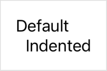

> Navigation: [Technologies](../technologies.md) · [SwiftUI](../swiftui.md)

# ViewDimensions

<sub>Structure</sub>

A view’s size and alignment guides in its own coordinate space.

<sub>iOS, iPadOS, Mac Catalyst, macOS, tvOS, visionOS, watchOS</sub>

```swift
struct ViewDimensions
```

## Overview

This structure contains the size and alignment guides of a view. You receive an instance of this structure to use in a variety of layout calculations, like when you:

- Define a default value for a custom alignment guide; see [defaultValue(in:)](<alignmentid/defaultvalue(in_).md>).
- Modify an alignment guide on a view; see [alignmentGuide(_:computeValue:)](<view/alignmentguide(__computevalue_).md>).
- Ask for the dimensions of a subview of a custom view layout; see [dimensions(in:)](<layoutsubview/dimensions(in_).md>).

### Custom alignment guides

You receive an instance of this structure as the `context` parameter to the [defaultValue(in:)](<alignmentid/defaultvalue(in_).md>) method that you implement to produce the default offset for an alignment guide, or as the first argument to the closure you provide to the [alignmentGuide(_:computeValue:)](<view/alignmentguide(__computevalue_).md>) view modifier to override the default calculation for an alignment guide. In both cases you can use the instance, if helpful, to calculate the offset for the guide. For example, you could compute a default offset for a custom [VerticalAlignment](verticalalignment.md) as a fraction of the view’s [height](viewdimensions/height.md):

```swift
private struct FirstThirdAlignment: AlignmentID {
    static func defaultValue(in context: ViewDimensions) -> CGFloat {
        context.height / 3
    }
}

extension VerticalAlignment {
    static let firstThird = VerticalAlignment(FirstThirdAlignment.self)
}
```

As another example, you could use the view dimensions instance to look up the offset of an existing guide and modify it:

```swift
struct ViewDimensionsOffset: View {
    var body: some View {
        VStack(alignment: .leading) {
            Text("Default")
            Text("Indented")
                .alignmentGuide(.leading) { context in
                    context[.leading] - 10
                }
        }
    }
}
```

The example above indents the second text view because the subtraction moves the second text view’s leading guide in the negative x direction, which is to the left in the view’s coordinate space. As a result, SwiftUI moves the second text view to the right, relative to the first text view, to keep their leading guides aligned:



### Layout direction

The discussion above describes a left-to-right language environment, but you don’t change your guide calculation to operate in a right-to-left environment. SwiftUI moves the view’s origin from the left to the right side of the view and inverts the positive x direction. As a result, the existing calculation produces the same effect, but in the opposite direction.

You can see this if you use the [environment(_:_:)](<view/environment(____).md>) modifier to set the [layoutDirection](environmentvalues/layoutdirection.md) property for the view that you defined above:

```swift
ViewDimensionsOffset()
    .environment(\.layoutDirection, .rightToLeft)
```

With no change in your guide, this produces the desired effect — it indents the second text view’s right side, relative to the first text view’s right side. The leading edge is now on the right, and the direction of the offset is reversed:


## Relationships

- **Conforms To**: [Equatable](../swift/equatable.md)

## Topics

### Getting dimensions

- [height](viewdimensions/height.md) — The view’s height.
- [width](viewdimensions/width.md) — The view’s width.

### Accessing guide values

- [subscript(_:)](<viewdimensions/subscript(__).md>) — Gets the value of the given horizontal guide.
- [subscript(explicit:)](<viewdimensions/subscript(explicit_).md>) — Gets the explicit value of the given horizontal alignment guide.

## See Also

### Aligning views

- [Aligning views within a stack](aligning-views-within-a-stack.md) — Position views inside a stack using alignment guides.
- [Aligning views across stacks](aligning-views-across-stacks.md) — Create a custom alignment and use it to align views across multiple stacks.
- [alignmentGuide(_:computeValue:)](<view/alignmentguide(__computevalue_).md>) — Sets the view’s horizontal alignment.
- [Alignment](alignment.md) — An alignment in both axes.
- [HorizontalAlignment](horizontalalignment.md) — An alignment position along the horizontal axis.
- [VerticalAlignment](verticalalignment.md) — An alignment position along the vertical axis.
- [DepthAlignment](depthalignment.md) — An alignment position along the depth axis.
- [AlignmentID](alignmentid.md) — A type that you use to create custom alignment guides.
- [ViewDimensions3D](viewdimensions3d.md) — A view’s 3D size and alignment guides in its own coordinate space.
- [SpatialContainer](spatialcontainer.md) — A layout container that aligns overlapping content in 3D space.
