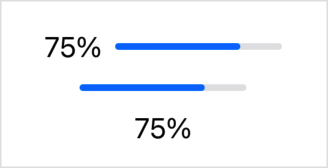

> Navigation: [Technologies](../technologies.md) · [SwiftUI](../swiftui.md)

# ViewThatFits

<sub>Structure</sub>

A view that adapts to the available space by providing the first child view that fits.

<sub>iOS, iPadOS, Mac Catalyst, macOS, tvOS, visionOS, watchOS</sub>

```swift
@frozen nonisolated struct ViewThatFits<Content> where Content : View
```

## Overview

`ViewThatFits` evaluates its child views in the order you provide them to the initializer. It selects the first child whose ideal size on the constrained axes fits within the proposed size. This means that you provide views in order of preference. Usually this order is largest to smallest, but since a view might fit along one constrained axis but not the other, this isn’t always the case. By default, `ViewThatFits` constrains in both the horizontal and vertical axes.

The following example shows an `UploadProgressView` that uses `ViewThatFits` to display the upload progress in one of three ways. In order, it attempts to display:

- An [HStack](hstack.md) that contains a [Text](text.md) view and a [ProgressView](progressview.md).
- Only the `ProgressView`.
- Only the `Text` view.

The progress views are fixed to a 100-point width.

```swift
struct UploadProgressView: View {
    var uploadProgress: Double

    var body: some View {
        ViewThatFits(in: .horizontal) {
            HStack {
                Text("\(uploadProgress.formatted(.percent))")
                ProgressView(value: uploadProgress)
                    .frame(width: 100)
            }
            ProgressView(value: uploadProgress)
                .frame(width: 100)
            Text("\(uploadProgress.formatted(.percent))")
        }
    }
}
```

This use of `ViewThatFits` evaluates sizes only on the horizontal axis. The following code fits the `UploadProgressView` to several fixed widths:

```swift
VStack {
    UploadProgressView(uploadProgress: 0.75)
        .frame(maxWidth: 200)
    UploadProgressView(uploadProgress: 0.75)
        .frame(maxWidth: 100)
    UploadProgressView(uploadProgress: 0.75)
        .frame(maxWidth: 50)
}
```



## Relationships

- **Conforms To**: [View](view.md)

## Topics

### Creating a view that fits

- [init(in:content:)](<viewthatfits/init(in_content_).md>) — Produces a view constrained in the given axes from one of several alternatives provided by a content builder.
