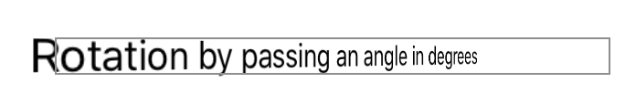

> Navigation: [Technologies](../../technologies.md) · [SwiftUI](../../swiftui.md) · [VisualEffect](../visualeffect.md)

# rotation3DEffect(_:axis:anchor:anchorZ:perspective:)

<sub>Instance Method</sub>

Renders content as if it’s rotated in three dimensions around the specified axis.

<sub>iOS, iPadOS, Mac Catalyst, macOS, tvOS, visionOS, watchOS</sub>

```swift
func rotation3DEffect(_ angle: Angle, axis: (x: CGFloat, y: CGFloat, z: CGFloat), anchor: UnitPoint = .center, anchorZ: CGFloat = 0, perspective: CGFloat = 1) -> some VisualEffect

```

## Parameters

- `angle` — The angle by which to rotate the content.

- `axis` — The axis of rotation, specified as a tuple with named elements for each of the three spatial dimensions.

- `anchor` — A two dimensional unit point within the content about which to perform the rotation. The default value is [center](../unitpoint/center.md).

- `anchorZ` — The location on the z-axis around which to rotate the content. The default is `0`.

- `perspective` — The relative vanishing point for the rotation. The default is `1`.

## Return Value

A rotation effect.

## Discussion

Use this method to create the effect of rotating a two dimensional view in three dimensions around a specified axis of rotation. The effect projects the rotated content onto the original content’s plane. Use the `perspective` input to control the renderer’s vanishing point. The following example creates the appearance of rotating text 45˚ about the y-axis:

```swift
Text("Rotation by passing an angle in degrees")
    .visualEffect { content, geometryProxy in
        content
            .rotation3DEffect(
                .degrees(45),
                axis: (x: 0.0, y: 1.0, z: 0.0),
                anchor: .center,
                anchorZ: 0,
                perspective: 1)
        }
    .border(Color.gray)
```



<sub>A screenshot of text in a grey box. The text says Rotation by passing an angle in degrees. The text is rendered in a way that makes it appear farther from the viewer on the right side and closer on the left, as if the text is angled to face someone sitting on the viewer’s right.</sub>

> [!important] Important
> In visionOS, create this effect with [perspectiveRotationEffect(_:axis:anchor:perspective:)](<perspectiverotationeffect(__axis_anchor_perspective_).md>) instead. To truly rotate a view in three dimensions, use a 3D rotation effect without a perspective input like [rotation3DEffect(_:axis:anchor:)](<rotation3deffect(__axis_anchor_).md>).

## See Also

### Rotating

- [rotationEffect(_:anchor:)](<rotationeffect(__anchor_).md>) — Rotates content in two dimensions around the specified point.
- [perspectiveRotationEffect(_:axis:anchor:perspective:)](<perspectiverotationeffect(__axis_anchor_perspective_).md>) — Renders content as if it’s rotated in three dimensions around the specified axis.
- [rotation3DEffect(_:anchor:)](<rotation3deffect(__anchor_).md>) — Rotates content by the specified 3D rotation value.
- [rotation3DEffect(_:axis:anchor:)](<rotation3deffect(__axis_anchor_).md>) — Rotates content by an angle about an axis that you specify as a rotation axis value.
