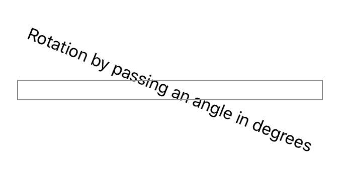

> Navigation: [Technologies](../../technologies.md) · [SwiftUI](../../swiftui.md) · [VisualEffect](../visualeffect.md)

# rotationEffect(_:anchor:)

<sub>Instance Method</sub>

Rotates content in two dimensions around the specified point.

<sub>iOS, iPadOS, Mac Catalyst, macOS, tvOS, visionOS, watchOS</sub>

```swift
func rotationEffect(_ angle: Angle, anchor: UnitPoint = .center) -> some VisualEffect

```

## Parameters

- `angle` — The angle by which to rotate the content.

- `anchor` — A unit point within the content about which to perform the rotation. The default value is [center](../unitpoint/center.md).

## Return Value

A rotation effect.

## Discussion

This effect rotates the content around the axis that points out of the xy-plane. It has no effect on the content’s frame. The following code rotates text by 22˚ and then draws a border around the modified view to show that the frame remains unchanged by the rotation:

```swift
Text("Rotation by passing an angle in degrees")
    .visualEffect { content, geometryProxy in
        content
            .rotationEffect(.degrees(22))
    }
    .border(Color.gray)
```



<sub>A screenshot of text and a wide grey box. The text says Rotation by passing an angle in degrees. The baseline of the text is rotated clockwise by 22 degrees relative to the box. The center of the box and the center of the text are aligned.</sub>

## See Also

### Rotating

- [rotation3DEffect(_:axis:anchor:anchorZ:perspective:)](<rotation3deffect(__axis_anchor_anchorz_perspective_).md>) — Renders content as if it’s rotated in three dimensions around the specified axis.
- [perspectiveRotationEffect(_:axis:anchor:perspective:)](<perspectiverotationeffect(__axis_anchor_perspective_).md>) — Renders content as if it’s rotated in three dimensions around the specified axis.
- [rotation3DEffect(_:anchor:)](<rotation3deffect(__anchor_).md>) — Rotates content by the specified 3D rotation value.
- [rotation3DEffect(_:axis:anchor:)](<rotation3deffect(__axis_anchor_).md>) — Rotates content by an angle about an axis that you specify as a rotation axis value.
