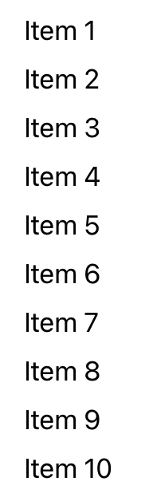

> Navigation: [Technologies](../technologies.md) · [SwiftUI](../swiftui.md)

# VStack

<sub>Structure</sub>

A view that arranges its subviews in a vertical line.

<sub>iOS, iPadOS, Mac Catalyst, macOS, tvOS, visionOS, watchOS</sub>

```swift
@frozen nonisolated struct VStack<Content> where Content : View
```

## Overview

Unlike [LazyVStack](lazyvstack.md), which only renders the views when your app needs to display them, a `VStack` renders the views all at once, regardless of whether they are on- or offscreen. Use the regular `VStack` when you have a small number of subviews or don’t want the delayed rendering behavior of the “lazy” version.

The following example shows a simple vertical stack of 10 text views:

```swift
var body: some View {
    VStack(
        alignment: .leading,
        spacing: 10
    ) {
        ForEach(
            1...10,
            id: \.self
        ) {
            Text("Item \($0)")
        }
    }
}
```



> [!note] Note
> If you need a vertical stack that conforms to the [Layout](layout.md) protocol, like when you want to create a conditional layout using [AnyLayout](anylayout.md), use [VStackLayout](vstacklayout.md) instead.

## Relationships

- **Conforms To**: [View](view.md)

## Topics

### Creating a stack

- [init(alignment:spacing:content:)](<vstack/init(alignment_spacing_content_).md>) — Creates an instance with the given spacing and horizontal alignment.

## See Also

### Statically arranging views in one dimension

- [Building layouts with stack views](building-layouts-with-stack-views.md) — Compose complex layouts from primitive container views.
- [HStack](hstack.md) — A view that arranges its subviews in a horizontal line.
