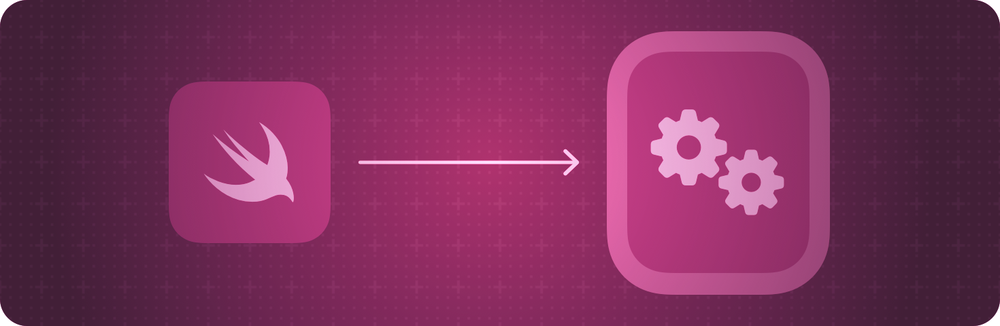

> Navigation: [Technologies](../technologies.md) · [SwiftUI](../swiftui.md)

# WatchKit integration

API Collection

Add WatchKit views to your SwiftUI app, or use SwiftUI views in your WatchKit app.

## Overview

Integrate SwiftUI with your app’s existing content using hosting controllers to add SwiftUI views into WatchKit interfaces. A hosting controller wraps a set of SwiftUI views in a form that you can then add to your storyboard-based app.

You can also add WatchKit views and view controllers to your SwiftUI interfaces. A representable object wraps the designated view or view controller, and facilitates communication between the wrapped object and your SwiftUI views.

For design guidance, see [Designing for watchOS](../design/human-interface-guidelines/designing-for-watchos.md) in the Human Interface Guidelines.

## Topics

### Displaying SwiftUI views in WatchKit

- [WKHostingController](wkhostingcontroller.md) — A WatchKit interface controller that hosts a SwiftUI view hierarchy.
- [WKUserNotificationHostingController](wkusernotificationhostingcontroller.md) — A WatchKit user notification interface controller that hosts a SwiftUI view hierarchy.

### Adding WatchKit views to SwiftUI view hierarchies

- [WKInterfaceObjectRepresentable](wkinterfaceobjectrepresentable.md) — A view that represents a WatchKit interface object.
- [WKInterfaceObjectRepresentableContext](wkinterfaceobjectrepresentablecontext.md) — Contextual information about the state of the system that you use to create and update your WatchKit interface object.

## See Also

### Framework integration

- [AppKit integration](appkit-integration.md) — Add AppKit views to your SwiftUI app, or use SwiftUI views in your AppKit app.
- [UIKit integration](uikit-integration.md) — Add UIKit views to your SwiftUI app, or use SwiftUI views in your UIKit app.
- [Technology-specific views](technology-specific-views.md) — Use SwiftUI views that other Apple frameworks provide.
