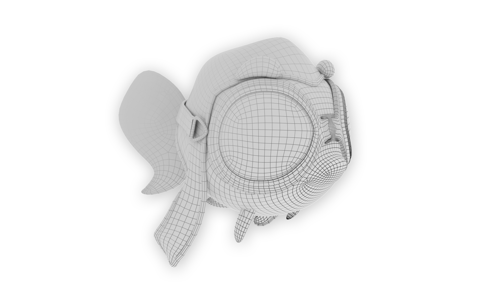
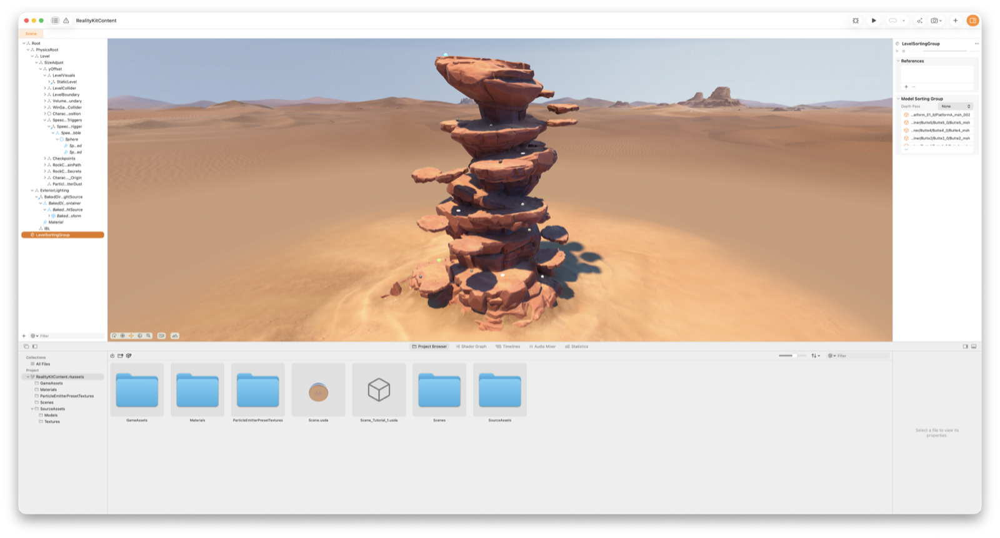
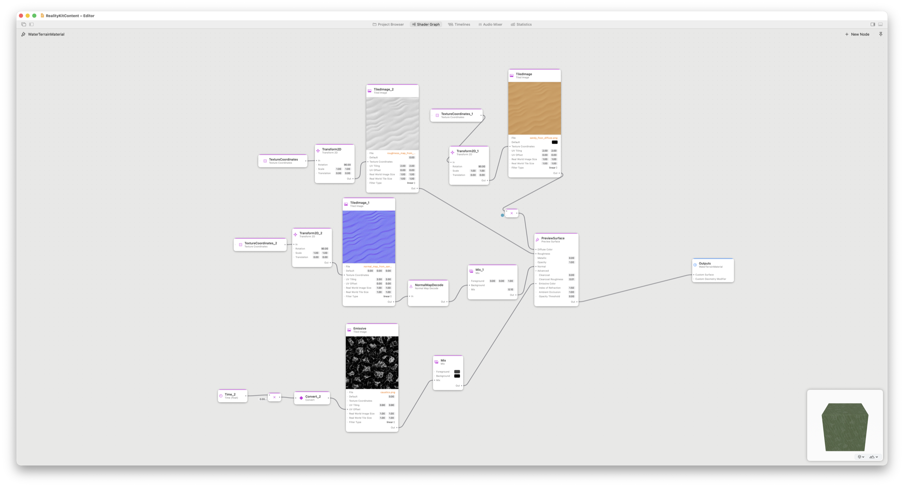

> Navigation: [Technologies](../technologies.md) · [Technology Overviews](../technologyoverviews.md) · [Graphics, drawing, and animation](graphics-drawing-and-animation.md)

# 3D content

Create 3D content and incorporate it into your app’s interface.

Build content in three dimensions when you want to create more realistic experiences. A game might use 3D content to immerse the player in a fabricated world that mimics the real one. A shopping app might let people view 3D versions of products from any angle, or use augmented reality to show how those products look in a person’s home.

On most Apple platforms, you build models in three dimensions and display them in a two-dimensional view. You can use industry-standard tools or Apple technologies to create your 3D models, but you use Apple-provided views to display those models in your app. In visionOS, apps can display content in 2D views, and also have access to [special views](../visionos/adding-3d-content-to-your-app.md) that present your models stereoscopically, making them appear three dimensional to the viewer.

## Build 3D objects for your scene

Start your exploration of 3D with content-creation apps, such as [Reality Composer Pro](../realitycomposerpro.md), which comes with the Xcode app. Use Reality Composer Pro to build spatial content from existing 3D models and simple shapes you add. Augment your scenes with additional content, such as particle effects, lighting, audio, and animation behaviors. Preview your content and optimize it for your app, and then export it to a package you can load directly into your app at runtime.

A screenshot of a scene in Reality Composer Pro. The scene depicts a desert landscape with a rock formation. The editor window shows the objects that comprise the scene. 

Reality Composer Pro also includes the [Shader Graph](../shadergraph.md) editor, which you use to create the custom materials you apply to your 3D models. Similar to _textures_, materials give your shapes their appearance. For example, you might create a material that imparts a metal appearance onto a shape. The editor’s node-based construction approach lets you create materials that use dynamic logic and stylized effects to produce the final results. This support for dynamic content gives you the ability to change the appearance of your content based on properties and values you control.

A screenshot of the Shader Graph editor in Reality Composer Pro. The editor shows a graph of nodes, and wires that manage the flow of data from one node to the next. The result is a texture that you can apply to an object in your 3d scene.

Apple technologies support many file formats for 3D content, but [Universal Scene Description](../usd.md) (USD) is the preferred format. USD is an efficient, scalable, and extensible system that assembles multiple meshes, textures, assets, and data into a single file to create virtual sets, scenes, shots, and worlds that you can load and render. Many apps export their content in the USD format, and you can also import the USD files you create using other apps directly into Reality Composer Pro.

## Display 3D content in your interface

Use [RealityKit](../realitykit.md) for managing and displaying 3D content in your app. RealityKit uses an [entity-component-system](../visionos/understanding-the-realitykit-modular-architecture.md) architecture to separate your 3D models from the behaviors and code you use to present and animate them in your app. The result is a high-performance 3D simulation and rendering system that displays your content and animates changes for you.

Build content for RealityKit programmatically or use [Reality Composer](https://apps.apple.com/us/app/reality-composer/id1462358802) or [Reality Composer Pro](../realitycomposerpro.md) to create scenes in advance. Present those scenes from your from a SwiftUI, UIKit, or AppKit interface using a special [view](../realitykit/realityview.md) that manages the RealityKit simulation.  When building apps for visionOS, you can also display your RealityKit content directly in a [person’s environment](../visionos/adding-3d-content-to-your-app.md). To animate your content, make changes to the components that govern the behavior of that content and let RealityKit apply those changes to the simulation. For example, use [physics components](../realitykit.md#Physics-simulation) to apply physical forces to your 3D models and animate their movement in your scene.

If you’re generating 3D content dynamically or need maximum performance, use [Metal](drawing-and-printing.md#Build-a-graphics-engine-using-Metal) to achieve 3D scenes with realistic lighting, textures, and even special effects like smoke, lens flares, motion blurs, and more. Metal gives you direct access to the GPU, putting you in control of what you render and when you render it. Build your own [rendering pipeline](../metal/gpu-devices-and-work-submission.md) and use the tightly integrated [graphics](../metal/render-passes.md) and [compute](../metal/compute-passes.md) APIs to build your content frame by frame. Incorporate machine learning, [ray tracing](../metal/ray-tracing-with-acceleration-structures.md), and many other features into your code to create incredible experiences. Use the suite of [Metal debugger](../xcode/metal-debugger.md) tools to debug and profile your Metal code.

## Place 3D content in the person’s environment

If you’re building an augmented reality app in iOS or iPadOS, the [ARKit framework](../arkit.md) offers a privacy-friendly way to integrate your 3D content into a person’s environment. After you add an [augmented reality view](../realitykit/arview.md) to your interface, use its [session](../arkit/managing-session-life-cycle-and-tracking-quality.md) object to start the cameras and display the results in the view. The session’s [configuration](../arkit/configuration-objects.md) determines what information it collects from the person’s environment. For example, a session might generate anchors for planar surfaces it discovers in the environment. When you attach your custom content to the session-provided anchors, the session displays your content in the view and updates its position in response to device movements.

To collect information about a person’s environment in a privacy friendly way, use the [RoomPlan](../roomplan.md) framework. RoomPlan is for apps that need to create a model of someone’s room to perform other tasks. For example, an interior decorating app might use this framework to collect room measurements and the position of furniture, appliances, doors, windows, and other room features. The framework delivers a 3D mesh to your app that you can use to recreate the room virtually.
