> Navigation: [Technologies](../technologies.md) · [Technology Overviews](../technologyoverviews.md) · [App design and UI](app-design-and-ui.md) · [Liquid Glass](liquid-glass.md)

# Adopting Liquid Glass

Find out how to bring the new material to your app.

## Overview

If you have an existing app, adopting Liquid Glass doesn’t mean reinventing your app from the ground up. Start by building your app in the latest version of Xcode to see the changes. As you review your app, use the following sections to understand the scope of changes and learn how you can adopt these best practices in your interface.


#### See your app with Liquid Glass

If your app uses standard components from SwiftUI, UIKit, or AppKit, your interface picks up the latest look and feel on the latest platform releases for iOS, iPadOS, macOS, tvOS, and watchOS. In Xcode, build your app with the latest SDKs, and run it on the latest platform releases to see the changes in your interface.

## Visual refresh

Interfaces across Apple platforms feature a new dynamic [material](../design/human-interface-guidelines/materials.md) called Liquid Glass, which combines the optical properties of glass with a sense of fluidity. This material forms a distinct functional layer for controls and navigation elements. It affects how the interface looks, feels, and moves, adapting in response to a variety of factors to help bring focus to the underlying content.

**Leverage system frameworks to adopt Liquid Glass automatically.** In system frameworks, standard components like bars, sheets, popovers, and controls automatically adopt this material. System frameworks also dynamically adapt these components in response to factors like element overlap and focus state. Take advantage of this material with minimal code by using standard components from SwiftUI, UIKit, and AppKit.

**Reduce your use of custom backgrounds in controls and navigation elements.** Any custom backgrounds and appearances you use in these elements might overlay or interfere with Liquid Glass or other effects that the system provides, such as the scroll edge effect. Make sure to check any custom backgrounds in elements like split views, tab bars, and toolbars. Prefer to remove custom effects and let the system determine the background appearance, especially for the following elements:

**SwiftUI**

[NavigationStack](../swiftui/navigationstack.md)

[NavigationSplitView](../swiftui/navigationsplitview.md)

[titleBar](../swiftui/windowstyle/titlebar.md)

[toolbar(content:)](<../swiftui/view/toolbar(content_).md>)

**UIKit**

[UINavigationBar](../uikit/uinavigationbar.md)

[UITabBar](../uikit/uitabbar.md)

[UIToolbar](../uikit/uitoolbar.md)

[UISplitViewController](../uikit/uisplitviewcontroller.md)

**AppKit**

[NSToolbar](../appkit/nstoolbar.md)

[NSSplitView](../appkit/nssplitview.md)

**Test your interface with a variety of display and accessibility settings.** Translucency and fluid morphing animations contribute to the look and feel of Liquid Glass, but can adapt to people’s needs. For example, people can choose a preferred look for Liquid Glass in their device’s settings, or turn on accessibility settings that reduce transparency or motion in the interface. These settings can remove or modify certain effects. If you use standard components from system frameworks, this experience adapts automatically. Ensure you test your app’s custom elements, colors, and animations with different configurations of these settings.

**Avoid overusing Liquid Glass effects.** If you apply Liquid Glass effects to a custom control, do so sparingly. Liquid Glass seeks to bring attention to the underlying content, and overusing this material in multiple custom controls can provide a subpar user experience by distracting from that content. Limit these effects to the most important functional elements in your app. To learn more, read [Applying Liquid Glass to custom views](../swiftui/applying-liquid-glass-to-custom-views.md).

**SwiftUI**

[glassEffect(_:in:)](<../swiftui/view/glasseffect(__in_).md>)

**UIKit**

[UIGlassEffect](../uikit/uiglasseffect.md)

**AppKit**

[NSGlassEffectView](../appkit/nsglasseffectview.md)

## App icons

[App icons](../design/human-interface-guidelines/app-icons.md) take on a design that’s dynamic and expressive. Updates to the icon grid result in a standardized iconography that’s visually consistent across devices and concentric with hardware and other elements across the system. App icons now contain layers, which dynamically respond to lighting and other visual effects the system provides. iOS, iPadOS, and macOS all now offer default (light), dark, clear, and tinted appearance variants, empowering people to personalize the look and feel of their Home Screen.

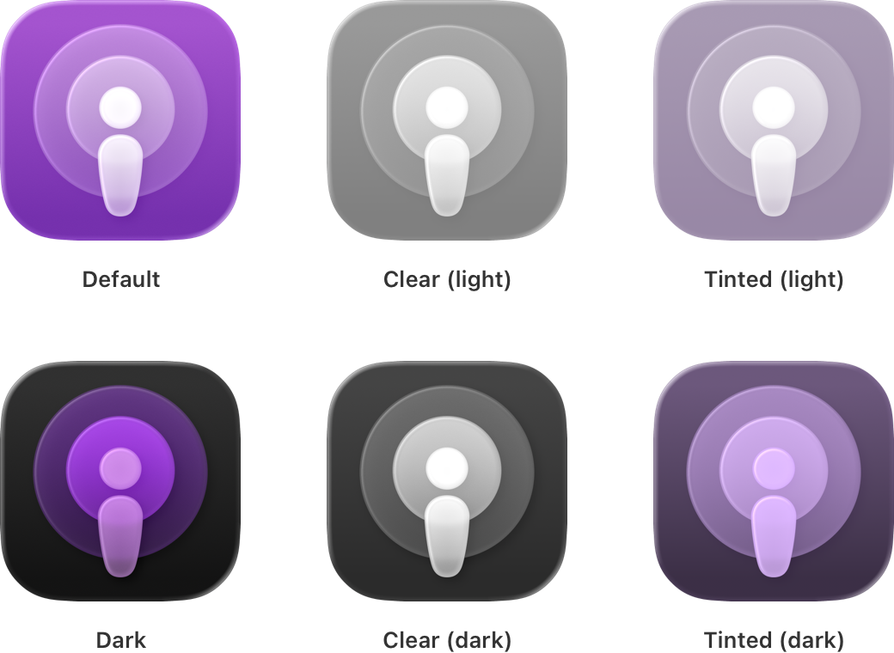

<sub>A grid showing the Podcasts app icon in the six style variants: default, dark, clear (light), clear (dark), tinted (light), and tinted (dark).</sub>

**Reimagine your app icon for Liquid Glass.** Apply key design principles to help your app icon shine:

- Provide a visually consistent, optically balanced design across the platforms your app supports.
- Consider a simplified design comprised of solid, filled, overlapping semi-transparent shapes.
- Let the system handle applying masking, blurring, and other visual effects, rather than factoring them into your design.

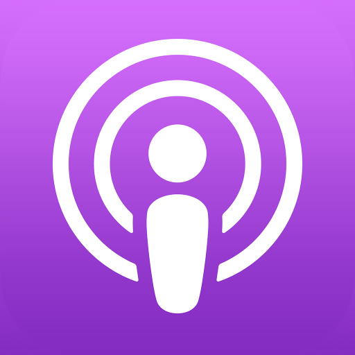

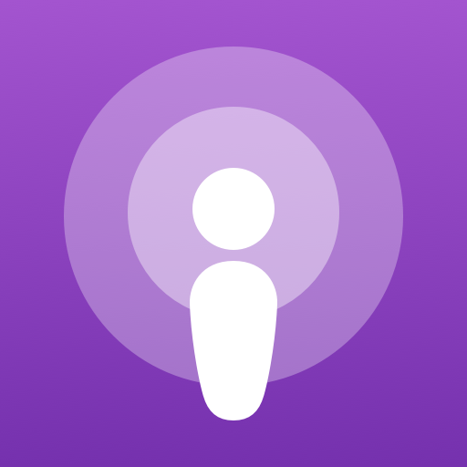

<sub>The Podcasts app icon in iOS using the default style, shown before applying system effects. The design of the icon uses solid filled shapes instead of outlines, and multiple layers of varying opacity.</sub>

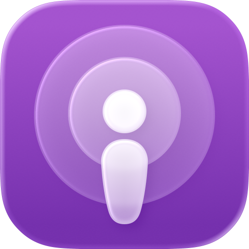

**Design using layers.** The system automatically applies effects like reflection, refraction, shadow, blur, and highlights to your icon layers. Determine which elements of your design make sense as foreground, middle, and background elements, then define separate layers for them. You can perform this task in the design app of your choice.

**Compose and preview in Icon Composer.** Drag and drop app icon layers that you export from your design app directly into the Icon Composer app. Icon Composer lets you add a background, create layer groupings, adjust layer attributes like opacity, and preview your design with system effects and appearances. Icon Composer is available in the latest version of Xcode and for download from [Apple Design Resources](https://developer.apple.com/design/resources/). To learn more, read [Creating your app icon using Icon Composer](../xcode/creating-your-app-icon-using-icon-composer.md).

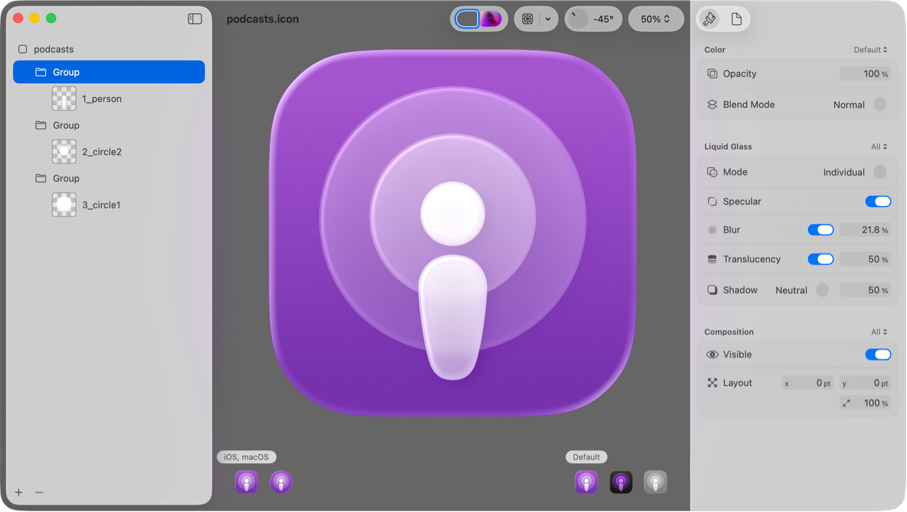

**Preview against the updated grids.** The system applies masking to produce your final icon shape — rounded rectangle for iOS, iPadOS, and macOS, and circular for watchOS. Keep elements centered to avoid clipping. Irregularly shaped icons receive a system-provided background. See how your app icon looks with the updated grids to determine whether you need to make adjustments. Download these grids from [Apple Design Resources](https://developer.apple.com/design/resources/).

## Controls

Controls have a refreshed look across platforms, and come to life when a person interacts with them. For controls like sliders and toggles, the knob transforms into Liquid Glass during interaction, and [buttons](../design/human-interface-guidelines/buttons.md) fluidly morph into menus and popovers. The shape of the hardware informs the curvature of controls, so many controls adopt rounder forms to elegantly nestle into the corners of windows and displays. Controls also feature an option for an extra-large size, allowing more space for labels and accents.

[A video showing a slider as its value changes during interaction.](https://docs-assets.developer.apple.com/published/3ccad20f7f520b572e170e5c8427c0ef/adoption-guide-slider.mp4)

[A video showing a segmented control as its selection changes during interaction between two segments: For You and Library.](https://docs-assets.developer.apple.com/published/4806dea0258ea62471842c0fbf18e005/adoption-guide-segmented-control.mp4)

**Review updates to control appearance and dimensions.** If you use standard controls from system frameworks and don’t hard-code their layout metrics, your app adopts changes to shapes and sizes automatically when you rebuild your app with the latest version of Xcode. Review changes to the following controls and any others and make sure they continue to look at home with the rest of your interface:

**SwiftUI**

[Button](../swiftui/button.md)

[Toggle](../swiftui/toggle.md)

[Slider](../swiftui/slider.md)

[Stepper](../swiftui/stepper.md)

[Picker](../swiftui/picker.md)

[TextField](../swiftui/textfield.md)

**UIKit**

[UIButton](../uikit/uibutton.md)

[UISwitch](../uikit/uiswitch.md)

[UISlider](../uikit/uislider.md)

[UIStepper](../uikit/uistepper.md)

[UISegmentedControl](../uikit/uisegmentedcontrol.md)

[UITextField](../uikit/uitextfield.md)

**AppKit**

[NSButton](../appkit/nsbutton.md)

[NSSwitch](../appkit/nsswitch.md)

[NSSlider](../appkit/nsslider.md)

[NSStepper](../appkit/nsstepper.md)

[NSSegmentedControl](../appkit/nssegmentedcontrol.md)

[NSTextField](../appkit/nstextfield.md)

**Review your use of color in controls.** Be judicious with your use of [color](../design/human-interface-guidelines/color.md) in controls and navigation so they stay legible. If you do apply color to these elements, leverage system colors, or define a custom color with light and dark variants, and an increased contrast option for each variant.

**Check for crowding or overlapping of controls.** Prefer to use standard spacing metrics instead of overriding them, and avoid overcrowding or layering Liquid Glass elements on top of each other.

**Optimize for legibility when content scrolls beneath controls.** Scroll views offer a [scroll edge effect](<../swiftui/view/scrolledgeeffectstyle(__for_).md>) that helps maintain sufficient legibility and contrast for controls by obscuring content that scrolls beneath them. System bars like toolbars adopt this behavior by default. If you use a custom bar with elements like controls, text, or icons that have content scrolling beneath them, you can register those views to use a scroll edge effect with these APIs:

**SwiftUI**

[safeAreaBar(edge:alignment:spacing:content:)](<../swiftui/view/safeareabar(edge_alignment_spacing_content_).md>)

**UIKit**

[UIScrollEdgeElementContainerInteraction](../uikit/uiscrolledgeelementcontainerinteraction.md)

**Consider aligning the shape of controls with other rounded elements throughout the interface.** Across Apple platforms, the shape of the hardware informs the curvature, size, and shape of nested interface elements, including controls, sheets, popovers, windows, and more. Help maintain a sense of visual continuity in your interface by using rounded shapes that are concentric to their containers using these APIs:

**SwiftUI**

[rect(corners:isUniform:)](<../swiftui/shape/rect(corners_isuniform_).md>)

[ConcentricRectangle](../swiftui/concentricrectangle.md)

**UIKit**

[cornerConfiguration](../uikit/uiview/cornerconfiguration-7l0ja.md)

[UICornerConfiguration](../uikit/uicornerconfiguration-swift.struct.md)

**Leverage new button styles**. Instead of creating buttons with custom Liquid Glass effects, you can adopt the look and feel of the material with minimal code by using one of the following button style APIs:

**SwiftUI**

[glass](../swiftui/primitivebuttonstyle/glass.md)

[glassProminent](../swiftui/primitivebuttonstyle/glassprominent.md)

[glass(_:)](<../swiftui/primitivebuttonstyle/glass(__).md>)

**UIKit**

[glass()](<../uikit/uibutton/configuration-swift.struct/glass().md>)

[prominentGlass()](<../uikit/uibutton/configuration-swift.struct/prominentglass().md>)

[clearGlass()](<../uikit/uibutton/configuration-swift.struct/clearglass().md>)

[prominentClearGlass()](<../uikit/uibutton/configuration-swift.struct/prominentclearglass().md>)

**AppKit**

[NSButton.BezelStyle.glass](../appkit/nsbutton/bezelstyle-swift.enum/glass.md)

## Navigation

Liquid Glass applies to the topmost layer of the interface, where you define your navigation. Key navigation elements like [tab bars](../design/human-interface-guidelines/tab-bars.md) and [sidebars](../design/human-interface-guidelines/sidebars.md) float in this Liquid Glass layer to help people focus on the underlying content.

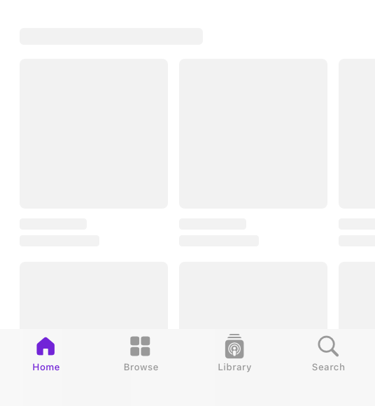

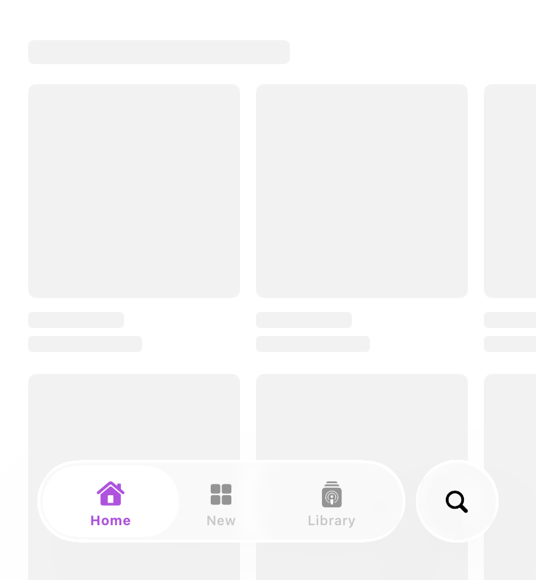

<sub>A screenshot of the bottom half of an iPhone showing a tab bar as it appears in the latest version of iOS. The search tab appears in its own section at the trailing end of the tab bar.</sub>

**Establish a clear navigation hierarchy.** It’s more important than ever for your app to have a clear and consistent navigation structure that’s distinct from the content you provide. Ensure that you clearly separate your content from navigation elements, like tab bars and sidebars, to establish a distinct functional layer above the content layer.

**Consider adapting your tab bar into a sidebar automatically.** If your app uses a tab-based navigation, you can allow the tab bar to adapt into a sidebar depending on the context by using the following APIs:

**SwiftUI**

[sidebarAdaptable](../swiftui/tabviewstyle/sidebaradaptable.md)

**UIKit**

[UITabBarController.Mode.tabSidebar](../uikit/uitabbarcontroller/mode-swift.enum/tabsidebar.md)

**Consider using split views to build sidebar layouts with an inspector panel.** [Split views](../design/human-interface-guidelines/split-views.md) are optimized to create a consistent and familiar experience for sidebar and inspector layouts across platforms. You can use the following standard system APIs for split views to build these types of layouts with minimal code:

**SwiftUI**

[NavigationSplitView](../swiftui/navigationsplitview.md)

[inspector(isPresented:content:)](<../swiftui/view/inspector(ispresented_content_).md>)

**UIKit**

[UISplitViewController](../uikit/uisplitviewcontroller.md)

[UISplitViewController.Column.inspector](../uikit/uisplitviewcontroller/column/inspector.md)

**AppKit**

[NSSplitViewController](../appkit/nssplitviewcontroller.md)

[init(inspectorWithViewController:)](<../appkit/nssplitviewitem/init(inspectorwithviewcontroller_).md>)

**Check content safe areas for sidebars and inspectors.** If you have these types of components in your app’s navigation structure, audit the safe area compatibility of content next to the sidebar and inspector to help make sure underlying content is peeking through appropriately.

**Extend content beneath sidebars and inspectors.** A background extension effect creates a sense of extending a background under a sidebar or inspector, without actually scrolling or placing content under it. A background extension effect mirrors the adjacent content to give the impression of stretching it under the sidebar, and applies a blur to maintain legibility of the sidebar or inspector. This effect is perfect for creating a full, edge-to-edge content experience in apps that use split views, such as for hero images on product pages.

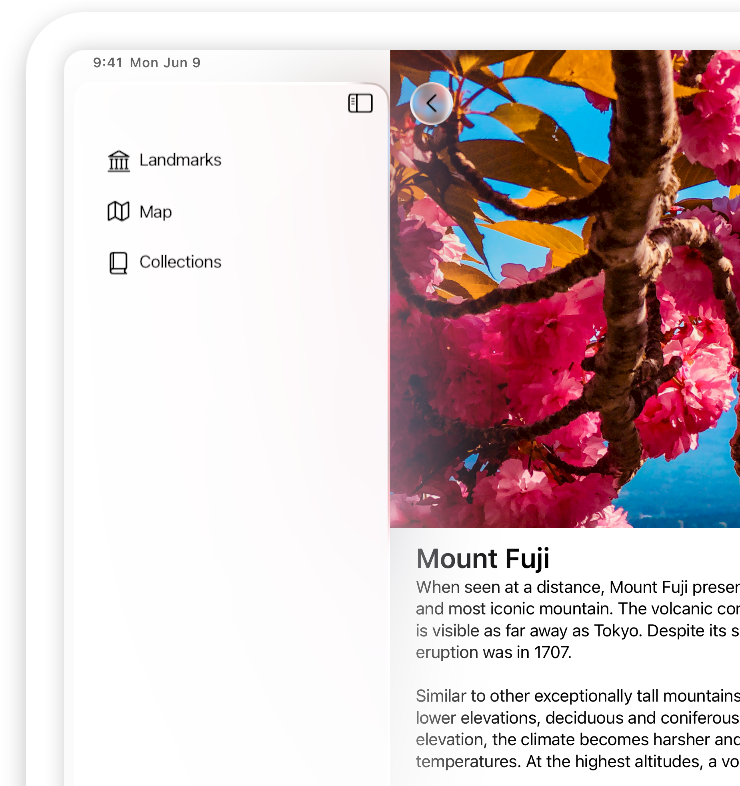

<sub>A screenshot of the Landmarks app showing the sidebar. The image next to the sidebar doesn't extend beneath it, so the sidebar floats above an empty background.</sub>

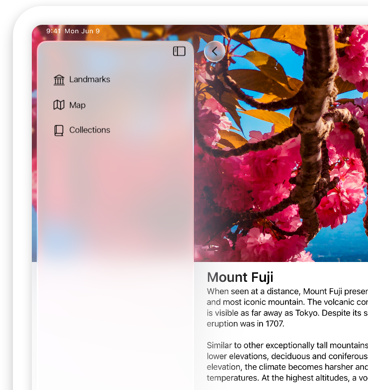

<sub>A screenshot of the Landmarks app showing the sidebar. The image next to the sidebar gives the impression of extending beneath it using the background extension effect.</sub>

**SwiftUI**

[backgroundExtensionEffect()](<../swiftui/view/backgroundextensioneffect().md>)

**UIKit**

[UIBackgroundExtensionView](../uikit/uibackgroundextensionview.md)

**AppKit**

[NSBackgroundExtensionView](../appkit/nsbackgroundextensionview.md)

**Choose whether to automatically minimize your tab bar in iOS.** Tab bars can help elevate the underlying content by receding when a person scrolls up or down. You can opt into this behavior and configure the tab bar to minimize when a person scrolls down or up. The tab bar expands when a person scrolls in the opposite direction.

**SwiftUI**

```swift
TabView {
    // ...
}
.tabBarMinimizeBehavior(.onScrollDown)
```

**UIKit**

```swift
tabBarMinimizeBehavior = .onScrollDown
```

## Menus and toolbars

[Menus](../design/human-interface-guidelines/menus.md) have a refreshed look across platforms. They adopt Liquid Glass, and menu items for common actions use icons to help people quickly scan and identify those actions. New to iPadOS, apps also have a [menu bar](../design/human-interface-guidelines/the-menu-bar.md) for faster access to common commands.

**Adopt standard icons in menu items.** For menu items that perform standard actions like Cut, Copy, and Paste, the system uses the menu item’s selector to determine which icon to apply. To adopt icons in those menu items with minimal code, make sure to use standard selectors.

**Match top menu actions to swipe actions.** For consistency and predictability, make sure the actions you surface at the top of your contextual menu match the swipe actions you provide for the same item.

[Toolbars](../design/human-interface-guidelines/toolbars.md) take on a Liquid Glass appearance, and provide a grouping mechanism for toolbar items, letting you choose which actions to display together.


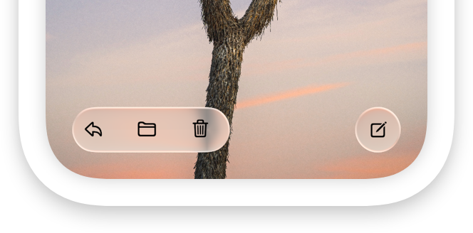

**Determine which toolbar items to group together.** Group items that perform similar actions or affect the same part of the interface, and maintain consistent groupings and placement across platforms.

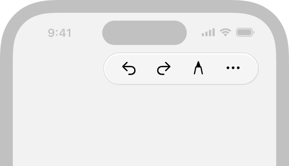

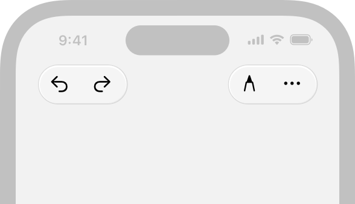

<sub>A graphic that shows a toolbar with the four buttons split into two groupings according to their functions. The Undo and Redo buttons share a background, and the Markup and More buttons share a background.</sub>

You can create a fixed spacer to separate items that share a background using these APIs:

**SwiftUI**

[fixed](../swiftui/spacersizing/fixed.md)

[ToolbarSpacer](../swiftui/toolbarspacer.md)

**UIKit**

[fixedSpace(_:)](<../uikit/uibarbuttonitem/fixedspace(__).md>)

**AppKit**

[space](../appkit/nstoolbaritem/identifier/space.md)

**Find icons to represent common actions.** Consider representing common actions in toolbars with [standard icons](../design/human-interface-guidelines/icons.md) instead of text. This approach helps declutter the interface and increase the ease of use for common actions. For consistency, don’t mix text and icons across items that share a background.

**Provide an accessibility label for every icon.** Regardless of what you show in the interface, always specify an accessibility label for each icon. This way, people who prefer a text label can opt into this information by turning on accessibility features like VoiceOver or Voice Control.

**Audit toolbar customizations.** Review anything custom you do to display items in your toolbars, like your use of fixed spacers or custom items, as these can appear inconsistent with system behavior.

**Check how you hide toolbar items.** If you see an empty toolbar item without any content, your app might be hiding the view in the toolbar item instead of the item itself. Instead, hide the entire toolbar item, using these APIs:

**SwiftUI**

[hidden(_:)](<../swiftui/toolbarcontent/hidden(__).md>)

**UIKit**

[isHidden](../uikit/uibarbuttonitem/ishidden.md)

**AppKit**

[isHidden](../appkit/nstoolbaritem/ishidden.md)

## Windows and modals

[Windows](../design/human-interface-guidelines/windows.md) adopt rounder corners to fit controls and navigation elements. In iPadOS, apps show window controls and support continuous window resizing. Instead of transitioning between specific preset sizes, windows resize fluidly down to a minimum size.

**Support arbitrary window sizes.** Allow people to resize their window to the width and height that works for them, and adjust your content accordingly.

**Use split views to allow fluid resizing of columns.** To support continuous window resizing, split views automatically reflow content for every size using beautiful, fluid transitions. Make sure to use standard system APIs for split views to get these animations with minimal code:

**SwiftUI**

[NavigationSplitView](../swiftui/navigationsplitview.md)

**UIKit**

[UISplitViewController](../uikit/uisplitviewcontroller.md)

**AppKit**

[NSSplitViewController](../appkit/nssplitviewcontroller.md)

**Use layout guides and safe areas.** Make sure you specify safe areas for your content so the system can automatically adjust the window controls and title bar in relation to your content.

Modal views like sheets and action sheets adopt Liquid Glass. [Sheets](../design/human-interface-guidelines/sheets.md) feature an increased corner radius, and half sheets are inset from the edge of the display to allow content to peek through from beneath them. When a half sheet expands to full height, it transitions to a more opaque appearance to help maintain focus on the task.

**Check the content around the edges of sheets.** Inside the sheet, check for content and controls that might appear too close to rounder sheet corners. Outside the sheet, check that any content peeking through between the inset sheet and display edge looks as you expect.

**Audit the backgrounds of sheets and popovers.** Check whether you add a visual effect view to your popover’s content view, and remove those custom background views to provide a consistent experience with other sheets across the system.

An [action sheet](../design/human-interface-guidelines/action-sheets.md) originates from the element that initiates the action, instead of from the bottom edge of the display. When active, an action sheet also lets people interact with other parts of the interface.

**Specify the source of an action sheet.** Position an action sheet’s anchor next to the control it originates from. Make sure to set the source view or item to indicate where to originate the action sheet and create the inline appearance.

**SwiftUI**

[confirmationDialog(_:isPresented:titleVisibility:presenting:actions:)](<../swiftui/view/confirmationdialog(__ispresented_titlevisibility_presenting_actions_)-9ibgk.md>)

**UIKit**

[sourceView](../uikit/uipopoverpresentationcontroller/sourceview.md)

[sourceItem](../uikit/uipopoverpresentationcontroller/sourceitem.md)

**AppKit**

[beginSheetModal(for:completionHandler:)](<../appkit/nsalert/beginsheetmodal(for_completionhandler_).md>)

## Organization and layout

Style updates to [list-based layouts](../design/human-interface-guidelines/lists-and-tables.md) help you organize and showcase your content so it can shine through the Liquid Glass layer. To give content room to breathe, organizational components like lists, tables, and forms have a larger row height and padding. Sections have an increased corner radius to match the curvature of controls across the system.

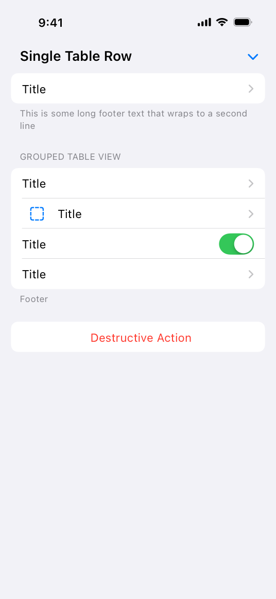

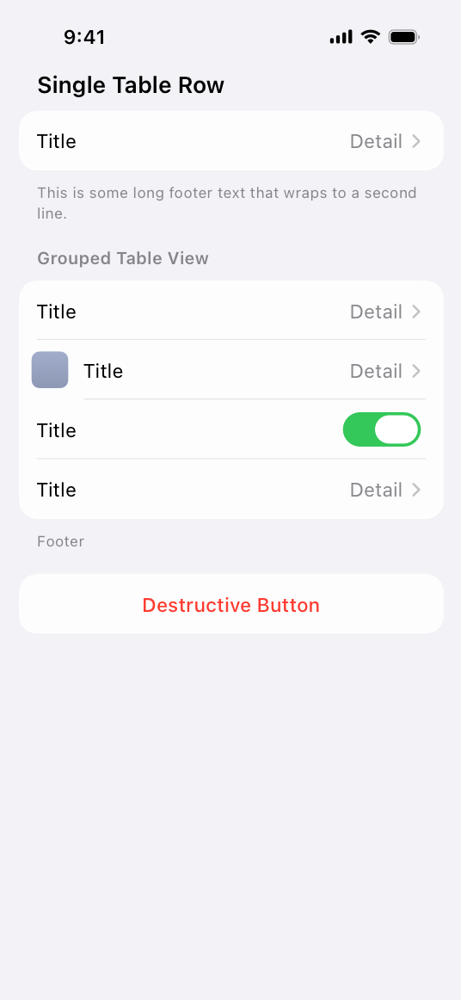

**Check capitalization in section headers.** Lists, tables, and forms optimize for legibility by adopting title-style capitalization for [section headers](<../swiftui/section/init(content_header_).md>). This means section headers no longer render entirely in capital letters regardless of the capitalization you provide. Make sure to update your section headers to title-style capitalization to match your app’s text to this systemwide convention.

**Adopt forms to take advantage of layout metrics across platform.** Use SwiftUI forms with the [grouped form style](../swiftui/formstyle/grouped.md) to automatically update your form layouts.

## Search

Platform conventions for location and behavior of search optimize the experience for each device and use case. To provide an engaging search experience in your app, review these [search](../design/human-interface-guidelines/search-fields.md) design conventions.

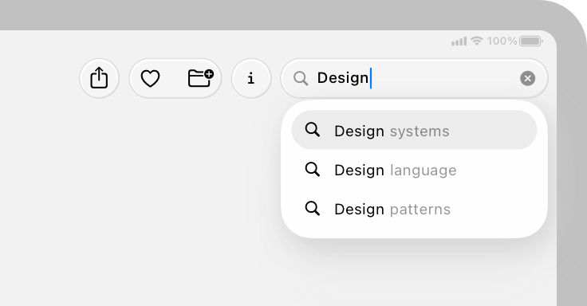

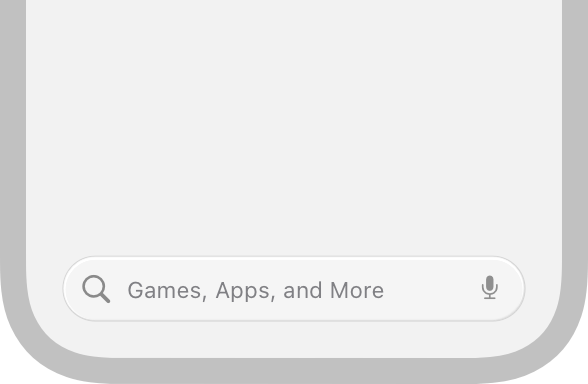

**Check the keyboard layout when activating your search interface.** In iOS, when a person taps a search field to give it focus, it slides upwards as the keyboard appears. Test this experience in your app to make sure the search field moves consistently with other apps and system experiences.

**Use semantic search tabs.** If your app’s search appears as part of a tab bar, make sure to use the standard system APIs for indicating which tab is the search tab. The system automatically separates the search tab from other tabs and places it at the trailing end to make your search experience consistent with other apps and help people find content faster.

**SwiftUI**

```swift
Tab(role: .search) {
    // ...
}
```

**UIKit**

```swift
UISearchTab { _ in 
    // ...
}
```

## Platform considerations

Liquid Glass can have a distinct appearance and behavior across different platforms, contexts, and input methods. Test your app across devices to understand how the material looks and feels across platforms.

**In watchOS, adopt standard button styles and toolbar APIs.** Liquid Glass changes are minimal in watchOS, so they appear automatically when you open your app on the latest release even if you don’t build against the latest SDK. However, to make sure your app picks up this appearance, adopt standard toolbar APIs and button styles from watchOS 10.

**In tvOS, adopt standard focus APIs.** Across apps and system experiences in tvOS, standard buttons and controls take on a Liquid Glass appearance when focus moves to them. For consistency with the system experience, consider applying these effects to custom controls in your app when they gain focus by adopting the standard focus APIs. Apple TV 4K (2nd generation) and newer models support Liquid Glass effects. On older devices, your app maintains its current appearance.

**SwiftUI**

[focusable(_:)](<../swiftui/view/focusable(__).md>)

[isFocused](../swiftui/environmentvalues/isfocused.md)

**UIKit**

[UIFocusItem](../uikit/uifocusitem.md)

[focused](../uikit/uicontrol/state-swift.struct/focused.md)

**Combine custom Liquid Glass effects to improve rendering performance.** If you apply these effects to custom elements, make sure to combine them using a [GlassEffectContainer](../swiftui/glasseffectcontainer.md), which helps optimize performance while fluidly morphing Liquid Glass shapes into each other.

**Performance test your app across platforms.** It’s a good idea to regularly assess and improve your app’s performance, and building your app with the latest SDKs provides an opportunity to check in. Profile your app to gather information about its current performance and find any opportunities for improving the user experience. To learn more, read [Improving your app’s performance](../xcode/improving-your-app-s-performance.md).

To update and ship your app with the latest SDKs while keeping your app as it looks when built against previous versions of the SDKs, you can add the [UIDesignRequiresCompatibility](../bundleresources/information-property-list/uidesignrequirescompatibility.md) key to your project’s Info pane.
