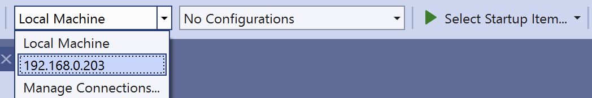
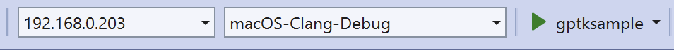

> Navigation: [Technologies](../technologies.md) · [Technology Overviews](../technologyoverviews.md) · [Games](games.md)

# Building your macOS game remotely from your PC

Configure a Mac for remote builds, and use it to build your game from your PC and catch mistakes when porting your game to macOS.

When porting your Windows game code to macOS, it’s important to find platform-specific issues early, so you have time to address them. To avoid disrupting your Windows-based workflow, Apple provides tools to configure a remote Mac to build and debug the macOS version of your game from your PC. This build system lets you continue developing your game on your PC but build the macOS version and fix issues regularly.

Setting up a Mac to build your Windows code remotely requires changes to both the Mac and your PC. On the Mac, you install the tools to build your code, and configure the system to support remote connections from your PC. On your PC, you configure your Microsoft Visual Studio environment to connect to the Mac and initiate remote builds. To build on both platforms, you must have a CMake-based project, which provides the instructions that both systems need to build your code.

## Configure your Mac as the remote builder

To remotely build projects on your Mac, verify that your Mac is running macOS Sequoia 15.4 or later, and has Xcode 26 or later installed. Perform this verification in the Terminal app on your Mac using the following command:

```swift
% sw_vers -productVersion && xcodebuild -version
```

In addition to verifying the base software installation:

- Accept the Xcode license agreement. In Terminal, enter `sudo xcodebuild -license` and press Return, then follow the prompts to accept the license agreement.
- Verify that `zsh` is your default UNIX shell. In Terminal, enter `echo $SHELL` and press Return. If Terminal returns something other than `/bin/zsh`, change shells by entering `chsh -s /bin/zsh` and pressing Return.
- Download the [Game Porting Toolkit](https://developer.apple.com/download/all/?q=game%20porting%20toolkit), and double-click `Mac Remote Development Tools for Windows.pkg` to run the installer. The installer guides you through the automatic configuration of your Mac as a remote build and debug target.
- Download and install the [Metal shader converter](https://developer.apple.com/metal/shader-converter/) on your Mac if your build process requires building DXIL shaders.
- In System Settings, choose General \> Sharing, and ensure that both Remote Management and Remote Login are turned on to allow VNC and SSH access, respectively.

> [!note] Note
> If your network uses a firewall, make sure it allows Remote Management and Remote Login services, as well as TCP port forwarding over SSH. Microsoft Visual Studio requires this configuration to copy files over the network.

## Configure Microsoft Visual Studio to connect to your Mac

With your Mac environment set up, switch to your Microsoft Windows PC to download and install Microsoft Visual Studio 2022 17.14 or later. Using the Visual Studio Installer tool, install the “Linux and embedded development with C++” workload, which allows you to target and run on remote hosts. You might also want to install “Game Development with C++”.

With Visual Studio installed and set up, choose Tools \> Options \> CMake and select “Use CMake presets if available, otherwise use a CMakeSettings.json”. Now, open your game project:

1. Choose Open \> Folder, and navigate to the folder that contains your game project.
2. Click Open. This opens the project’s folder, which enables you to set up a CMake-based build system that builds on macOS. Avoid opening any Visual Studio Solution files.

  > [!note] Note
  > If your project doesn’t currently use CMake, adopt CMake as your native build system or implement a mechanism to drive your current build system through CMake for remote builds.
3. To connect to your Mac, choose Tools \> Options.
4. Navigate to Cross Platform \> Connection Manager.
5. Click Add.
6. Enter the following details to connect Visual Studio with your Mac:

    1. The network name of the Mac. This can either be its IP address or the name in System Settings \> General \> About \> Name.
    2. The user name and password of an account in the `admin` or `_developer` group. You can verify this in System Settings \> Users & Groups, and examining your user account’s details.

  > [!important] Important
  > To debug your program on the Mac, your user account needs to be in the `admin` or `_developer` groups in macOS.
7. Click Verify to ensure that Visual Studio connects to your Mac.
8. Click OK to close the dialog.

Your Mac now appears as a new run destination in Visual Studio:



If the entry is missing from this list, try restarting Visual Studio. For more details, see [Connect to your remote Linux system by using Visual Studio](https://learn.microsoft.com/en-us/cpp/linux/connect-to-your-remote-linux-computer?view=msvc-170).

## Create a build configuration file for CMake

To initiate builds from your PC, you need to provide CMake with a build file and debugger settings it can use for the macOS version of your game. Create this file on your PC:

1. Right-click the folder name in the Solution Explorer, and choose Add \> New File.
2. Name the file `CMakeLists.txt`.

When you save the `CMakeLists.txt` file, Visual Studio “generates” the project build files, according to a generator. Examples of generators available on macOS include “Unix Makefiles” and “Xcode”. Third-party generators such as Ninja also support macOS.

A minimal `CMakeLists.txt` specifies the minimum version of CMake that your build instructions support, the name of the overall project, and adds an executable target named gptksample, along with its source files. The following listing shows an example of this minimal file:

```swift
cmake_minimum_required(VERSION 3.26)
project(gptksample)
add_executable(gptksample main.m)
```

> [!note] Note
> Review the CMake documentation for a comprehensive introduction to writing CMakeLists.txt files.

You also need to create a `CMakePresets.json` file for `lldb-dap` debugger integration.

1. Right-click the folder name in the Solution Explorer, and choose Add \> New File.
2. Name the file `CMakePresets.json`.

Add the following contents to the `CMakePresets.json` file you created:

```json
{
  "version": 3,
  "configurePresets": [
    {
      "name": "macos-debug",
      "displayName": "macOS-Clang-Debug",
      "generator": "Ninja",
      "binaryDir": "${sourceDir}/out/build/${presetName}",
      "installDir": "${sourceDir}/out/install/${presetName}",
      "cacheVariables": {
        "CMAKE_BUILD_TYPE": "Debug"
      },
      "condition": {
        "type": "equals",
        "lhs": "${hostSystemName}",
        "rhs": "Darwin"
      },
      "vendor": {
        "microsoft.com/VisualStudioRemoteSettings/CMake/1.0": {
          "sourceDir": "$env{HOME}/.vs/$ms{projectDirName}"
        }
      }
    }
  ]
}

```

> [!note] Note
> The Game Porting Toolkit includes a project “gptk-sample” that includes an example `CMakeLists.txt` file ready for remote building on a target Mac from your PC. Use it to explore building a game remotely from within Visual Studio.

## Set up the default debugger environment

To debug on your Mac, upgrade to Visual Studio 2022 17.14.3 or later and configure the default debugger with the following steps:

1. Choose Tools \> Options.
2. Navigate to Environment \> Preview Features.
3. Click “Enable default debugger selection in CMake Remote scenarios”.
4. Click OK to close the dialog and save the preference.
5. Choose Tools \> Options to reopen the updated dialog.
6. Navigate to Cross Platform \> Logging and Diagnostics.
7. Under “Manage Remote Debugging,” select `lldb-dap`.
8. Click OK to save and close.
9. Choose Project \> Configure to reconfigure your project.

## Build and run the game project remotely on your Mac

After you configure a remote Mac and set up the build configuration files you need, you can initiate builds from your PC. In the Visual Studio run bar, select the remote build destination, the macOS build configuration, and the target that matches the executable name in the `CMakeLists.txt` file you created. The following screenshot shows the IP address of a connected Mac, the macOS build configuration settings, and the `gptksample` target.



To start a remote build, click the green run button. Visual Studio builds your game and logs any errors in the error panel, as well as in the output panel. Examine the errors and use them to update your `CMakeLists.txt` file and tune the build process on your Mac.

> [!note] Note
> If you reboot or shutdown and restart your remote Mac, you need to log into it locally again before you can continue debugging apps remotely.

You can dramatically accelerate the remote building process by configuring CMake to build your project in parallel over multiple CPU cores. To enable parallel building:

1. In Visual Studio, choose Project \> CMake Settings.
2. Add the `-j` option to the “Build command arguments”.
3. Restart Visual Studio to pick up the new CMake settings.

## Visualize the Mac desktop remotely

Depending on your setup, you may need to access the desktop of your Mac remotely to visualize your game or app running. macOS comes with a built-in VNC server that enables you to remotely log in and view its desktop.

While Microsoft’s Remote Desktop Client doesn’t support the VNC protocol, several third-party VNC clients enable you to connect to your remote Mac, including Jump Desktop, TightVNC, and RealVNC. Make sure to log into the remote desktop using the same user credentials you provide Visual Studio Professional for remote building.

> [!note] Note
> Visualizing a desktop remotely over the network may incur latency and compression artifacts. Additionally, the VNC protocol doesn’t support game controllers. If possible, connect a physical display to your Mac to visualize your game instead.

## Debug any connectivity issues

If a remote build fails, it could be the result of connectivity issues rather than an actual problem with your code. Verify that connectivity isn’t the issue by performing the following steps in Visual Studio on your PC:

1. Choose Tools \> Options, then go to Cross Platform \> Logging and Diagnostics.
2. Turn on “Enable logging”.
3. Select the “Log to the Cross Platform Logging pane in the Output Window” checkbox.
4. Click OK.

Visual Studio logs connections to the Cross Platform Logging pane in the output window. Examine the logs for any potential problems, including:

- Remote building occasionally fails with an error stating “Connection closed by peer,” despite the configuration phase working correctly. If the problem persists, restart Visual Studio and reopen the project folder.
- Large projects (50 GB or more) may cause a connection drop in Visual Studio Professional during the initial copy over the network. If this affects your project, restart Visual Studio Professional to reopen the connection to the Mac and resume the file copy.

You can also copy your project contents manually using `rsync` or `scp` to the remote Mac. To copy files manually, retrieve the location that Visual Studio assigns to your project from the logs in its “Cross Platform Logging” pane.
