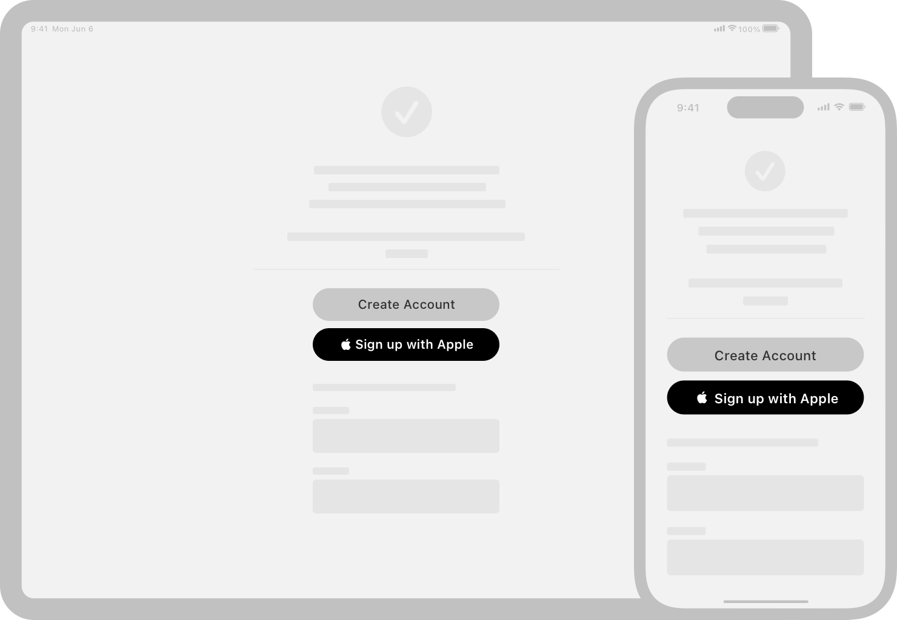

> Navigation: [Technologies](../technologies.md) · [Technology Overviews](../technologyoverviews.md) · [Core experiences](core-experiences.md)

# Convenience

Make it easier for people to access their content and adopt your app as part of their daily workflow.

Incorporate features that make it easier for people to do the things they want to do. When you adopt the right technologies, it takes less effort to make your app more convenient to use. Some technologies even provide the fundamental support you need to implement other features. For example, Handoff and App Clips require you to implement universal links for your app’s content.

## Provide consistent URLs for app content

URLs are a consistent way for people to access content on the web, and universal links extend that consistency to your apps. When you [adopt universal links](../xcode/allowing-apps-and-websites-to-link-to-your-content.md) in your app, the same URLs people use to access your website work in your app, too. Many features rely on universal links, including:

- Handoff uses universal links to [continue tasks on other devices](convenience.md#Transfer-activities-to-other-devices).
- [App Clips](convenience.md#Allow-people-to-try-your-app-quickly) handle URLs intended for your app.
- Sharing web credentials via iCloud relies on universal links.
- [Shared with You](convenience.md#Incorporate-content-shared-in-Messages) uses universal links to transfer links from Messages to your app.

Adopting universal links creates a two-way association between your app and your company’s website. When someone opens a URL on their iPhone or other device, the system opens that URL in the default web browser by default. However, if your app is installed on that device, the system can reroute those URLs to your app instead. Directing URLs to your app can lead to a better experience, but only if your app handles those URLs correctly.

When the system [sends a URL to your app](../xcode/supporting-universal-links-in-your-app.md), analyze the contents of the URL to identify the request and present the requested content from your interface. For example, if a URL contains a link to a product on your company’s website, display the matching product page in your app. When configuring your interface, do your best to make it look like the person launched your app and navigated to the intended product page.

> [!important] Important
> Always validate URLs your app receives to make sure they don’t contain malicious content.

To prevent other apps from opening links intended for your website, universal links require an [entitlement](../bundleresources/entitlements/com.apple.developer.associated-domains.md), which you add to your Xcode project. You must also [update your website](../xcode/supporting-associated-domains.md) and create an association between the site and your app. This two-way validation process helps protect against malicious apps trying to intercept your links.

## Transfer activities to other devices

Handoff is a way for people to start an activity on one device, and transfer that activity to a different device with the same Apple ID. Handoff works with iPhone, iPad, Apple Watch, and Mac, so add support if you offer your app on more than one of those platforms.

To add Handoff support, you first must consider which tasks someone might be able to transfer to another device. A shopping app might transfer the URL of the product page someone is viewing. A reading app might transfer the book and page number someone is reading. A media app might transfer the name of the audio or video file and the current playback location. In each case, choose activities a person knowingly starts, and might reasonably want to continue on their other device, and [declare those activities](../foundation/implementing-handoff-in-your-app.md#3112023) in your Xcode project.

[Apps make relevant activities available](../foundation/implementing-handoff-in-your-app.md) automatically via Handoff when someone starts that activity. At that time, collect the activity-related details and put them into an [NSUserActivity](../foundation/nsuseractivity.md) object. Enable the [isEligibleForHandoff](../foundation/nsuseractivity/iseligibleforhandoff.md) property of that object, and [make the object the current activity](<../foundation/nsuseractivity/becomecurrent().md>). Alternatively, [assign an activity objects to one of your views](../foundation/implementing-handoff-in-your-app.md#3112026) and let the system manage the activation of your object.

Because Handoff transfers your app’s data from one device to another, make transfers fast by putting as little data as possible in your [NSUserActivity](../foundation/nsuseractivity.md) objects. A shopping app that lets someone continue viewing product information might include only the URL of the product page, using a [universal link](convenience.md#Provide-consistent-URLs-for-app-content). A video app might transfer only the name or URL of the video and not the video file itself. Because the devices that accept Handoff transfers share an Apple ID, you can expect them to have access to the same content.

## Generate previews for custom data formats

If your app has custom document formats, include a Quick Look Preview app extension to generate a preview of files that use those formats. Quick Look is a system feature that people use to view the contents of a file or document without opening it. They can use this feature to verify a file contains the content they expect before opening it. The Finder displays a Quick Look preview when someone selects a file and presses the Spacebar key, and the [Share Sheet](../design/human-interface-guidelines/activity-views.md) and other system interfaces also incorporate Quick Look previews.

Create a Quick Look Preview app extension using the [Quick Look](../quicklook.md) framework, and include it with the app that owns one of your custom file formats. Create the app extension only for custom file formats that you define. You don’t need this app extension if you rely solely on standard file formats. The system already generates previews for many standard text and image file formats, PDFs, audio and video files, USDZ files, and more.

If you have a macOS app that shows files as part of its interface, add previews for those files using the [Quick Look UI](../quicklookui.md) framework. This framework provides panels and views that show the contents of files that have defined previews. These panels show both the standard file formats and any custom formats that apps provide.

## Adopt a fast login workflow

If your app or website requires a login and password, give people the option to log in using [Sign in with Apple](../signinwithapple.md). When someone needs to perform a task quickly, prompting them for their login and password information can be inconvenient and delay their access to that information. Sign in with Apple lets people log in to apps and websites using Face ID or Touch ID from their device, and using credentials that map to their Apple ID. This approach respects people’s privacy, while giving you greater confidence that the account information you receive represents real people.

You adopt Sign in with Apple in several different ways:

- When your app or website needs to prompt for a login and password, include a [Sign in with Apple button](../signinwithapple/displaying-sign-in-with-apple-buttons-in-your-app.md) in your interface to give people the option to use the feature.
- To [authenticate accounts that use Sign in with Apple](../authenticationservices.md#Sign-In-with-Apple) from your app, use the [Authentication Services](../authenticationservices.md) framework
- To authenticate people’s credentials from your web interface, use [Sign in with Apple JS](../signinwithapplejs.md).
- To authenticate people’s accounts on a back-end server, use [Sign in with Apple REST API](../signinwithapplerestapi.md).

For a media streaming app that runs on multiple platforms, [create a single sign-on experience](../videosubscriberaccount/signing-people-in-to-media-apps-automatically.md) to get people to your content more quickly. The [Video Subscriber Account](../videosubscriberaccount.md) framework supports an Automatic Sign-In workflow, which you use to generate a token that authorizes the person’s access to your services. The framework stores this token on the person’s Apple Account, making it available to all of their devices. If the token is present at app startup, use it to log in automatically instead of asking for the person’s credentials. Update the token, or remove it entirely, using [Automatic Sign-In API](../automaticsigninapi.md).

## Incorporate content shared in Messages

People often receive links and other content when they’re not ready to receive it. [Shared with You](../sharedwithyou.md) makes it easier for you to incorporate the links that people share into your app. The framework extracts app-specific links people send using Messages and makes them available to your app. You can display this list of links to people from a custom view in your app, giving them quick access to content they might have forgotten about in their Messages conversations.

Shared with You relies on your app adopting [universal links](convenience.md#Provide-consistent-URLs-for-app-content) for its content. You must also [add the Shared with You capability](../xcode/adding-capabilities-to-your-app.md) to your app to receive links from Messages. After you adopt these features, [add Shared with You support](../https_/developer.apple.com/videos/play/wwdc2022/10094.md) in the following ways:

- Display a view that presents links from Messages as rich content with thumbnail images and descriptions. Use a [SWHighlightCenter](../sharedwithyou/swhighlightcenter.md) object to fetch the URL for each shared link.
- Display a [SWAttributionView](../sharedwithyou/swattributionview.md) object in views you use to display linked content. The view shows the people who sent you the content in Messages, and interactions with the view open Messages and take the person to the conversation with the link.

In addition to managing shared items in Messages, you can also use Shared with You to [create a collaboration workflow](../sharedwithyou/adding-shared-content-collaboration-to-your-app.md) for content your app creates. You might use this approach for content you put in CloudKit, iCloud Drive, or another shared storage server. After you place the content in a shared location, use Shared with You types to present UI for sharing that content with other people.

## Allow people to try your app quickly

People use apps for many kinds of tasks, but they might not always have the app they need when they need it. An App Clip helps people discover your app at a moment when they might not have time to download the full version. For example, the system can display your App Clip to help someone set up a new appliance, rent a scooter, or order take-out from a restaurant. This convenience can help convince people to download the full version of your app later.

An App Clip focuses on one task and performs it quickly, ideally in only a few seconds. People discover your App Clip using special App Clip codes, NFC tags, QR codes, links you send out, and place cards in Maps. For example, you might place an App Clip code on the scooters you rent to people. When someone scans the code, the system downloads and launches the App Clip to start the task immediately.

[Create an App Clip](../appclip/creating-an-app-clip-with-xcode.md) in Xcode by adding an App Clip target to your project. Use the [App Clips](../appclip.md) framework to implement your clip, and add any app-specific code you need to complete the intended task. Keep the size of your App Clip as small as possible, and include only the code and assets you absolutely need. App Clips have size limitations so the system can download them quickly.

In addition to [uploading your App Clip](../appclip/distributing-your-app-clip.md) to the App Store, begin work on [creating the App Clip codes](../appclip/creating-app-clip-codes.md) people use to access launch your App Clip. Include these codes in promotional materials or in the place where people encounter your services and need to use your App Clip.

Additional things to know when creating your App Clip include:

- You need to adopt [universal links](convenience.md#Provide-consistent-URLs-for-app-content) for the tasks you want people to perform. The processes that launch your App Clip contain the URL for the associated task.
- You can use your App Clip to [recommend your full app](../appclip/recommending-your-app-to-app-clip-users.md) to people. A well-executed App Clip is good encouragement for someone to download your app.
- Your App Clip can [schedule and receive notifications](../appclip/enabling-notifications-in-app-clips.md) for a short period of time. For example, a scooter rental App Clip might send notifications when the rental is about to expire, and give someone the option to extend the rental time.
- Your App Clip can [include Live Activities](../appclip/offering-live-activities-with-your-app-clip.md), which you might use to inform someone about the progress of a task. For example, you might display the time left on your scooter rental.
