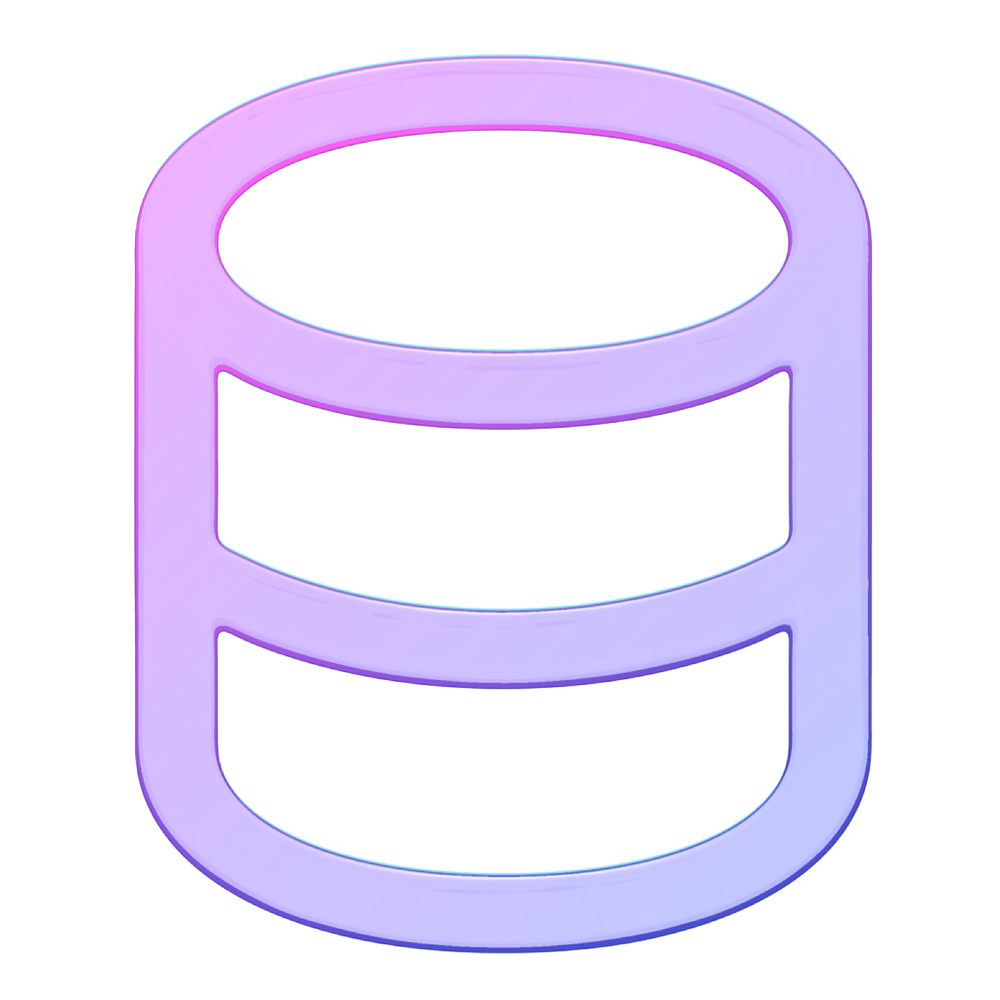
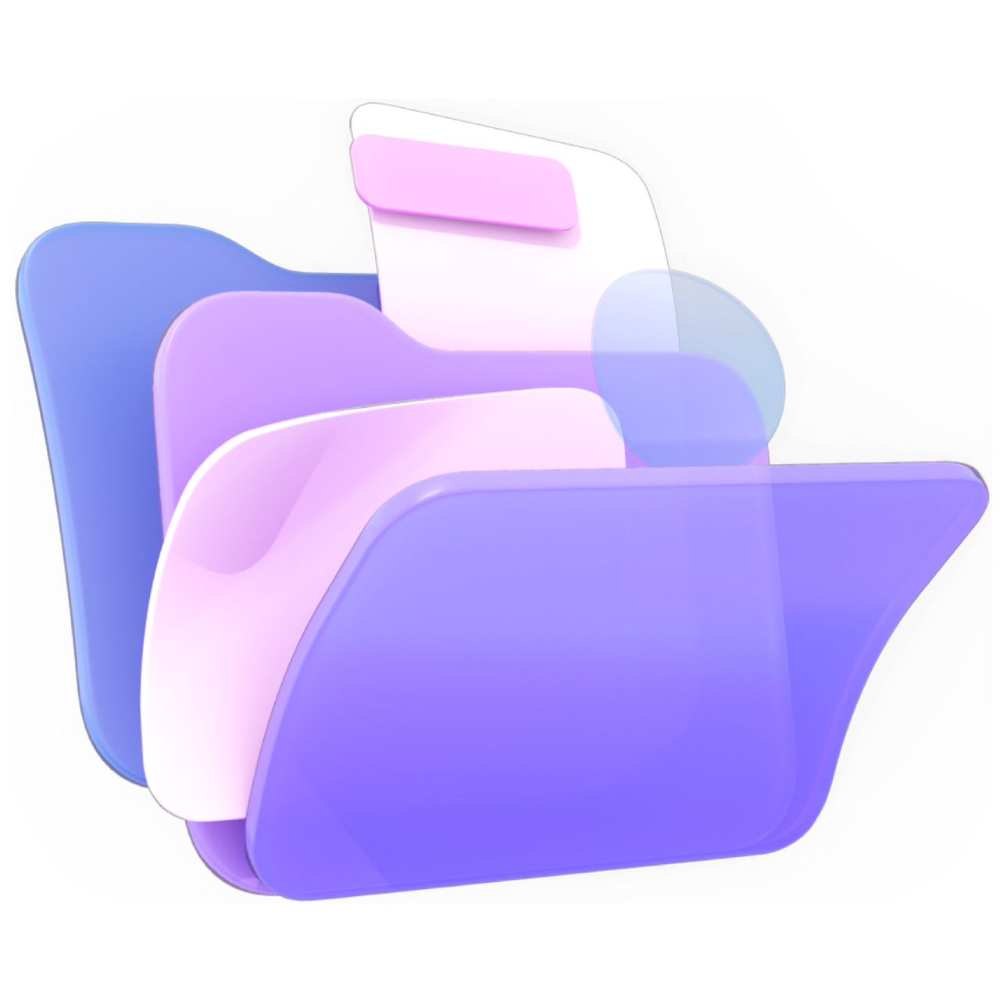

> Navigation: [Technologies](../technologies.md) · [Technology Overviews](../technologyoverviews.md)

# Data management

Build your app’s data model, persist that data to disk or iCloud, and access people’s personal data.

Your app’s data drives everything you do, and Apple frameworks provide the types you need to represent that data. Build your data structures with basic types like numbers, strings, dates, URLs. Add collections and other types to organize large amounts of data. Persist data to disk securely, storing your app’s data in designated locations in the file system or in iCloud. Make use of someone’s music, contacts, photos, and other personal data in a privacy friendly way.

All apps use integers, floating-point numbers, strings, URLs, collections, and other primitive types to store data. When you use [Swift Standard Library](../swift/swift-standard-library.md) and the [Foundation](../foundation.md) framework, you get object-oriented versions of these types that work on all Apple platforms. These types also support security and convenience features that make them easier to use in your code.

- Create types as mutable or immutable to match your planned usage.
- Serialize types and data structures to a binary format that you can write to disk.
- Format numbers, dates, and other values you include in strings to reflect someone’s language and locale settings.
- Filter, sort, and compare simple types and custom data structures.
- Encrypt data and store it on disk or in someone’s Keychain.

Build a scalable and efficient data model for your app using technologies like [SwiftData](../swiftdata.md) and [Core Data](../coredata.md). Both technologies offer straightforward ways to build your data structures, and fetch only the data you need. They also offer the features you’d expect, like persistence, undo support, and iCloud integration.

- Create highly structured data models.
- Save data to disk or iCloud, and handle errors gracefully.
- Fetch only the data you need using predicate-based queries.
- Adopt SQLite when you need a fast, reliable database engine to manage your content.

Learn about the structure of the file system on Apple devices, and how to access that file system using the [Foundation](../foundation.md) framework. If you manage your app’s data using technologies such as [SwiftData](../swiftdata.md), you might not work with files often. When you do, you need to know where to put them, and how to manage them efficiently. You also need to understand some of the special conventions that Apple platforms use to minimize the complexity of the file system for people using Apple devices.

- Learn about file-system conventions like bundles and where to put files.
- Read and write the contents of files, create new files and directories, and move items around the file system.
- Download large data files in the background, or before your app’s initial launch.
- Protect the files you create by storing them in an encrypted format on disk.

Make your app’s data available where it’s needed — on one device or multiple devices. Place your data in iCloud to create a feeling of continuity for people moving from one device to the next. Similarly, share data between your app and one of your app extensions to keep your own content synchronized and up to date.

- Share files and data among someone’s devices using iCloud key-value storage, iCloud Drive, and CloudKit.
- Share data between your app and an app extension.
- Design your data structures and code to support sharing.
- Build your own remote storage server and deploy it on Apple devices.

Apple devices can contain a lot of personal information, including contacts, photos, locations, health information, and more. People use the system apps to manage some of this data, but your app can also contribute to that data in a privacy friendly way. Let people know what data you plan to access.

- Request access to someone’s personal data, and inform them of how you plan to use it.
- Access different types of personal data.
- Access environmental data on Apple Vision Pro, including the content and obstacles in the person’s room, details about the person’s hands, and other information detected by the onboard cameras and sensors.
- Verify someone’s identity, age, or personal information using on-device identity documents in a privacy-friendly way.

## Topics

### Data structures

- [Standard data types and processes](standard-data-types-and-processes.md) — Store fundamental types of data, and discover the key behaviors that make using those types easier.
- [Structured data models](structured-data-models.md) — Build a structured data model for your app, and persist that data model to disk or iCloud.

### Persistence and sharing

- [Files and directories](files-and-directories.md) — Navigate the file system on Apple devices, find important directories, and read and write your app’s documents and files.
- [Shared data](shared-data.md) — Share data with your apps running on different devices using iCloud, or share data between your app and app extensions.
- [Personal data](personal-data.md) — Access the personal data that people keep on their devices.
