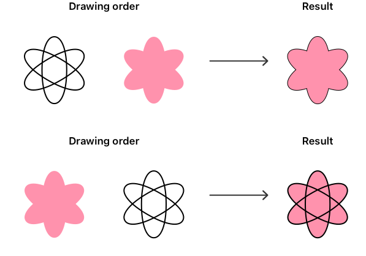

> Navigation: [Technologies](../technologies.md) · [Technology Overviews](../technologyoverviews.md) · [Graphics, drawing, and animation](graphics-drawing-and-animation.md)

# Drawing and printing

Draw custom content in your app’s views, and print content to a file or available printer.

You can use standard views to display many types of content, and when you need something completely custom you can draw the content yourself. The app-builder frameworks provide the views for your interface, and also provide drawing tools for custom content. Use the types in [SwiftUI](../swiftui/drawing-and-graphics.md), [UIKit](../uikit/drawing.md), and [AppKit](../appkit/drawing.md) to draw shapes and composite them alongside images and text. As needed, incorporate types and features from [Core Graphics](../coregraphics.md) and other frameworks into your custom drawing code. As your drawing requirements become more complex, or when performance requires it, switch to [Metal](../metal.md) to achieve your goals.

Anything you can draw in your app, you can also print. The system offers integrated printing support, including a standard interface to configure print jobs and start the printing process. Print your content to a connected printer or to a PDF file.

## Draw custom content using a view

When your app’s drawing requirements are moderate, create your content using existing [SwiftUI](../swiftui/canvas.md), [UIKit](../uikit/uiview.md), or [AppKit](../appkit/nsview.md) views. These views provide the blank canvas and drawing environment you need to add your custom content. In SwiftUI, you use a closure to build your content from [shape views](../swiftui/shapes.md) that the framework provides. In UIKit and AppKit, you define your own subclass and add your custom drawing code to it.

With view-based drawing, you use a painter’s model to create the content you want. Each successive drawing command applies a new layer of “paint” to the underlying view or canvas. When a new shape overlaps a previously drawn shape, the new shape obscures or modifies the content underneath. The amount of transparency in each shape determines how the two colors blend together, as do the blend modes and other graphics-related settings you apply. The order in which you draw your shapes also affects the final outcome, with different orders leading to potentially different appearances, as the following illustration shows.

An illustration that shows two images drawn together in two different ways. The drawing order of the images changes the final output that appears onscreen.

Use types in SwiftUI, UIKit, and AppKit frameworks for most operations, but you can also use types in the Core Graphics framework for some tasks. For exmple, your drawing code might rely on the
[points, rectangles, and other geometric types](../coregraphics.md#Geometric-Data-Types) in Core Graphics to specify the placement of content on your drawing canvas. Similarly, some other system frameworks might require you to specify [images](../coregraphics/cgimage.md) or [colors](../coregraphics/cgcolor.md) using Core Graphics types.

In addition to the technologies you use to draw your content, several technologies provide drawing-adjacent capabilities. Incorporate them as needed to support your app’s features.

- [PencilKit](../pencilkit.md) captures and displays hand-drawn input into a custom view. Add it if you support drawing content using [Apple Pencil](../applepencil.md).
- [Core Image](../coreimage.md) performs hardware-accelerated image-based manipulations. Use this framework to apply filters or special effects to your app’s images. For example, use it to blur the content of an image.
- [PDFKit](../pdfkit.md) displays and manipulates PDF documents and content.
- [Core Animation](../quartzcore.md) provides additional drawing infrastructure. The [layer type](../quartzcore/calayer.md) in particular offers ways to accelerate common operations like adding a background color to your view or masking the view’s content.

## Build a graphics engine using Metal

If drawing is a central feature of your app, [Metal](../metal.md) offers the performance to draw that content efficiently. With Metal, you use a set of [dedicated types](../metal/understanding-the-metal-4-core-api.md) to build your own graphics engine and generate 2D or 3D content frame-by-frame. During the creation of a single frame, Metal runs your custom shader code on the available GPU cores, applying your rendering commands at hardware speeds. Choose Metal when you need to draw complex content at high frame rates, or want to ensure that your drawing code runs as fast as possible.

In addition to drawing, Metal supports [compute capabilities](../metal/compute-passes.md), [ray tracing](../metal/ray-tracing-with-acceleration-structures.md), and other features to create your content. Mix these capabilities with your rendering code to update your app’s content and generate more realistic content.

Metal works hand-in-hand with several other frameworks, which supplement its capabilities. [MetalKit](../metalkit.md) defines additional types, including a view you can use to integrate Metal content into your existing view hierarchies. [MetalFX](../metalfx.md) upscales lower-resolution content in less time than it takes to render that content directly. [Metal Performance Shaders](../metalperformanceshaders.md) provide optimized code to accelerate many common graphics and compute tasks.

If you’re building an immersive app for Apple Vision Pro, combine your Metal graphics engine with the [Compositor Services](../compositorservices.md) framework to create a stereoscopic version of your 3D content. Compositor Services provides the information Metal needs to render the same content from two different eye positions, and give your content a three-dimensional appearance.

## Print your app’s content

Printing support is built-in to iOS, iPadOS, macOS, and visionOS, and the system provides extensive support and UI to manage the printing process for you. To add printing support to your app, you perform three tasks:

- Provide UI to initiate the printing process. For example, provide a Print menu item or initiate printing from an [activity view](../design/human-interface-guidelines/activity-views.md).
- Show the system-provided printing interface from your app.
- Draw your app’s content during the printing operation.

In macOS, add items to your app’s menu bar to print content and configure printer-related information. If your app supports documents, the [NSDocument](../appkit/nsdocument.md) class manages most of the printing process for you. Alternatively, you can show the system printing interfaces when someone selects your print-related menu items. AppKit provides a [page layout panel](../appkit/nspagelayout.md) to configure printing options and a configurable [print panel](../appkit/nsprintpanel.md) to start printing. The system manages the behavior of both panels while they’re visible, and delivers a [print operation](../appkit/nsprintoperation.md) object to you when it’s time to print. Configure and run that operation to generate a printable version of your app’s content and send it to the printer.

On platforms other than macOS, people typically initiate printing using an [activity view controller](../uikit/uiactivityviewcontroller.md), which you configure with a [print-related activity](../uikit/uiactivity/activitytype-swift.struct/print.md). To initiate printing directly when someone interacts with your interface, create and configure a [print interaction controller](../uikit/uiprintinteractioncontroller.md). The controller supports [AirPrint](https://developer.apple.com/airprint/) and other network-based printing devices.

> [!note] Note
> The system print interfaces support generating PDF files as an alternative to sending your content to a printer. People can use this option to format your content for printing but save it as a file instead.
