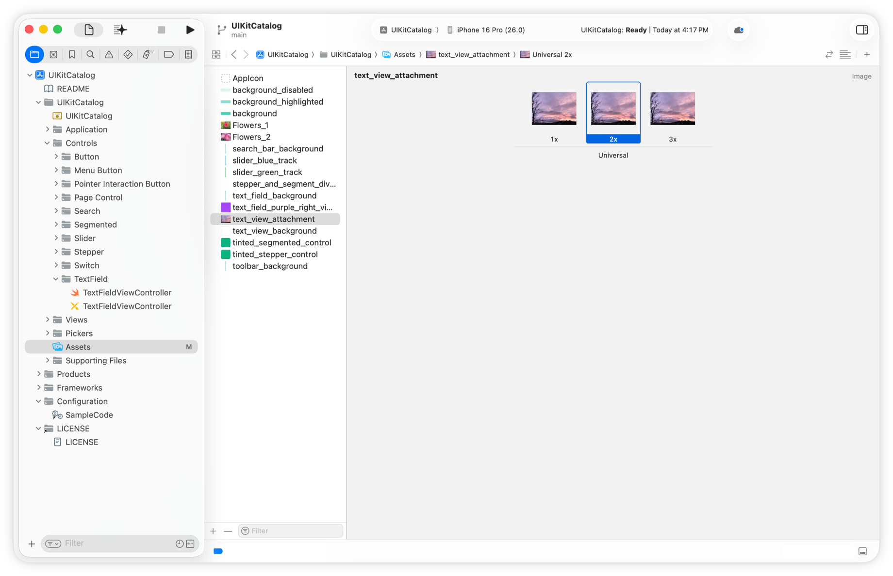

> Navigation: [Technologies](../technologies.md) · [Technology Overviews](../technologyoverviews.md) · [Data management](data-management.md)

# Files and directories

Navigate the file system on Apple devices, find important directories, and read and write your app’s documents and files.

The file system stores data files, apps, and the operating system itself. All disks connected to a device — whether they’re connected physically to the device or connected over the network — contribute space to a single collection of files. To manage the large number of files, the file system organizes them hierarchically using directories. Although the directory hierarchy for most Apple platforms is similar, there are some minor differences from one platform to another.

Most disks attached to Apple devices use [Apple File System](../foundation/about-apple-file-system.md) (APFS) for the underlying disk format. APFS offers modern features like cloning, snapshots, space sharing, fast directory sizing, atomic safe-save operations, and sparse files. Because disks can adopt file systems other than APFS, use system frameworks like [Foundation](../foundation.md) to access files and directories. These frameworks provide a consistent API that handles differences between disk formats.

## File, directory, and bundle concepts

Apple platforms adopt specific conventions for files and directories, and it’s easier to write file-related code when you know these conventions.

### File paths

To specify the location of a file or directory, create a [URL](../foundation/url.md) with the path to the item. Build your path from the directory names that precede the item’s location. When creating paths, adopt the following best practices:

- **Start each path from a well-known directory.** Some platforms require you to put files in [specific locations](files-and-directories.md#Well-known-directories), and starting your path with a well-known directory is always the best approach. For example, iOS apps put files into the app’s container directory. Choose one of these directories instead of building a path from the current working directory or the root of the file system.
- **Separate path components with forward-slash characters.** When building a path from text strings, use a forward-slash (/) character to separate directory and filenames. You can use your string to create a corresponding [URL](../foundation/url.md) for the file or directory.
- **Assume directory and filenames are case sensitive.** APFS is case insensitive by default, but people can configure APFS to be case sensitive. Building your code to handle case-sensitive names lets you run safely on any system.
- **Include filename extensions for all files.** The system uses filename extensions to route files to appropriate apps. It also uses them as a hint for the file’s contents.
- **Show display names only from your interface.** A file or directory can have a second name, known as its _display name_, which you show only from your app’s interface. The system shows [display names](<../foundation/filemanager/displayname(atpath_).md>) to create a more friendly view of the file system. For example, the display name for a file might hide the filename extension. If your app shows file and directory names in its interface, show display names when they’re available. Never use display names in file paths or in code that accesses the file system.

### Well-known directories

The system organizes system files, apps, and all other content into well-known locations, each with a specific purpose. Use each directory only for its intended purpose.

- **Container directory** — Because most apps run in a sandbox, an app’s container directory is the place to put most [app-specific files](../foundation/url/applicationdirectory.md) and documents. The system creates container directories automatically for apps running in iOS, iPadOS, tvOS, visionOS, and watchOS. In macOS, the system creates container directories only for [sandboxed apps](../security/accessing-files-from-the-macos-app-sandbox.md). The container directory contains additional subdirectories for storing [app-private data and support files](../foundation/url/applicationsupportdirectory.md), [discardable cache files](../foundation/url/cachesdirectory.md), and someone’s [personal documents](../foundation/url/documentsdirectory.md). An app can create additional directories inside any of these directories to organize content.
- **Documents directory** — Inside the app’s container directory is a directory for storing a person’s [files and documents](../foundation/url/documentsdirectory.md). Use this directory specifically for files that someone creates as part of using your app. For macOS apps without a sandbox, this directory points to the `Documents` directory for the currently logged-in account.
- **Temporary directory** — Most container directories also contain a place to put [temporary files](../foundation/url/temporarydirectory.md) that you create. Create files in this location, and delete them when you no longer need them.
- **Shared directories** — An app with the proper entitlements can gain access to an app-specific directory in a person’s [iCloud storage](shared-data.md#Make-your-apps-content-available-on-multiple-devices) and use that directory to store content with the person’s other devices. If you build a suite of apps, or share files between an app and app extension, you can also create an [app group](shared-data.md#Share-content-on-the-same-device) to share content between different processes on the same device.

Get paths for other well-known directories from the [URL](../foundation/url.md) or [FileManager](../foundation/filemanager.md) type. macOS in particular has many more well-known directories, most of which people can access directly from the Finder or Terminal apps. You might use one of these locations in specific circumstances. For example, you might want to put an item directly into the home directory of the logged-in account. You rarely use these locations outside of macOS apps.

### Bundles

A _bundle_ is a directory that the system presents to people as a single file. Bundles simplify people’s interactions with apps, app extensions, and other bundled items. For example, interacting with an app launches that app instead of showing you the app’s code and resource files.

Bundle directories have specific structures, which are similar but can vary from one platform to another. In macOS, bundles are more hierarchical, with code, resources, and other types of content in dedicated directories. In iOS, iPadOS, tvOS, visionOS, and watchOS, bundles use a flatter organizational structure for simplicity. Bundle-related APIs use the platform-specific structure to locate resources. For example, when an app [supports multiple languages](../xcode/supporting-multiple-languages-in-your-app.md), the APIs look for localized resources in language-specific project directories, which have an ISO 639 language code and an `.lproj` extension for the directory name.

**macOS**

```swift
MyApp.app
    Contents
        MacOS
            MyApp
        PkgInfo
        Resources
            Assets.car
            en.lproj
            de.lproj
            ...
```

**Other platforms**

```swift
MyApp.app
    Assets.car
    MyApp
    PkgInfo
    en.lproj
    de.lproj
    ...
```

Although bundles have a well-defined structure, you don’t need to know the details of this structure to create or use them. Xcode automatically creates bundle structures for you at build time, and places code and other resources in appropriate locations. To retrieve items from a bundle, use a [Bundle](../foundation/bundle.md) type to request the URL of the item you want first. This type searches the bundle for the requested resource, taking platform differences and language settings into account.

The Info pane of your project in Xcode also contains static information about your app’s [features and configuration](../bundleresources/information-property-list.md). Configure this file in Xcode by selecting it and using the associated editor to [add relevant entries](../bundleresources/managing-your-app-s-information-property-list.md).

### File packages

Like a bundle, a _file package_ is a directory that the system presents to people as a single file. You use file packages to implement custom file formats, especially when those formats contain multiple different types of data. For example, a word processor document type that contains one or more files with text and separate files for images and media can keep those resources separate using a file package.

Unlike bundles, file packages have no predefined structure, so you’re responsible for determining the contents and organization of your app’s file packages. To define a custom document type, [add that type](../bundleresources/managing-your-app-s-information-property-list.md) to the Info pane of your project in Xcode. To turn a document type into a package, add the [LSTypeIsPackage](../bundleresources/information-property-list/cfbundledocumenttypes/lstypeispackage.md) key to its definition.

### Asset catalogs

An [asset catalog](../xcode/managing-assets-with-asset-catalogs.md) is one of the best ways to manage resources in your app bundle. Asset catalogs help you organize the images icons, colors, and other resources your app uses. Depending on the device and system settings, your app might need to display images and colors with a several different appearances. For example, you might need to display light or dark versions of an image or one with a high contrast ratio. Asset catalogs let you gather all of these related resources under a single name in your app bundle. When you need a resource, you specify the name and the system provides the version of the resource that best matches the current settings.



## Read, write, and manage files and directories

System-provided objects minimize the time you spend reading, writing, and managing files directly. In a document-based app, [FileDocument](../swiftui/filedocument.md), [UIDocument](../uikit/uidocument.md), and [NSDocument](../appkit/nsdocument.md) automatically read and write the underlying file for you, and support autosave operations and your app’s menus. Similarly, [Image](../swiftui/image.md), [UIImage](../uikit/uiimage.md), and [NSImage](../appkit/nsimage.md) types read image files and provide you with an object you can use directly in your app. These types let you focus on using the data, and are often more efficient than managing the files yourself.

When working with custom file types, or files the system doesn’t natively support, you can still manage files and directories yourself. The [Foundation](../foundation.md) framework provides several types for reading and writing files, but the [FileManager](../foundation/filemanager.md) provides your initial access to the file system. Use that object to find and create files and directories, read and write file attributes, and move items around the file system.

When you need to read and write files, you have several options. You can do so all at once using a [Data](../foundation/data.md) type, or you can open a file and read it incrementally using a [FileHandle](../foundation/filehandle.md) object or the POSIX APIs. If you have a custom type that uses a file package, manage the files in that package using a [FileWrapper](../foundation/filewrapper.md) object.

**Data object**

```swift
let filePathURL = ... // A path to a new file.
let objectToSave = ... // The object to save.
do {
    // Create a Data object and write it atomically to disk.
    let data = try NSKeyedArchiver.archivedData(withRootObject: objectToSave, requiringSecureCoding: true)
    try data.write(to: filePathURL, options: .atomic)
    print("File written successfully.")
}
catch {
    print("File not written.")
}
```

**File handle**

```swift
let filePathURL = ... // A path to an existing file.
do {
    // Open a file handle and read data from it.
    let fileHandle = try FileHandle(forReadingFrom: filePathURL)
    let fileContents = try fileHandle.readToEnd()
    print("File read successfully.")
}
catch {
    print("File not read.")
}
```

If your app shares files with other processes, [coordinate access](shared-data.md#Coordinate-access-to-shared-files) to ensure file integrity. If your app shares files with an app extension or another process, or if you read and write files from someone’s iCloud storage, you must use file coordinators.

## Download large files in the background

When people buy your app from the App Store, they want to be able to download it quickly and try it out. If your app has large data files that it doesn’t need right away, consider downloading them separately after your app is already on someone’s device. A game might ship with the assets for the first level and download assets for other levels separately. Similarly, you might choose to download a large language model separately, so you can update it later.

To support background downloads, store your files on your company’s servers or on the App Store. Adopt the [Background Assets](../backgroundassets.md) framework and use it to schedule downloads. If your app needs files at first launch, configure a [list of essential files](../backgroundassets/creating-managed-asset-packs.md) for the system to download right away. Provide an [app extension ](../backgroundassets/downloading-essential-assets-in-the-background.md) to track the download progress of your app’s files.

## Protect the files you create

Enable automatic encryption for files you create by assigning an appropriate [data protection level](../foundation/urlfileprotection.md) to each one. The system stores your files encrypted on disk, making them accessible only under specific circumstances. For example, you might make files accessible only after someone unlocks their device. Choose a level of protection based on the type of data you’re saving, adopting more strict protection rules for sensitive or personal data.

> [!note] Note
> If your app manages personal or sensitive information, consider [adding additional encryption](../cryptokit.md) for any data you store in files on disk.
