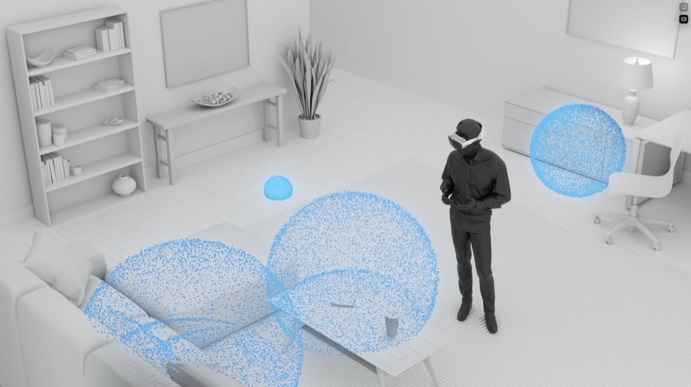
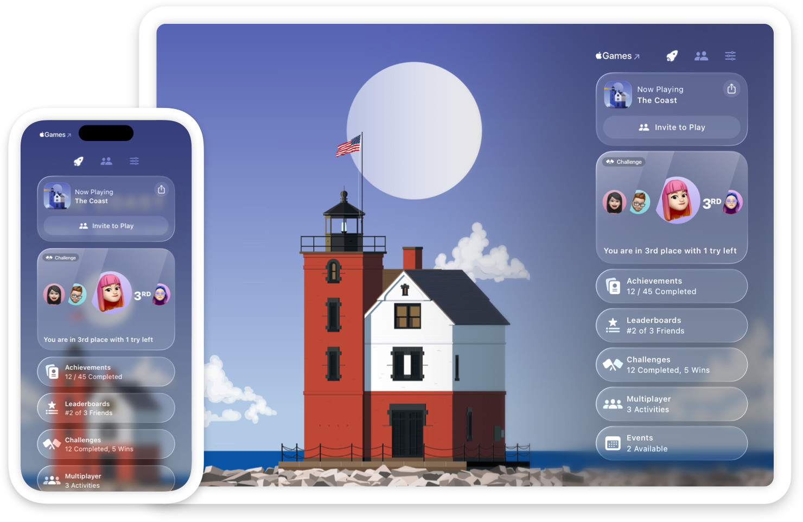

> Navigation: [Technologies](../technologies.md) · [Technology Overviews](../technologyoverviews.md) · [Games](games.md)

# Game technologies

Plan the creation of your game and incorporate the gameplay features people expect.

Game development starts with [Xcode](../xcode.md), Apple’s integrated development environment, which includes code editors, debugging tools, device simulators, graphics performance and analysis tools, and platform SDKs. When you [create a project](../xcode/creating-an-xcode-project-for-an-app.md), Xcode lets you choose the initial platforms, templates, and game technologies for your project. If you already have a game, you can also [bring that game](https://developer.apple.com/games/game-porting-toolkit/) to Apple platforms.

Great games take advantage of the characteristics and capabilities of the devices that they run on. For example, someone might use their iPhone when travelling or relaxing on the couch, or use their Mac when they’re sitting at their desk. [Design your game](../design/human-interface-guidelines/designing-for-games.md) with these factors in mind and take advantage of all available hardware connected to the device.

## Create gorgeous graphics

Get the best graphics performance on all Apple platforms using [Metal](https://developer.apple.com/metal/) — Apple’s API for hardware-accelerated 2D and 3D graphics. With Metal, you have the power of the graphics processing unit (GPU) at your fingertips. Deliver smooth 3D animations with realistic visual effects from your game’s rendering code. Tune the performance of that code to maximize frame rates and efficiency on a variety of Apple devices.

Metal offers the features you need to create detailed graphics, with the performance you need to achieve high frame rates:

- [Run commands](../metal/setting-up-a-command-structure.md) directly on the device’s GPU. Encode [compute passes](../metal/compute-passes.md) to run in parallel with [render passes](../metal/render-passes.md) so that computations don’t impact graphics rendering.
- [Load graphics resources](../metal/resource-loading.md) faster by streaming asset data to textures and buffers asynchronously.
- Improve the performance of 3D scenes using high-performance temporal antialiasing or spatial upscaling. Upscale low-resolution images to higher-resolution images in less time using [MetalFX](../metalfx.md).
- Apply high-performance filters to images, multiply matrices, and vectors using the [Metal Performance Shaders framework](../metalperformanceshaders.md).
- [Accelerate ray tracing tasks](../metal/accelerating-ray-tracing-using-metal.md) using Metal’s built-in ray tracing support.

Make your game fast and efficient using the powerful suite of [Metal development tools](../xcode/metal-developer-workflows.md).

- [Validate your Metal code](../xcode/validating-your-apps-metal-api-usage.md) and catch shader execution errors in Xcode.
- [Investigate visual artifacts](../xcode/debugging-the-shaders-within-a-draw-command-or-compute-dispatch.md), and [optimize GPU performance](../xcode/optimizing-gpu-performance.md), using the [Metal debugger](../xcode/metal-debugger.md).
- [Find the cause of low frame rates](../xcode/analyzing-the-performance-of-your-metal-app.md) so you can fix interruptions and stutters.
- [Maintain a small memory footprint](../https_/developer.apple.com/videos/play/wwdc2022/10106.md) to improve overall performance.
- [Analyze your game’s performance in real time](https://developer.apple.com/documentation/xcode/monitoring-your-metal-apps-graphics-performance/) with the Metal Performance HUD, which shows CPU and GPU metrics in real time.

Make sure you tune your graphics code specifically for Apple silicon:

- [Fix architectural differences in your code](../apple-silicon/addressing-architectural-differences-in-your-macos-code.md) to ensure your code runs well on Apple silicon. Make sure your code supports virtual memory-page sizes, cache line sizes, variadic functions, memory that’s simultaneously writable and executable, and more.
- [Manage thread priorities and schedules](../apple-silicon/tuning-your-code-s-performance-for-apple-silicon.md#Assign-Quality-of-Service-QoS-Classes-to-Work) using [Dispatch](../dispatch.md) and [Quality of Service (QoS)](../dispatch/dispatchqos.md) levels.
- Accelerate your code’s performance using the open source [SSE2Neon](https://github.com/DLTcollab/sse2neon) and [AVX2Neon](https://github.com/kunpengcompute/AvxToNeon) libraries. The Neon instruction set provides single instruction multiple data (SIMD) operations to accelerate performance on ARM processors.
- [Optimize for Apple GPUs and Tile-Based Deferred Rendering](../metal/tailor-your-apps-for-apple-gpus-and-tile-based-deferred-rendering.md). Write your Metal code to use features like imageblocks, tile shading, and raster order groups.

## Build a spatial computing game for visionOS

Apple Vision Pro gives you an opportunity to create immersive 3D experiences. Whether you’re creating a fully immersive game or an augmented reality experience, take advantage of [visionOS](../visionos.md) features. And if you’re making a game for iPad or iPhone, that game can also run run on Apple Vision Pro in a window and use direct and indirect gestures as input.

- Integrate your game’s virtual content into someone’s real-world environment using [RealityKit](../realitykit.md), [SwiftUI](../swiftui.md), and [ARKit](../arkit.md). RealityKit makes your virtual content look more realistic by applying depth mitigation, passthrough, ground shadows, and other effects automatically.
- [Create a fully immersive app](../https_/developer.apple.com/videos/play/wwdc2023/10089.md) and render everything yourself using [Metal](../metal.md) and [Compositor Services](../compositorservices.md).
- [Design your game for spatial input](../https_/developer.apple.com/videos/play/wwdc2023/10073.md) using [ARKit](../https_/developer.apple.com/videos/play/wwdc2023/10082.md). Support interactions with attached game controllers and keyboards, which passthrough makes visible even in a Full Space.
- [Bring your existing Unity VR app to visionOS](../https_/developer.apple.com/videos/play/wwdc2023/10093.md) or [create a new immersive Unity app](../https_/developer.apple.com/videos/play/wwdc2023/10088.md).

Get started by [learning about the building blocks](https://developer.apple.com/videos/play/wwdc2023/10260/) that make up spatial computing, and find out how you use these elements to build your game experiences. Adapt your 2D games by adjusting your content to [take advantage of 3D](https://developer.apple.com/videos/play/wwdc2023/10076/). For example, render objects in separate layers to create a parallax effect, and add smoke, sparks, and other visual elements that come out of visual plane.

## Create exceptional soundtracks

Increase engagement and realism by adding sound effects and music that complement the action within your game.

- Play your app’s music, audio, and sound effects using the [AVFAudio](../avfaudio.md) framework. Configure your [audio session](../avfaudio/avaudiosession.md) to mix your audio components the way you want, then play back your audio using an [audio player](../avfaudio/avaudioplayer.md) object.
- Play music from someone’s iTunes library using the [MusicKit](../musickit.md) framework.
- [Create an immersive audio experience](../phase/playing-sound-from-a-location-in-a-3d-scene.md) that reacts in real time to events in your game using the [PHASE](../phase.md) framework.
- Perform advanced audio manipulation, or work directly with audio hardware, using the [Core Audio](../coreaudio.md) framework.
- [Add audio](../realitykit/scene-content-audio.md) to RealityKit [entities](../realitykit/entity.md) to bring those objects to life. [RealityKit](../realitykit.md) automatically applies reverb and real-world acoustics to your entities to give them a realistic sound. [Explore other aspects of immersive sound design](../https_/developer.apple.com/videos/play/wwdc2023/10271.md) to further improve the audio experience of your game.

On iPhone and Apple TV, get the player’s attention and reinforce actions with tactile and audio feedback using the [Core Haptics](../corehaptics.md) framework. Play both transient and continues patterns to match the events in your app. For example, play a short vibration pattern when someone toggles a switch, and play a continuous pattern to represent the ringing of a telephone. Generate haptics for an attached game controller using the [Game Controller](../gamecontroller.md) framework instead.

## Support input devices

Let players interact with your game in more natural ways using [Game Controller](../gamecontroller.md). Support the latest

- Support third-party gamepads, arcade sticks, and racing wheels, as well as the mouse and keyboard.
- Overlay a virtual controller on mobile devices to emulate a physical controller.
- Support [advanced game controller features](../https_/developer.apple.com/videos/play/wwdc2020/10614.md) such as [rumble and haptic feedback](../gamecontroller/gcdevicehaptics.md) from a physical controller.

The App Store adds a game controller badge to your game if it supports controllers.

## Build a social network

Take advantage of the services Apple provides for social gaming and storing game data using [Game Center](https://developer.apple.com/game-center/). Let Apple help promote your game organically through players sharing and interacting with each other.

- Grow discovery and engagement using [Game Center](../gamekit/initializing-and-configuring-game-center.md), Apple’s social-gaming network.
- Keep players engaged using [achievements](../gamekit/rewarding-players-with-achievements.md) and [leaderboards](../gamekit/encourage-progress-and-competition-with-leaderboards.md).
- [Connect players to their friends](../gamekit/connecting-players-with-their-friends-in-your-game.md) and create new ways for friends to interact with each other.
- Let people continue your game on any of their devices by saving game data in their [iCloud storage](shared-data.md#Make-your-apps-content-available-on-multiple-devices).
- Present familiar interfaces to [match players](../gamekit/finding-multiple-players-for-a-game.md) with other players before the game starts.
- [Share data between players](../gamekit/sending-messages-to-players-in-turn-based-games.md) to advance the gameplay as each person takes their turn. [Exchange messages](../gamekit/exchanging-data-between-players-in-turn-based-games.md) between players in turn-based games.
- Let people communicate with each other using FaceTime or Messages by turning your game into a [shared activity](../groupactivities.md).
- Add a screen-sharing or game-streaming feature to your macOS game using [ScreenCaptureKit](../screencapturekit.md).

## Distribute your game

The [App Store](https://developer.apple.com/app-store/features/) lets you easily distribute your game to hundreds of millions of people around the world on all Apple platforms. The App Store processes customer payments, provides secure and reliable downloads, manages releases, and helps promote your game.

- Distribute your game through the App Store. Join the [Apple Developer Program](https://developer.apple.com/help/account/get-started/about-your-developer-account/) and upload builds using Xcode. Use [App Store Connect](https://developer.apple.com/help/app-store-connect/get-started/app-store-connect-workflow/) to configure game-oriented features, distribute your game for beta testing, and submit builds to App Review.
- [Prepare your app for distribution](../xcode/preparing-your-app-for-distribution.md) and let the App Store optimize downloads for each platform. Enable faster downloads of your game by [hosting assets on the App Store or your own server](../backgroundassets.md), and downloading them separately.
- [Create your product page](https://developer.apple.com/app-store/product-page/) on the App Store with app previews, screenshots, and a description that gets players excited about your game.
- Make your macOS game available on Apple silicon only. [Target your game](https://developer.apple.com/macos/submit/) for the “Apple silicon-only apps” section of the Mac App Store by targeting your game to Macs with an M1 chip or later.
- Give players confidence that your macOS game is from you and is free of malicious components by
  [notarizing it](../security/notarizing-macos-software-before-distribution.md) before distribution.
- Protect the integrity of your game by enabling the [Hardened Runtime](../security/hardened-runtime.md) capability. Select options to prevent against malicious code injection, dynamic library hijacking, and process memory space tampering.

Contact Apple if you’re working on a groundbreaking, unreleased game and would like Apple to consider it for the [Apple Arcade](https://developer.apple.com/apple-arcade/) game subscription service.
