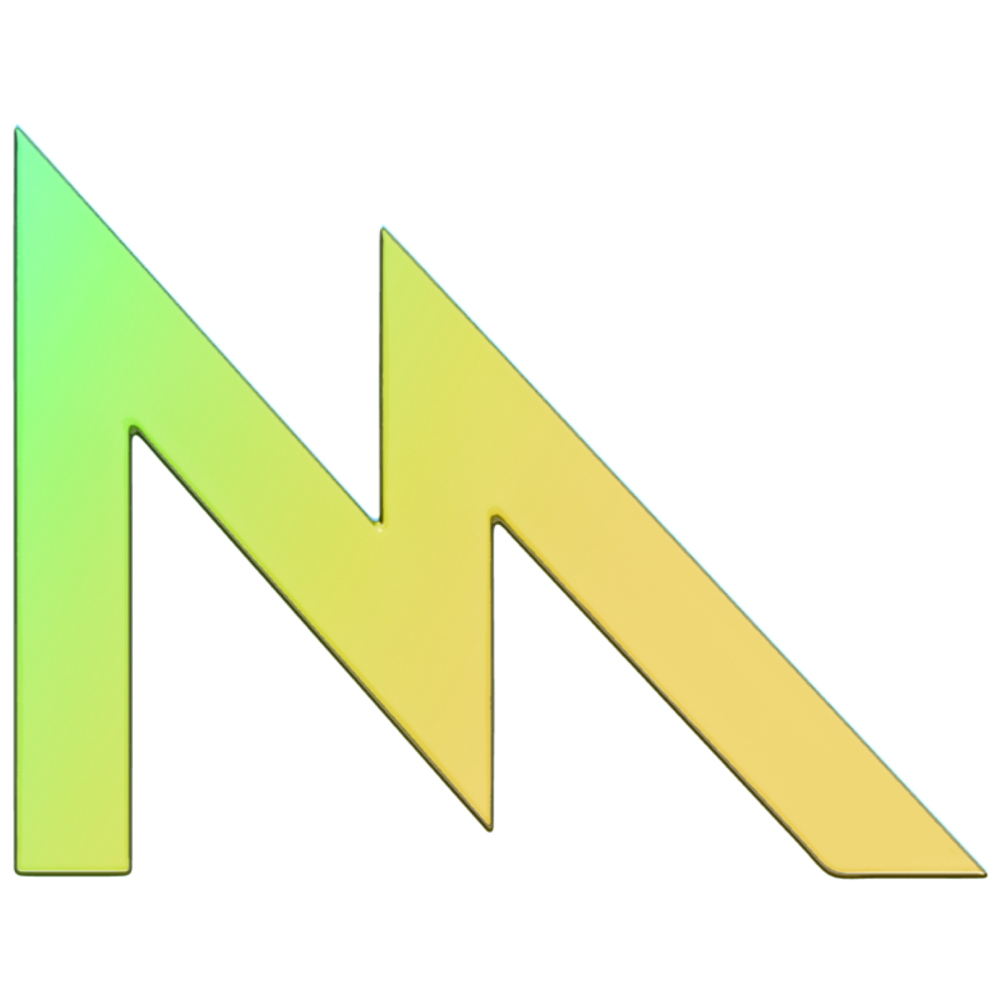
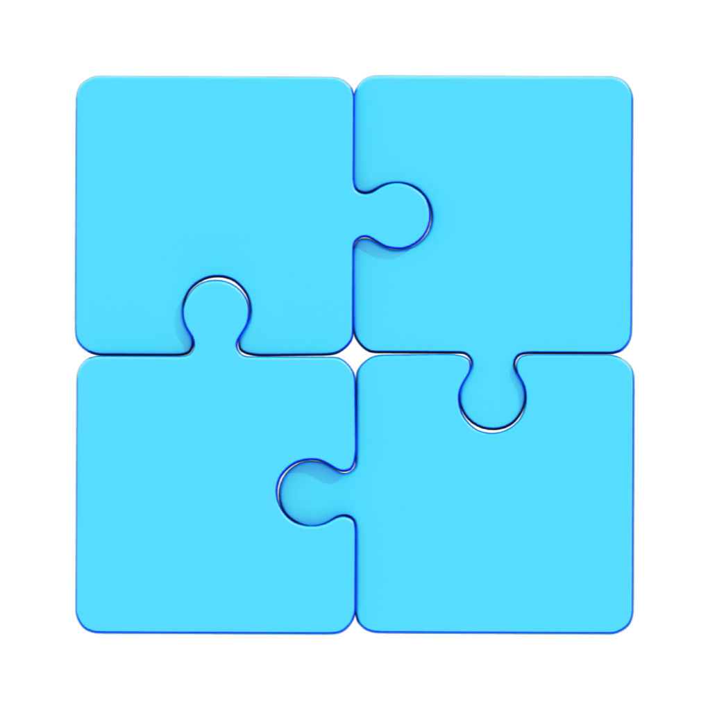

> Navigation: [Technologies](../technologies.md) · [Technology Overviews](../technologyoverviews.md)

# Games

Deliver fantastic game experiences to millions of players worldwide using Apple hardware, graphics, audio, social gaming, and distribution tools.

Whether you’re starting your game from scratch or porting a game from another platform, Apple offers tools and technologies to help you tap into the high-performance graphics and amazing sound of Apple devices. Make your game experience even better by adding support for game controllers, leaderboards, achievements, challenges, and multiple players.

Familiarize yourself with the tools and technologies you use to build games on Apple platforms. Apple provides the hardware, graphics, audio, social-gaming, and development and distribution systems you need to create the next generation of games. On visionOS, build unparalleled immersive games that incorporate real-world objects and infinite spaces. Distribute your game on the App Store to reach hundreds of millions of people around the world.

- Create gorgeous graphics, and get the best graphics performance from Apple’s hardware using Metal.
- Create exceptional soundtracks or immersive audio experiences, and use haptic feedback to get people’s attention.
- Add support for game controllers and other input devices.
- Support Game Center and enhance your game’s social aspects with multiplayer support, achievements, leaderboards, and challenges.

Catch mistakes early by setting up a project to remotely build a CMake-based project from within Microsoft Visual Studio on a target Mac system. Use this setup to [build your macOS game](building-your-macos-game-remotely-from-your-pc.md) from your PC.

- Configure a Mac to build your Windows game remotely.
- Configure your PC to initiate builds from Microsoft Visual Studio.
- Build and run your project remotely.
- Debug connectivity issues between your systems.

## Topics

### New games

- [Game technologies](games-technologies.md) — Plan the creation of your game and incorporate the gameplay features people expect.

### Porting

- [Building your macOS game remotely from your PC](building-your-macos-game-remotely-from-your-pc.md) — Configure a Mac for remote builds, and use it to build your game from your PC and catch mistakes when porting your game to macOS.
