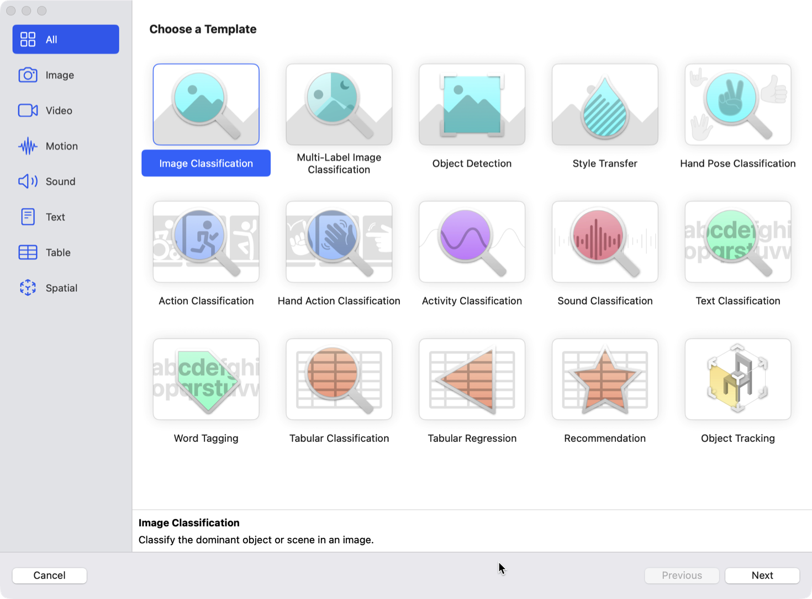
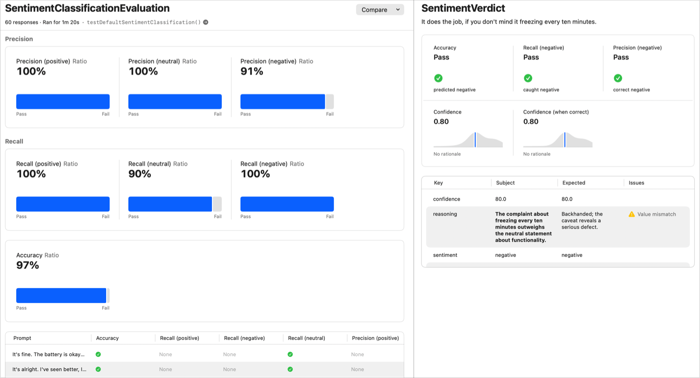
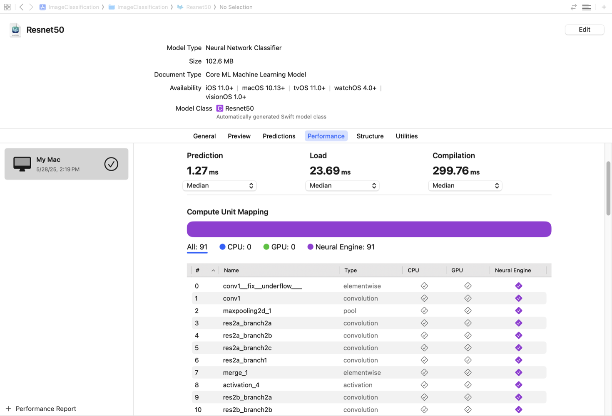

> Navigation: [Technologies](../technologies.md) · [Technology Overviews](../technologyoverviews.md) · [Apple Intelligence and machine learning](ai-machine-learning.md)

# Generative models and machine learning

Enhance features in your app by using the models at the core of Apple Intelligence.

## Overview

To add intelligent capabilities to your apps, build your features using the same models that power Apple Intelligence. Apple makes its models, so you don’t have to spend time creating and training your own. Use these models to answer general questions, extract structured data, personalize your app’s experience, or implement intelligent features. As your needs grow, integrate custom models you create or ones you acquire from other sources.

As you add support for generative models, keep the intended experience in mind. Focus on the prompts you send to the model initially, and use configuration options to tune the model’s output. When you’re ready for something more custom, review the [guidance and best practices](https://developer.apple.com/design/human-interface-guidelines/machine-learning) in the [Human Interface Guidelines](../design/human-interface-guidelines.md) before building an intelligent feature with your own model.

## Integrate Apple’s generative models into your workflows

The [Foundation Models](../foundationmodels.md) framework provides access to the same large language models that power Apple Intelligence. Use these models to analyze the text-based content you provide and generate responses.

When using Foundation Models, focus on [writing prompts](../foundationmodels/prompting-an-on-device-foundation-model.md) that deliver the results you need. It takes time and practice to craft a good prompt, so try [a variety of requests](../foundationmodels/languagemodelsession.md) and test the output the model returns. To minimize the mismatch between the model’s output and your app’s code, describe the output you want using [guided generation](../foundationmodels/generating-swift-data-structures-with-guided-generation.md). For example, you might use this approach to map the model’s output to a custom data type you use to configure your app.

Supplement the model you use with custom [tools](../foundationmodels/expanding-generation-with-tool-calling.md) to provide the model with information specific to your app. Tools provide a way for the model to interact with your code and retrieve additional information. For example, use the [Spotlight search tool](../corespotlight/spotlight-search-tool.md) to include your app’s content as additional context for the model to consider when generating its response.

## Run deep learning models on device with Core AI

Use the [Core AI](../coreai.md) framework to run deep learning models on a device for tasks like generating text, recognizing images, or transcribing speech. Core AI handles models of any size, from small embedded models to large language models, running them across the CPU, GPU, and Neural Engine of the device.

To get started with Core AI, convert your own model to the `.aimodel` format with the [coreai-torch](https://apple.github.io/coreai-torch) Python library, then compress it for deployment using [coreai-optimization](https://apple.github.io/coreai-optimization).

After generating the `.aimodel` file, [bundle and load it in your app using Swift APIs](../coreai/integrating-on-device-ai-models-in-your-app-with-core-ai.md). Core AI specializes the model by optimizing it for the current device, and allows for customizing [specialization and caching](../coreai/managing-model-specialization-and-caching.md) defaults.

For deeper customization, Core AI lets you replace model operations with custom Metal 4 kernels or your own memory buffers for model inputs and outputs. To diagnose problems and tune performance, Core AI provides a suite of [debugging and profiling tools](../coreai/inspecting-debugging-and-profiling-core-ai-models.md).

## Build custom machine learning models for your app

When your app needs a smaller, task-specific model, like a classifier or a regressor, create and train your own using the [Create ML app](https://developer.apple.com/machine-learning/create-ml/) or the [Create ML](../createml.md) and [Create ML Components](../createmlcomponents.md) frameworks. These tools take the data you provide and generate a model you can run in your app. Prepare the data you use to train models with help from the [TabularData](../tabulardata.md) framework. It supports loading, filtering, grouping, joining, and summarizing CSV or JSON data.

Run the models you create with Create ML on device using [Core ML](../coreml.md). Use Core ML for standard machine learning tasks like decision trees and tabular regression, and for models that don’t need the deep learning capabilities of [Core AI](../coreai.md). Your app invokes Core ML from the CPU, and Core ML decides at runtime whether to run inference on the CPU, GPU, or Neural Engine.

To compose a model from low-level operations, build it with [Metal Performance Shaders Graph](../metalperformanceshadersgraph.md), then run inference on the result with Core ML. This provides an alternative to training a model in Create ML or converting an existing PyTorch or TensorFlow model.

When your app needs inference to run on the GPU alongside compute or render passes, [schedule it directly on the GPU timeline](../metal/running-a-machine-learning-model-on-the-gpu-timeline.md) and the [tensor types and operations](https://developer.apple.com/metal/Metal-Shading-Language-Specification.pdf) in Metal Shading Language 4. This avoids the CPU round trip that occurs when Core ML and Metal coordinate through the app.

If you’re performing real-time signal processing on the CPU, use Core ML with [BNNSGraph](../accelerate/bnnsgraph.md) to support latency-sensitive inference.

If you’ve trained a model in [MLX](https://ml-explore.github.io/mlx/), or another library, convert it to the Core ML format using [Core ML Tools](https://coremltools.readme.io/). For common tasks like image classification or sentiment analysis, you can also [download a pre-built model](https://developer.apple.com/machine-learning/models/) and add it directly to your app.

## Evaluate the quality of your intelligence-powered features

When your feature depends on a generative model, use the [Evaluations](../evaluations.md) framework to see how well it’s working. Evaluations provides a systematic way to measure the output quality of any intelligence-powered feature you build, and a way to catch regressions when an underlying model changes or your prompt evolves.

An [evaluation](../evaluations/evaluating-language-model-responses.md) bundles the feature under test, a dataset of representative inputs, and evaluators that score each response. Use code-based evaluators for criteria with a clear programmatic definition, and use a [model-as-judge evaluator](../evaluations/modeljudgeevaluator.md) to score subjective qualities like tone, helpfulness, or accuracy.

An Xcode screenshot of an Evaluations results view. The left pane shows precision, recall, and accuracy ratios for a sentiment classification evaluation, each with a pass rate and bar chart. The right pane shows a single sample with pass results for accuracy, recall, and precision, confidence scores, and a table of scored responses.

Run evaluations from Xcode to view results and compare them against previous runs. Integrate evaluations into your everyday workflow to track quality over time and build confidence before shipping your app.

## Measure the performance of your custom models

Measuring the performance of models is an important task of machine learning. In Xcode, preview your model’s behavior by using sample data files or using the device’s camera and microphone. Review the performance of your model’s predictions directly from Xcode, or [profile your app in Instruments](../coreai/analyzing-model-runtime-performance-with-instruments.md) to get a thorough performance analysis. After adding a model to your project, select it to see the expected prediction latency, load times, and which compute units support and run each operation.

An Xcode screenshot that shows a selected model file. The UI shows the performance report for the Resnet50 image classification model with median times for prediction, load, and compilation. It also shows the compute unit mapping and that each unit ran on the Neural Engine.

To build a deeper understanding of the model you’re working with, Xcode allows you to visualize the structure of the full model architecture and dive into the details of any operation. This visualization helps you debug issues and find performance enhancing opportunities.

## Make your company’s generative models available to everyone

To help others build their generative AI feature, the [Foundation Models](../foundationmodels.md) framework provides a consistent API experience for interacting with any on-device or server-based model. By conforming to the [language model protocol](../foundationmodels/languagemodel.md), you provide a high-quality integration built by the people who know the model best.

To adopt the protocol, [create a Swift package](../xcode/creating-a-standalone-swift-package-with-xcode.md) that handles transforming events from the framework into requests your server expects, and streams responses back to an app using your model. When your implementation is ready to adopt, distribute your solution with Swift Package Manager so people can easily integrate your model in their project.

To start routing requests to your model, those who adopt your model package only need to change a single line of code to initialize their session — just as they do with [Private Cloud Compute](../foundationmodels/adding-server-side-intelligence-with-private-cloud-compute.md) (PCC). Keep in mind that you’re responsible for handling server authentication and managing any on-device weights your model requires.

The framework also supports capabilities beyond its built-in primitives. When a new modality comes along — like audio, video, or some new type of content — update your package and provide a [custom transcript segment](../foundationmodels/transcript/customsegment.md) to send that data through your model.
