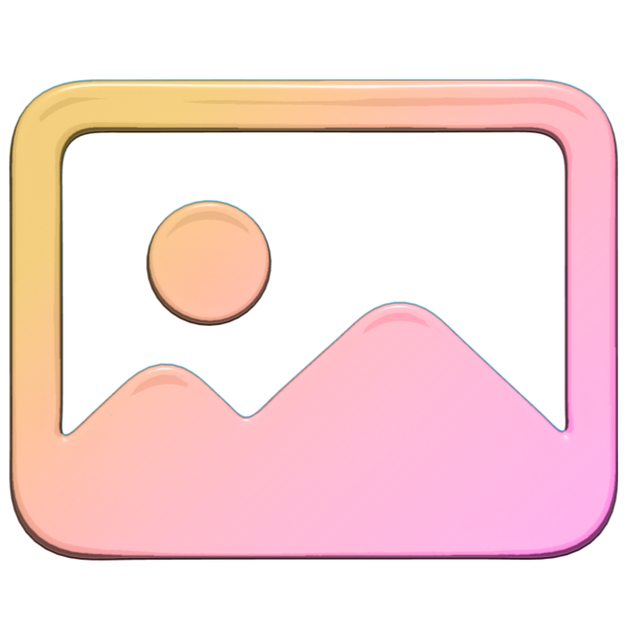
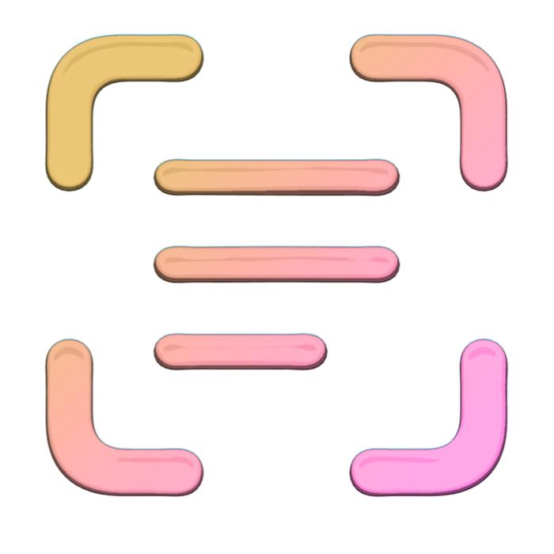
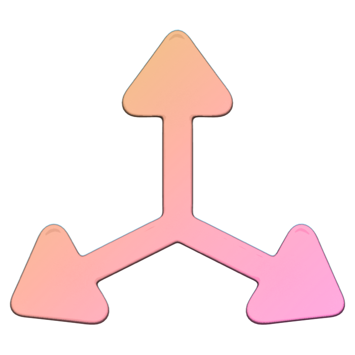
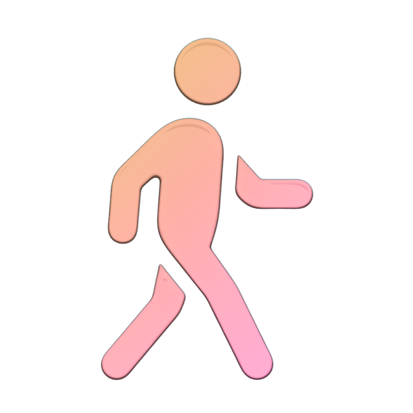

> Navigation: [Technologies](../technologies.md) · [Technology Overviews](../technologyoverviews.md)

# Graphics, drawing, and animation

Create 2D and 3D content for your app, and learn how to animate and print that content.

When you want to customize your app’s appearance in ways the standard system views don’t support, draw the content yourself using the system’s drawing technologies. Most apps can use a combination of images, text, and standard views to display their content. Custom drawing lets you create any content you want and update it dynamically. A digital painting app might use custom drawing to reflect mouse or touch input, while a game might draw custom worlds in two or three dimensions.

Images provide a simple way to display custom content without drawing it dynamically at runtime. Use images in your interface for decoration or to show custom content. Access a person’s photo library with permission and include their photos in the content you display. Capture or create images on the fly and save them to disk or access their pixel information and metadata.

- Load images and photos from disk and display them in your interface.
- Create and use SF Symbols in your interface.
- Capture photos and videos using the device’s camera.
- Incorporate someone’s personal photos into your app.
- Draw images and access pixel information and metadata.

Incorporate text into your interface to describe your content in a person’s native language. Manage your app’s text as Unicode characters and support both left-to-right and right-to-left layouts. Display text in your interface using the system-provided text views or create your own custom text view to perform advanced layout of your content.

- Display text in your interface using single and multiline text views.
- Include text from different languages in a single string.
- Format the text you display with fonts, colors, and a variety of style options.
- Create custom text views and perform your own text layout and rendering.

Perform custom drawing in your app for content that changes dynamically or in ways you can’t predict at design time. Use system types to configure the drawing environment, issue drawing commands, and composite the results in one of your views. Configure your app for printing and use your existing drawing code to generate the content for an attached printer.

- Draw rectangles, circles, lines, polygons, and other shapes.
- Build an efficient drawing engine using shaders and Metal.
- Generate a PDF of the content you draw or send it to a printer.
- Add a drawing canvas to your app that supports Apple Pencil input.

Build and animate 3D content entirely on your own or with the help of system technologies. Give your content its appearance using custom materials and textures you define in advance. When performance matters most, build your own rendering engine to communicate directly with the GPU.

- Build 3D content from simple shapes and USDZ meshes.
- Construct 3D scenes using Reality Composer Pro.
- Add behaviors to animate changes to your content over time.
- Build your own 3D rendering engine using shaders and Metal.

Animate items in your interface to make them feel more lively or to provide feedback about what your app is doing. Keep people oriented to where they are in your app’s content by animating transitions between different sets of views. Customize the parameters and timing of your animations and synchronize them with animations in other parts of your interface.

- Animate changes to view properties such as opacity, size, or position.
- Customize the transitions between your app’s views.
- Animate behaviors and movement to 3D scenes using RealityKit.
- Animate everything in your interface using Metal.

## Topics

### Standard content

- [Images, camera, and photos](images-camera-and-photos.md) — Display existing images and photos, create or capture new images, and read and write image data.
- [Text display](text-display.md) — Display localized text from your app’s interface, and discover how to lay out and render text yourself.

### Drawing techniques

- [Drawing and printing](drawing-and-printing.md) — Draw custom content in your app’s views, and print content to a file or available printer.
- [3D content](3d-content.md) — Create 3D content and incorporate it into your app’s interface.
- [Animations](animations.md) — Add motion to your app’s interface to entertain or provide feedback.
