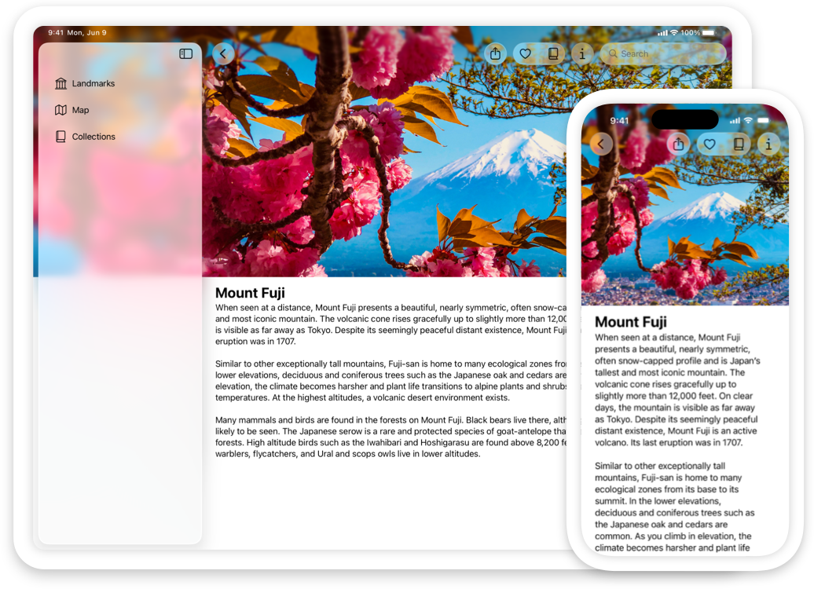
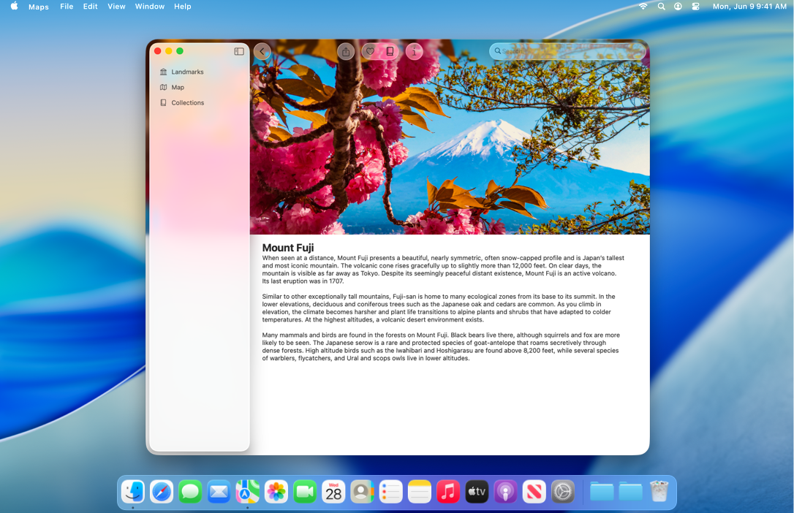
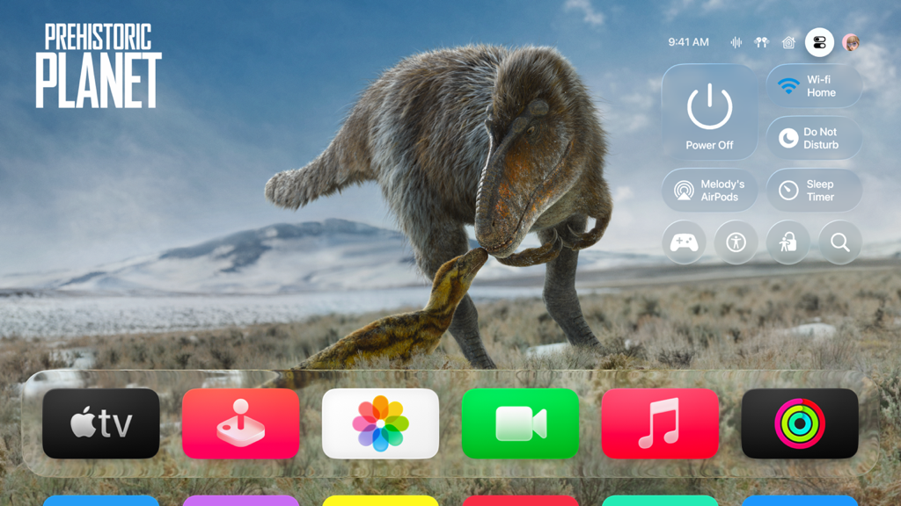
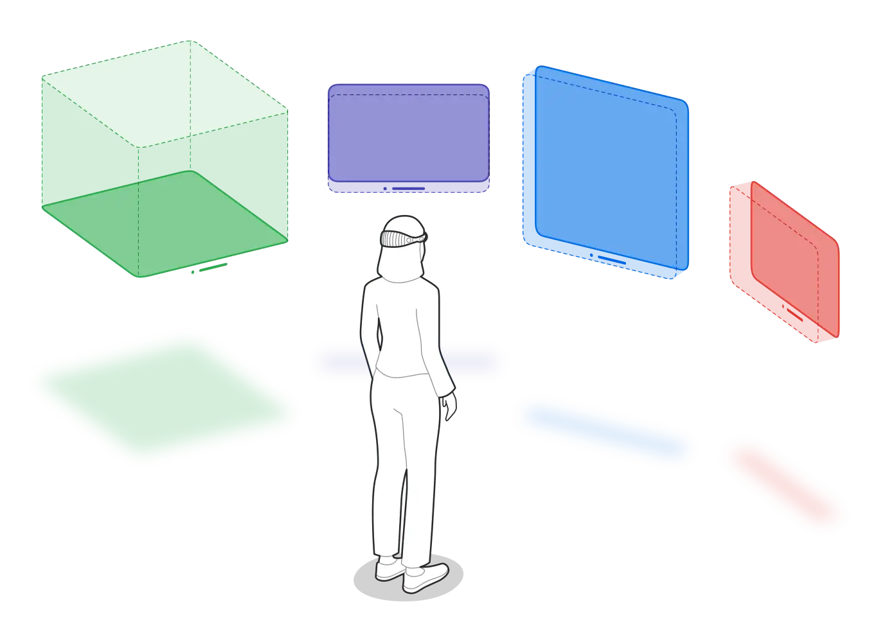
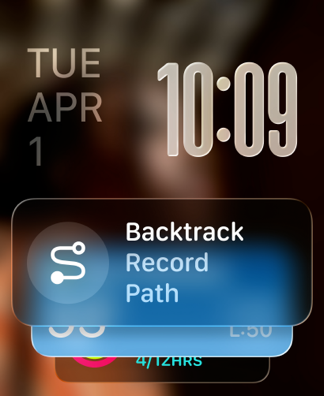
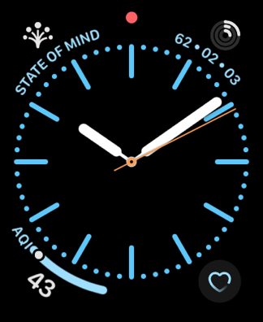
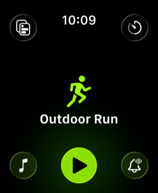
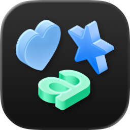

> Navigation: [Technologies](../technologies.md) · [Technology Overviews](../technologyoverviews.md) · [App design and UI](app-design-and-ui.md)

# Interface fundamentals

Explore the components that go into building your app’s interface, and discover platform-specific features that improve the experience you offer to people.

To build your app’s interface, you can use standard system views, draw content yourself, or mix custom drawing with the standard views. Regardless of how you create your content, all interfaces rely on some standard components to present that content:

- _Windows_ are the primary containers for your app’s content, and they also facilitate system-related interactions. Every [SwiftUI](../swiftui/windows.md), [UIKit](../uikit/windows-and-screens.md), and [AppKit](../appkit/windows-panels-and-screens.md) app has at least one [window](../design/human-interface-guidelines/windows.md), and some platforms let your app display multiple windows simultaneously. Windows in macOS, iPadOS, and visionOS can have a visible border and controls to change the size of the window. Windows in iOS, tvOS, and watchOS have no visible appearance of their own.
- _Scenes_ manage instances of your app’s interface in iOS, iPadOS, tvOS, visionOS, and watchOS. Every [SwiftUI](../swiftui/scenes.md) and [UIKit](../uikit/scenes.md) app has at least one scene, and you can create additional scenes to manage distinct experiences. Each scene manages the data for one instance of your interface and any relevant system behaviors. For example, each scene object handles transitions between the foreground and background execution states for that scene. AppKit apps don’t use scenes.
- _Views and controls_ display specific types of content in your interface. [SwiftUI](../swiftui.md#Views), [UIKit](../uikit/views-and-controls.md), and [AppKit](../appkit/views-and-controls.md) provide views for displaying standard types of content like [images](../design/human-interface-guidelines/image-views.md), [text](../design/human-interface-guidelines/text-views.md), [collections](../design/human-interface-guidelines/collections.md), [pickers](../design/human-interface-guidelines/pickers.md), [buttons](../design/human-interface-guidelines/buttons.md), [toggles](../design/human-interface-guidelines/toggles.md), and much more. They also define the architecture that you use to create custom views and display any content you want.
- _Volumes_ are a [specific type](../swiftui/volumetricwindowstyle.md) of window that you use to [showcase 2D and 3D content](../visionos/adding-3d-content-to-your-app.md#Display-3D-content-in-a-volume) in visionOS.

The app-builder technologies you use to create your app maintain a separation between your app’s data and the views and other interface elements you use to display that data. Your data model objects are always the source of truth for your app’s content. When you configure a view, you pass a copy of your data to the view for display purposes. If interactions with a view cause a value to change, your app’s infrastructure is responsible for synchronizing the changes with your data objects. When you use SwiftUI, this process is more automatic, but with UIKit and AppKit you synchronize the changes yourself.

## Choose a design approach for the target platform

The platform you target naturally affects the approach you take to building your interface. You want apps to feel like they belong on a given platform, which might require you to tweak your interface on each platform.

### iOS and iPadOS

Design [iOS](../design/human-interface-guidelines/designing-for-ios.md) and [iPadOS](../design/human-interface-guidelines/designing-for-ipados.md) apps as experiences people can take with them anywhere. Apps in iOS fill the screen, and apps in iPadOS need to be flexible enough to fill all or part of the screen. Because space is more constrained, interfaces make greater use of [layout](../design/human-interface-guidelines/layout-and-organization.md) and [navigation](../design/human-interface-guidelines/navigation-and-search.md) elements to organize content.

iOS and iPadOS apps need to handle different iPhone and iPad sizes and orientations gracefully. Make sure your app’s interface adjusts automatically to size changes. In SwiftUI, automatic layout is an integral part of the interface-creation process. In UIKit, adopt [Auto Layout constraints](../uikit/view-layout.md) to adjust your interface at appropriate times. Take advantage of the Xcode interface editors so you can see how your interface looks in different configurations.

On iPad, don’t forget to support features that people can access from Magic Keyboard and Apple Pencil. Magic Keyboard adds pointer-based navigation, [menu support](../design/human-interface-guidelines/menus.md), and hover-based interactions. Apple Pencil enables [high-precision, low-latency input](../uikit/handling-input-from-apple-pencil.md) and also lets you capture altitude, azimuth, and pressure information, which a drawing app can use for content creation.

### macOS

[Design your macOS](../design/human-interface-guidelines/designing-for-macos.md) app to take advantage of the power, space, and flexibility of a Mac. Mac gives you more space for your content, but that doesn’t mean you want a cluttered interface. Take advantage of the same [navigation](../design/human-interface-guidelines/navigation-and-search.md) techniques as other platforms to create interfaces that present what people need when they need it.

Make sure your windows support flexible layouts and adapt to different sizes and modes. In SwiftUI, automatic layout is an integral part of the interface-creation process. In AppKit, adopt [Auto Layout constraints](../appkit/view-layout.md) to adjust your interface at appropriate times. Adopt [full-screen](../design/human-interface-guidelines/going-full-screen.md) mode for windows to give people the option to view your app in a distraction-free environment.

The menu bar along the top of the desktop displays your app’s menus. Identify your app’s relevant actions, and craft [menus](../design/human-interface-guidelines/menus.md) that reflect how people interact with your content.

### tvOS

[Design your tvOS interface](../design/human-interface-guidelines/designing-for-tvos.md) with [focus-based navigation](../design/human-interface-guidelines/focus-and-selection.md) in mind. Most interactions with your app occur through the [Siri Remote](../design/human-interface-guidelines/remotes.md). People use the directional buttons on the remote to change focus from one part of your UI to another. They then use the select button to act on the focused item, or the Menu button to navigate back to the previous screen. Make navigation as straightforward as possible, and minimize text input and other complex interactions.

[Lockups](../design/human-interface-guidelines/lockups.md) are one way to simplify navigation and promote consistency among similar items in your UI. A lockup is a group of related views that you combine into a single, selectable element. For example, a movie lockup might include the movie’s title, description, cast list, and poster image. When someone selects a movie, tvOS places focus on the entire lockup instead of on individual items.

### visionOS

[Design your visionOS interface](../design/human-interface-guidelines/designing-for-visionos.md) around an initial window to provide a familiar starting point for interactions. Add depth-based offsets to specific views to emphasize parts of your window, or to indicate a change in modality. [Incorporate 3D objects](../visionos/adding-3d-content-to-your-app.md) directly into your view layouts to place them side by side with your 2D views. Add [hover effects](../swiftui/view-input-and-events.md#Hover) to highlight elements when someone looks at them. Place frequently used tools and commands on the outside edge of your windows using [ornaments](<../swiftui/view/ornament(visibility_attachmentanchor_contentalignment_ornament_).md>).

Showcase your app’s 3D content by [adding a volume](../visionos/adding-3d-content-to-your-app.md#Display-3D-content-in-a-volume), or add a Full Space to [create an immersive experience](../visionos/creating-fully-immersive-experiences.md). Build and animate your app’s 3D content as [USD assets](../usd/creating-usd-files-for-apple-devices.md) and incorporate them into your scenes using [RealityKit](../realitykit.md).

### watchOS

[Design your watchOS app](../design/human-interface-guidelines/designing-for-watchos.md) to deliver only the most relevant content in a timely manner. Be prepared to [support different sizes of Apple Watch](../watchos-apps/supporting-multiple-watch-sizes.md), ranging from 38mm to 45mm. On Apple Watch models that [support the Always-On display](../watchos-apps/designing-your-app-for-the-always-on-state.md), be prepared to keep your app’s content up-to-date. In addition to the app you build, support the following additional interfaces:

- _Widgets_ elevate a small amount of timely, personally relevant information, and display it where people can see it at a glance. On Apple Watch, widgets appear in [Smart Stacks](../widgetkit/widget-suggestions-in-smart-stacks.md).
- _Complications_ are small visual elements that appear on the watch face in predefined areas. Use them to display your app’s most crucial information, and to help people engage with your app’s content. [Build them](../widgetkit/creating-accessory-widgets-and-watch-complications.md) using the [WidgetKit](../widgetkit.md) framework and deliver them with your app.
- _Notifications_ display time-sensitive information, using haptics, sound, and visual cues to get the person’s attention. [Create notifications](../watchos-apps/notifications.md) locally from your app, or push notifications to Apple Watch remotely from a server. Provide a [custom interface](../usernotificationsui.md) to incorporate custom content, images, or media.

## Manage assets for your interface

Most apps incorporate data from external files into their content. For example, an app’s interface might incorporate images, icons, audio, textures, and other types of content. An app can also store data files with any content, and use them to configure views or other parts of the app. All of these external files are assets for you to manage.

For images in your app’s interface, [use SF Symbols](../uikit/configuring-and-displaying-symbol-images-in-your-ui.md) whenever possible. The [SF Symbols app](https://developer.apple.com/sf-symbols/) offers a vast collection of configurable, vector-based images that adapt naturally to appearance and size changes. They also blend well with the San Francisco system font, resulting in a consistent look across Apple platforms.

Store images, colors, and appearance-sensitive items in asset catalogs. Interfaces need to adapt to different appearances, including light and dark appearances and accessibility settings for people with visual impairments. [Asset catalogs](files-and-directories.md#Asset-catalogs) simplify the process of loading these items into your app. Request the item you want and let the asset catalog return the best variant for the device.

Store critical resources inside your app [bundle](files-and-directories.md#Bundles), and store larger assets on a server and download them later. Your app bundle must contain all of the resources required to launch and run your app. For larger assets that aren’t critical to your app’s execution, store them on the App Store or your own server and download them using the [Background Assets](../backgroundassets.md) framework.

To load resource files present in your app bundle:

- Load image assets using the [Image](../swiftui/image.md) type (SwiftUI), [UIImage](../uikit/uiimage.md) type (UIKit), or [NSImage](../appkit/nsimage.md) type (AppKit). Each type provides methods to load images from a file or asset catalog.
- Load color assets using the [Color](../swiftui/color.md) type (SwiftUI), [UIColor](../uikit/uicolor.md) type (UIKit), or [NSColor](../appkit/nscolor.md) type (AppKit).
- Locate other resource files in your bundle using the [Bundle](../foundation/bundle.md) type. This type returns the URL for the filename you specify.

## Apply standard behaviors to your interface

There are a few features you always want to build into your interface:

- _Automatic layout_. Size and position the views of your interface using a rules-based approach, which allows your app to adapt automatically to different device sizes and orientations. Automatic layout is integral to SwiftUI, but you must add specific rules to your [UIKit](../uikit/view-layout.md) and [AppKit](../appkit/view-layout.md) interfaces.
- _Internationalization_. Prepare your app for localization using the [Foundation](../foundation.md) framework, which provides code to [format strings, dates, times, currencies, and numbers](../foundation/data-formatting.md) for different languages and regions. Ensure your UI looks good for both left-to-right and [right-to-left](../design/human-interface-guidelines/right-to-left.md) languages. [Localize](../xcode/localization.md) app resources and add them to your Xcode project.
- _Accessibility_. Apple builds [accessibility support](../accessibility.md) into its technologies, and screen readers and other accessibility features use that information to help people navigate your app. Review the default information that [SwiftUI](../swiftui.md#Accessibility), [UIKit](../uikit/accessibility-for-uikit.md), and [AppKit](../appkit/accessibility-for-appkit.md) provide and make improvements based on your content. In addition, review your app’s focus-based navigation to make sure it’s simple and intuitive.
- _Undo support_. Identify the actions people take in your app and build tasks that you can easily [undo or redo](../foundation/undomanager.md).
- _Pasteboard_. Support data exchange in your app and the rest of the system through Cut, Copy, and Paste operations. A pasteboard type in [SwiftUI](../swiftui/clipboard.md), [UIKit](../appkit/documents-data-and-pasteboard.md), and [AppKit](../uikit/documents-data-and-pasteboard.md) manages the content you transfer to it.

## Consider platform-specific behaviors in your design

When making decisions about how to build your interface, the platform you target affects some of the decisions you must make. Some features might impact your interface on one platform, but not on others. The following table lists the types of decisions to consider, and the support each platform offers.

| Feature | iOS | iPadOS | macOS | tvOS | visionOS | watchOS |
|---|---|---|---|---|---|---|
| Supported app-builder technologies | SwiftUI, UIKit | SwiftUI, UIKit | SwiftUI, AppKit | SwiftUI, UIKit, [TVUIKit](../tvuikit.md) | SwiftUI, UIKit | SwiftUI |
| Full-screen content mode | Yes | Yes | Available | Yes | Available | Yes |
| [Dark Mode](../uikit/supporting-dark-mode-in-your-interface.md) | Yes | Yes | Yes | Yes | No | No |
| [Dynamic Type](../uikit/scaling-fonts-automatically.md) | Yes | Yes | No | No | Yes | Yes |
| Multiple windows support | Yes* | Yes | Yes | No | Yes | No |
| Menu types | Context | Main, context | Main, context, Dock | None | Main, context | None |
| Primary interaction type | Touch | Touch, Apple Pencil, Magic Keyboard | Mouse, keyboard | Siri Remote | Eyes, hands | Touch, Digital Crown |
| Bluetooth keyboard support | Yes | Yes | Yes | No | Yes | No |
| Background task availability | Limited | Limited | Yes | No | Limited | No |
| [CarPlay](../carplay.md) support | Yes | No | No | No | No | No |

* - iOS supports multiple windows when an external display is connected.
