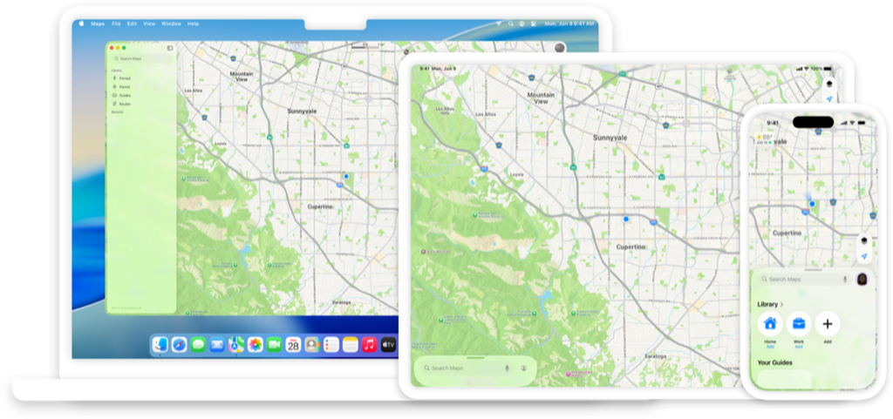
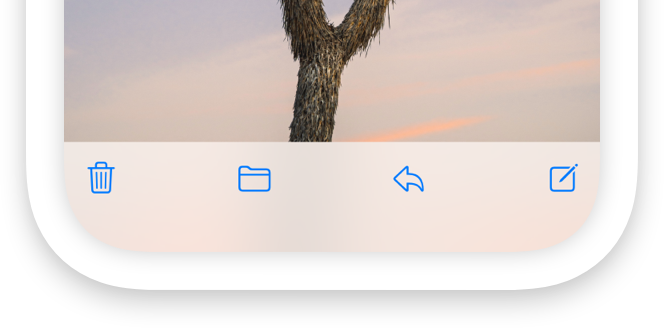
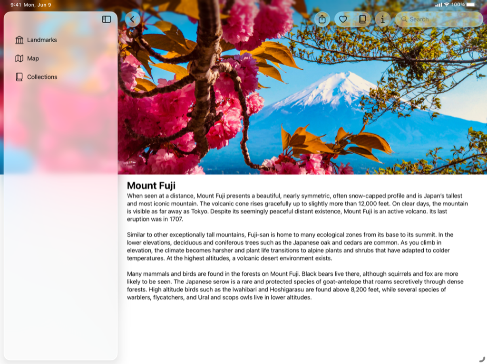

> Navigation: [Technologies](../technologies.md) · [Technology Overviews](../technologyoverviews.md) · [App design and UI](app-design-and-ui.md)

# Liquid Glass

Learn how to design and develop beautiful interfaces that leverage Liquid Glass.

## Introduction to Liquid Glass

Interfaces across Apple platforms feature a new dynamic material called Liquid Glass, which combines the optical properties of glass with a sense of fluidity. Learn how to adopt this material and embrace the design principles of Apple platforms to create beautiful interfaces that establish hierarchy, create harmony, and maintain consistency across devices and platforms.

Standard components from SwiftUI, UIKit, and AppKit like controls and navigation elements pick up the appearance and behavior of this material automatically. You can also implement these effects in custom interface elements.

## Adopting Liquid Glass

If you have an existing app, adopting Liquid Glass doesn’t mean reinventing your app from the ground up. Start by building your app in the latest version of Xcode to see the changes. Then, follow best practices in your interface to help your app look right at home on Apple platforms.

- Embrace the visual refresh for materials, controls, and app icons.
- Provide a universal navigation and search experience across platforms.
- Ensure your interface’s organization and layout looks consistent with other apps and system experiences.
- Adopt best practices for windows, modals, menus, and toolbars.
- Test your app to ensure it provides a great experience across platforms.

To learn more, read [Adopting Liquid Glass](adopting-liquid-glass.md).

## Sample code

The Landmarks app showcases how to create a beautiful and engaging user experience using SwiftUI and Liquid Glass. Explore how the Landmarks app implements the look and feel of the Liquid Glass material throughout its interface.

A screenshot of the Landmarks app running on an iPad. The app is showing the Mount Fuji landmark with the sidebar on the leading side.

- Configure an app icon with Icon Composer.
- Create an edge-to-edge content experience with the background extension effect.
- Enhance the edge-to-edge content experience by extending horizontal scroll views under a sidebar or inspector.
- Make your interface adaptable to changing window sizes.
- Explore search conventions across platforms.
- Apply Liquid Glass effects to custom interface elements and animations.

To learn more, see [Landmarks: Building an app with Liquid Glass](../swiftui/landmarks-building-an-app-with-liquid-glass.md).

## Design principles

The Human Interface Guidelines contains guidance and best practices that can help you design a great experience for any Apple platform. Browse the HIG to discover more about adapting your interface for Liquid Glass.

- Define a layout and choose a navigation structure that puts the most important content in focus.
- Reimagine your app icon with simple, bold layers that offer dimensionality and consistency across devices and appearances.
- Be judicious with your use of color in controls and navigation so they stay legible and allow your content to infuse them and shine through.
- Ensure interface elements fit in with software and hardware design across devices.
- Adopt standard iconography and predictable action placement across platforms.

To learn more, read the [Human Interface Guidelines](../design/human-interface-guidelines.md).

## Videos

- [Meet Liquid Glass](../https_/developer.apple.com/videos/play/wwdc2025/219.md)
- [Get to know the new design system](../https_/developer.apple.com/videos/play/wwdc2025/356.md)
- [Build a SwiftUI app with the new design](../https_/developer.apple.com/videos/play/wwdc2025/323.md)
- [Build a UIKit app with the new design](../https_/developer.apple.com/videos/play/wwdc2025/284.md)
- [Build an AppKit app with the new design](../https_/developer.apple.com/videos/play/wwdc2025/310.md)

## Topics

### Essentials

- [Adopting Liquid Glass](adopting-liquid-glass.md) — Find out how to bring the new material to your app.
